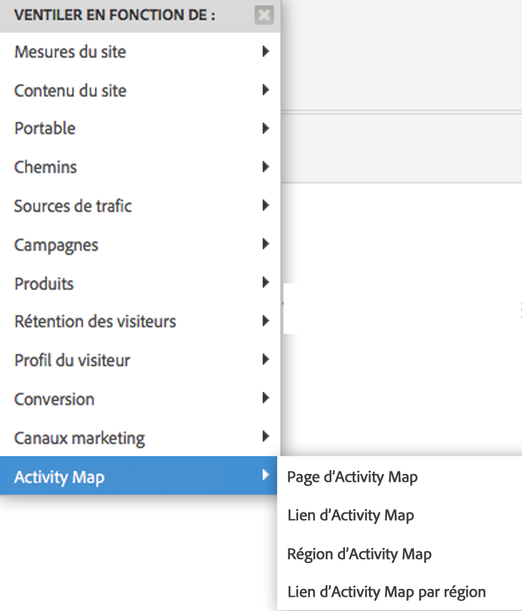

# Activation d’Activity Map {#enable-activity-map}

Décrit la procédure à suivre par l’administrateur Analytics pour activer la collecte des liens et le téléchargement par les utilisateurs d’Activity Map.

## Étape 1. Mise à jour de votre code AppMeasurement (Javascript) vers la version 1.6 (ou ultérieure) {#section_5D1586289DF2489289B1B6C1C80C300D}

Le module Activity Map fait partie du fichier AppMeasurement.js (situé en haut du fichier). La bibliothèque AppMeasurement se chargera dans le module Activity Map lorsqu’elle sera instanciée.

Les données d’Activity Map ne peuvent pas être collectées si vous n’effectuez pas la mise à jour vers cette version (ou ultérieure) d’AppMeasurement.

1. Téléchargez le code AppMeasurement (AppMeasurement_Javascript-1.6.zip) le plus récent en sélectionnant **[!UICONTROL Analytics]** > **[!UICONTROL Admin]** > **[!UICONTROL Gestionnaire de code]** et [implémentez-le](https://marketing.adobe.com/resources/help/fr_FR/sc/implement/js_implementation.html).

   Nous avons inclus un [exemple de code de mise en œuvre](/help/analyze/activity-map/activitymap-getting-started/activitymap-getting-started-admins/activitymap-sample-implementation-code.md) afin de vous aider à visualiser les changements apportés au code suite à l’intégration du module Activity Map.

1. Validez la mise en œuvre :

   1. Lorsque l’utilisateur clique sur un élément cliquable, les données sont stockées dans un cookie appelé s_sq.
   1. Les données d’Activity Map s’affichent dans la chaîne de requête sur l’appel de suivi. Par exemple :

      ```
      …&c.&a.&Activity Map.&link=My%20Link&region=My%20Region&page=My%20Page&.Activity Map&.a&.c&...
      ```

1. Ventilez ce rapport par **[!UICONTROL lien d’Activity Map par région]** pour afficher le lien/la région pour cette page : {width=&quot;400px&quot;}

## Étape 2 : Activation des rapports d’Activity Map {#section_D14F15D2FC0346FCAD8B3B87E6DD33D4}

Vous devez d’abord activer les rapports d’Activity Map au niveau de la suite de rapports.

1. Connectez-vous à Adobe Analytics et accédez à **[!UICONTROL Analytics]** > **[!UICONTROL Admin > Suites de rapports > [sélectionnez la suite de rapports] > Modifier les paramètres > Activity Map]** > **[!UICONTROL  Création de rapports d’Activity Map ]** .
1. Activity Map collecte les données des liens dans les rapports d’Activity Map. Pour que l’activation fonctionne, vous devez d’abord activer les variables en cliquant sur **[!UICONTROL Activer les rapports d’Activity Map]**.

   Cette étape permet d’ajouter toutes les dimensions Analytics dont vous avez besoin pour collecter des données.

1. Après environ une heure, consultez le [rapport Page d’Activity Map](/help/analyze/activity-map/activitymap-reporting-analytics.md) qui répertorie toutes les pages sur lesquelles les utilisateurs ont cliqué sur un lien.

## Étape 3. Ajout d’utilisateurs au groupe d’Activity Map {#section_4C7A47BB7DEF4AFFBC276392467F9675}

1. Cliquez sur **[!UICONTROL Ajouter des utilisateurs au groupe]**.

   Vous serez dirigé vers la page de gestion des groupes dans Admin Console.

1. [Ajoutez des utilisateurs à ce groupe](https://marketing.adobe.com/resources/help/fr_FR/reference/groups.html) et **[!UICONTROL enregistrez le groupe]**.

1. Cela permet à vos utilisateurs de télécharger Activity Map depuis **[!UICONTROL Adobe Analytics]** > **[!UICONTROL Outils]** > **[!UICONTROL Activity Map]** .

> [!NOTE] Si vous souhaitez que les utilisateurs non-administrateurs téléchargent Activity Map, créez un groupe d’utilisateurs qui accorde l’autorisation d’accès aux outils et à l’installation ClickMap héritée. Ce niveau d’autorisation associé à l’accès à Activity Map permet de télécharger et d’utiliser l’outil.
