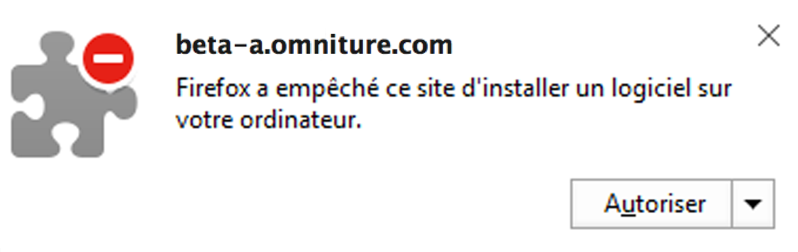
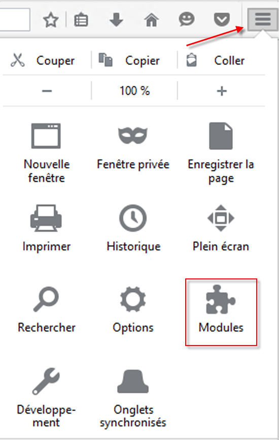

# Installation des modules de navigateur d’Activity Map {#install-activity-map-browser-plug-ins}

Le processus d’installation varie en fonction du navigateur que vous utilisez.

Les modules de navigateur d’Activity Map :

* sont injectés manuellement en tant que balise de page Analytics ;
* sont lancés à l’aide d’un bouton ou d’un élément de menu dans la barre d’outils du navigateur ;
* sont uniquement compatibles avec les dernières versions des navigateurs de bureau suivants : Internet Explorer, Firefox et Chrome ;
* prennent en charge la fonctionnalité **[!UICONTROL Mémoriser mes informations de connexion]** ;
* **peuvent injecter** la barre d’outils d’Activity Map sur des pages web qui ne contiennent pas de code de page Analytics. Afficheront un message d’erreur si la page ne contient pas de code de page Analytics ;
* nécessitent que vous passiez par le processus d’installation du module de navigateur.

## Installation du module Activity Map sur Chrome {#section_6907253D5D5E4422967E6439207A013F}

1. Sélectionnez **[!UICONTROL Adobe Analytics]** > **[!UICONTROL Outils]** > **[!UICONTROL Activity Map]**.  

1. Cliquez sur **[!UICONTROL Télécharger Activity Map]**.
1. Cliquez sur **[!UICONTROL Installer le module Activity Map]**.
1. Répondez **[!UICONTROL Oui]** lorsque l’avertissement de sécurité vous demande si vous souhaitez télécharger le module de navigateur d’Activity Map.
1. Une fois le téléchargement terminé, localisez le fichier .zip et décompressez-le.
1. Revenez à la barre d’adresse de Chrome et entrez `chrome://extensions`.
1. Cochez la case Mode développeur.
1. Cliquez sur Charger l’extension non empaquetée... et sélectionnez le dossier compressé dans la fenêtre contextuelle.
1. Si une icône Adobe Analytics {width=&quot;70px&quot;} a été ajoutée à votre barre d’outils, votre téléchargement s’est déroulé avec succès. Vous pouvez désormais [lancer Activity Map](/help/analyze/activity-map/activitymap-getting-started/activitymap-getting-started-users/activitymap-launch.md) à partir de votre page.

## Installation du module Activity Map sur Firefox {#section_1F69D3D22DB34D6992747B1A62C1D2DA}

1. Sélectionnez **[!UICONTROL Analytics]** > **[!UICONTROL Activity Map]**.

1. Cliquez sur **[!UICONTROL Télécharger Activity Map]**.
1. Cliquez sur **[!UICONTROL Installer le module Activity Map]**.
1. Cliquez sur **[!UICONTROL Autoriser]** lorsque le message suivant apparaît : 

1. Cliquez sur **[!UICONTROL Installer maintenant]**.
1. Cliquez sur l’icône du **[!UICONTROL menu Ouvrir]** en haut à droite de l’écran et sélectionnez **[!UICONTROL Modules complémentaires]**. {width=&quot;250px&quot;}

1. Activity Map devrait apparaître parmi les modules complémentaires Firefox.
1. Si une icône Adobe Analytics  a été ajoutée à votre barre d’outils, votre téléchargement s’est déroulé avec succès. Vous pouvez désormais [lancer Activity Map](/help/analyze/activity-map/activitymap-getting-started/activitymap-getting-started-users/activitymap-launch.md) à partir de votre page.

## Installation du module Activity Map sur Internet Explorer {#section_1A33705D7F784C4A88C9026ADC860FB8}

1. Sélectionnez **[!UICONTROL Analytics]** > **[!UICONTROL Activity Map]**.

1. Cliquez sur **[!UICONTROL Télécharger Activity Map]**.
1. Cliquez sur **[!UICONTROL Installer le module Activity Map]**.
1. Cliquez sur **[!UICONTROL Exécuter]** pour lancer l’installation d’Activity Map.
1. Cliquez sur **[!UICONTROL Oui]** dans la fenêtre contextuelle pour autoriser le programme à apporter des modifications à l’ordinateur.
1. Suivez les instructions de l’assistant d’installation.
1. Si l’installation d’Activity Map s’est déroulée avec succès, une notification dans Internet Explorer vous indiquera que la barre d’outils d’Activity Map est prête à être utilisée. Activez-la pour commencer à utiliser l’application. Vous pouvez désormais [lancer Activity Map](/help/analyze/activity-map/activitymap-getting-started/activitymap-getting-started-users/activitymap-launch.md) à partir de votre page.
