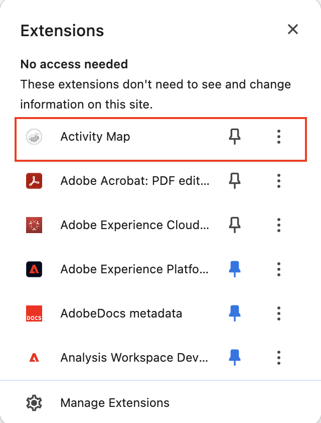

# Installer des modules de navigateur d’Activity Map

Le processus d’installation varie en fonction du navigateur que vous utilisez.

Extensions de navigateur d’Activity Map :

* sont injectés manuellement en tant que balise de page Analytics ;
* sont lancés à l’aide d’un bouton ou d’un élément de menu dans la barre d’outils du navigateur ;
* Elles sont uniquement compatibles avec les dernières versions des navigateurs de bureau suivants : Firefox et Chrome.
* prennent en charge la fonctionnalité **[!UICONTROL Mémoriser mes informations de connexion]** ;
* **peuvent injecter** la barre d’outils d’Activity Map sur des pages web qui ne contiennent pas de code de page Analytics. Afficheront un message d’erreur si la page ne contient pas de code de page Analytics ;
* Elles nécessitent que vous passiez par le processus d’installation de l’extension de navigateur.

## Installer l’extension d’Activity Map sur Chrome {#chrome}

1. Sélectionnez **[!UICONTROL Adobe Analytics]** > **[!UICONTROL Outils]** > **[!UICONTROL Activity Map]**.  
1. Cliquez sur **[!UICONTROL Télécharger Activity Map]**.
1. Cliquez sur **[!UICONTROL Installer Activity Map]**.
1. Cliquez sur **[!UICONTROL Ajouter à Chrome]**.
1. Cliquez sur **[!UICONTROL Ajouter une extension]**.
   
1. Cliquez sur l’icône Extensions de Chrome en haut à droite.
   
1. Cliquez sur Activity Map.
   

## Installation du module Activity Map sur Firefox {#firefox}

1. Sélectionnez **[!UICONTROL Analytics]** > **[!UICONTROL Activity Map]**.
1. Cliquez sur **[!UICONTROL Télécharger Activity Map]**.
1. Cliquez sur **[!UICONTROL Installer Activity Map]**.
1. Cliquez sur **[!UICONTROL Autoriser]** lorsque le message suivant apparaît : 
1. Cliquez sur **[!UICONTROL Installer maintenant]**.
1. Cliquez sur l’icône du **[!UICONTROL menu Ouvrir]** en haut à droite de l’écran et sélectionnez **[!UICONTROL Modules complémentaires]**.{width="250px"}
1. Activity Map devrait apparaître parmi les modules complémentaires Firefox.
1. Si une icône Adobe Analytics a été ajoutée à votre barre d’outils, votre téléchargement s’est déroulé avec succès.   Vous pouvez désormais [lancer Activity Map](/help/analyze/activity-map/activitymap-getting-started/activitymap-launch.md) à partir de votre page.

