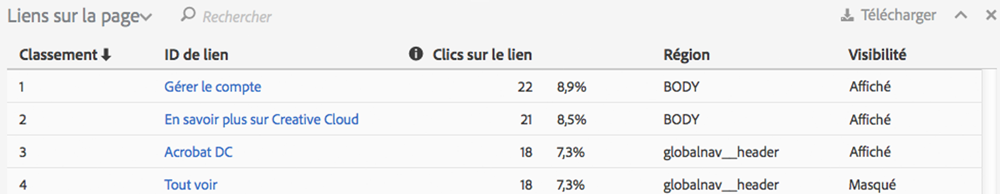
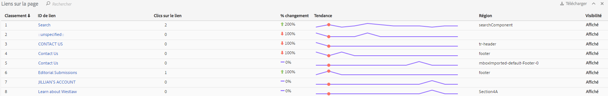

# Rapport sur les liens

Le rapport Liens tient compte des liens trouvés sur la page actuelle. Il ne tient pas compte de tous les liens collectés pour cette page.

Le rapport Liens sur la page offre une vue tabulaire de tous les liens. Il peut arriver que vous souhaitiez afficher les clics sur les liens (ou d’autres mesures) avec classement d’un seul coup d’œil. Cela vous permet de comparer un lien par rapport à un autre plus facilement. Créez le rapport Liens sur la page en incluant une liste de classement de tous les liens de la page (par ID de lien), les informations de clic (n° et %) ainsi que la région dans la page. Cliquez sur le bouton du rapport Liens sur la page dans la barre d’outils d’Activity Map.

Le rapport **[!UICONTROL Liens sur la page]** s’ouvre en dessous du cadre du navigateur dans le tableau de bord d’Activity Map.

## Mode standard {#section_C8D2A1C07A2A4E3A8F84AC9240603FA7}

En mode standard, le rapport Liens sur la page répertorie les données des liens allant d’un seul jour à plusieurs jours, regroupées sur toute la période. Les informations suivantes s’afficheront pour chaque lien :

<table id="table_3DE41B2CFA644B70AF802A3123CE51D9"> 
 <thead> 
  <tr> 
   <th colname="col1" class="entry"> Colonne  </th> 
   <th colname="col2" class="entry"> Description </th> 
  </tr> 
 </thead>
 <tbody> 
  <tr> 
   <td colname="col1"> Classement </td> 
   <td colname="col2"> Classement dans la page. En mode standard, la valeur de classement reste la même, quelle que soit la colonne sur laquelle vous cliquez. </td> 
  </tr> 
  <tr> 
   <td colname="col1"> ID de lien </td> 
   <td colname="col2">L’ID principal du lien (pour plus d’informations sur la façon dont l’ID principal est défini par la [Nouvelle méthodologie de suivi des liens] (/home/analyze/activity-map/activitymap-link-tracking/activitymap-link-tracking-methodology.md) </td> 
  </tr> 
  <tr> 
   <td colname="col1"> Clics </td> 
   <td colname="col2"> Le nombre de clics bruts pour un lien spécifique et son pourcentage par rapport au nombre total de clics sur la page. Si l’utilisateur choisit une mesure différente dans la barre d’outils, le rapport Lien tiendra compte de cette mesure à la place. </td> 
  </tr> 
  <tr> 
   <td colname="col1"> Région </td> 
   <td colname="col2"> Représente la région dans la page sur laquelle figure le lien. </td> 
  </tr> 
  <tr> 
   <td colname="col1"> Visibilité </td> 
   <td colname="col2">Se rapporte à l’état de visibilité du lien. Deux valeurs sont possibles : 
    <ul id="ul_BABCC0F64145407C9D439150A6898E6D">
     <li id="li_9AF0479BDCEB4A44A37292FAABFA83A5"><b>Masqué</b> : le lien se trouve actuellement sur la page mais n’est pas visible pour l’utilisateur final (comme un sous-menu dans un menu de navigation qui devient visible seulement si l’utilisateur survole le menu parent). </li>
     <li id="li_C6FA4EC27EDD4341AB9821E2B4BC9E60"><b>Visible</b> : le lien s’affiche actuellement sur la page. Cependant, il se peut que l’utilisateur doive faire défiler celle-ci pour voir le lien. </li>
    </ul>
Remarque : Si un lien est défini sur « Masqué », aucune superposition ne s’affichera pour celui-ci. 
</td> 
  </tr> 
 </tbody> 
</table>

**Filtrage des données**

Si vous souhaitez vous concentrer sur un lien spécifique, vous pouvez rechercher un terme associé dans le champ **[!UICONTROL Filtrer les données]**. Seuls les liens correspondant à la recherche disposeront de superpositions. Si aucun filtre n’est appliqué, les superpositions spécifiées dans [Paramètres d’Activity Map](/help/analyze/activity-map/activitymap-overlay-settings.md) s’afficheront.

## Mode réel {#section_AC1967217B5A4532ACB01D33636F6770}

En mode réel, le rapport Liens sur la page affiche les données de tendance sur plusieurs minutes.

<table id="table_61D1FB0F02894055A1AB394DE4FE4742"> 
 <thead> 
  <tr> 
   <th colname="col1" class="entry"> Colonne  </th> 
   <th colname="col2" class="entry"> Description </th> 
  </tr> 
 </thead>
 <tbody> 
  <tr> 
   <td colname="col1"> Classement </td> 
   <td colname="col2"> Classement dans la page. En cas de superposition en dégradé ou bulle, la valeur de classement reste la même, quelle que soit la colonne sur laquelle vous cliquez. En cas de superposition gagnants/perdants, cette valeur de classement varie en fonction des liens qui ont le plus gagné/perdu. </td> 
  </tr> 
  <tr> 
   <td colname="col1"> ID de lien </td> 
   <td colname="col2">L’ID principal du lien. Pour plus d’informations sur la manière dont l’ID principal est défini par la nouvelle [Méthodologie de suivi des liens] (/help/analyze/activity-map/activitymap-link-tracking/activitymap-)ink-tracking-methodology.md). </td> 
  </tr> 
  <tr> 
   <td colname="col1"> Clics sur les liens </td> 
   <td colname="col2"> Nombre total de clics pour la période sélectionnée. </td> 
  </tr> 
  <tr> 
   <td colname="col1"> % de changement </td> 
   <td colname="col2"> % de changement entre les mesures des liens de la période actuelle et les mesures des liens de la période précédente. Les % de changement négatifs sont affichés en rouge, les % de changement positifs en vert. </td> 
  </tr> 
  <tr> 
   <td colname="col1"> Tendance </td> 
   <td colname="col2"> Un graphique en courbes pour toutes les périodes collectées. La période actuellement sélectionnée est indiquée par un marqueur vert. La période actuellement survolée est indiquée par un marqueur rouge. </td> 
  </tr> 
  <tr> 
   <td colname="col1"> Région </td> 
   <td colname="col2"> Représente la région dans la page sur laquelle figure le lien. </td> 
  </tr> 
  <tr> 
   <td colname="col1"> Visibilité </td> 
   <td colname="col2">Se rapporte à l’état de visibilité du lien. Deux valeurs sont possibles : 
    <ul id="ul_B10C55ED4D3C4CF99506DC467E2E7CFB">
     <li id="li_EA646722A51041CC9E62C56DEF92C81F">Masqué : le lien se trouve actuellement sur la page mais n’est pas visible pour vous (par exemple, un lien qui apparaît une fois la page chargée). </li>
     <li id="li_F9543614C2894003AC9984A7404E2785">Visible : le lien s’affiche actuellement sur la page. Cependant, il se peut que vous deviez faire défiler celle-ci pour voir le lien. </li>
    </ul></td> 
  </tr> 
 </tbody> 
</table>

## Tri et filtrage {#section_4B8E8233C21247CAA70DAEC2156548AD}

Il arrive que vous deviez analyser uniquement les résultats d’une région de page spécifique (p. ex. le panneau gauche) afin de décider comment organiser le contenu de cette région spécifique de la page web.

À cette fin, nous avons créé une fonctionnalité de tri et de filtrage pour les liens dans le rapport Liens sur la page. Le filtrage est disponible par le biais du champ Filtrer. Le terme de recherche sera appliqué aux colonnes ID de lien et Région de lien. Le tri est disponible en cliquant sur les colonnes (Classement, ID de lien, Clics, Changement au fil du temps, Région, Visibilité) et peut être croissant ou décroissant. Les superpositions disparaissent du site web lorsque des liens sont filtrés à partir du rapport Liens sur la page.
