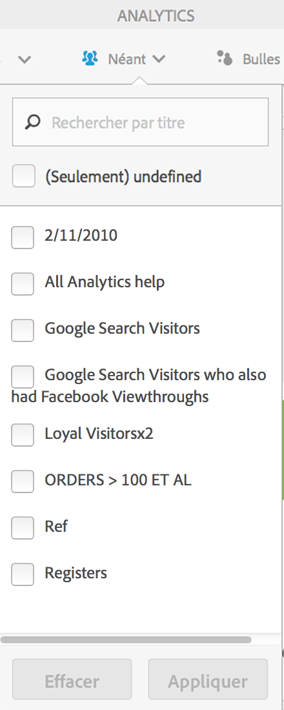

# Segmentation des clients

Vous permet d’appliquer un filtre de segments multiples dans Activity Map.

>[!NOTE] La commande Segment est uniquement disponible en mode standard, car la plateforme Adobe Analytics ne prend pas en charge la segmentation des données en temps réel.

Vous pouvez sélectionner un ou plusieurs des dans le menu déroulant **[!UICONTROL Segments]** Segments affiché ci-dessous. Les segments répertoriés sont identiques à ceux que vous possédez ou qui ont été partagés avec vous via les rapports et analyses pour la suite de rapports sélectionnée.

Lorsque la sélection des segments a changé et après la fermeture du sélecteur de segments, un nouveau processus de récupération des données Analytics est lancé pour toutes les mesures affichées dans l’application. Les segments sélectionnés sont mémorisés lors de la navigation d’une page à l’autre.

Lorsque plusieurs segments sont sélectionnés, le libellé de sélection de segments (dans un état réduit) affiche &quot;Multiple&quot;. Le complet des segments sélectionnés s’affiche lorsque vous cliquez sur le contrôle.

The selected segments will be applied to all Analytics reports presented in Activity Map, i.e. overlays and the **[!UICONTROL Links on Page]** and **[!UICONTROL Page Details]** reports.
