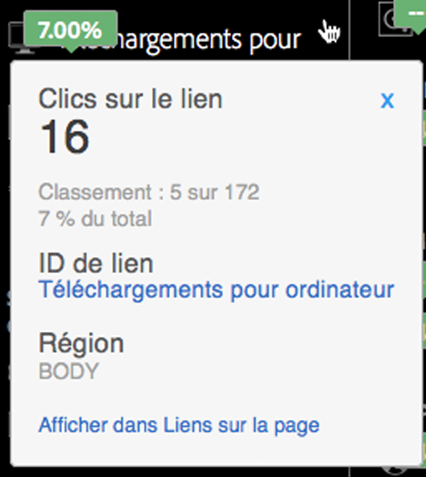

# Détails de la superposition

Les détails de la superposition s’affichent lorsque vous survolez une superposition de lien.

Les détails de la superposition affichent les valeurs suivantes suivies pour ce lien :

* Mesure
* Valeur brute
* Classement
* Valeur de pourcentage
* ID de lien
* Région
* Afficher dans le rapport Liens sur la page

