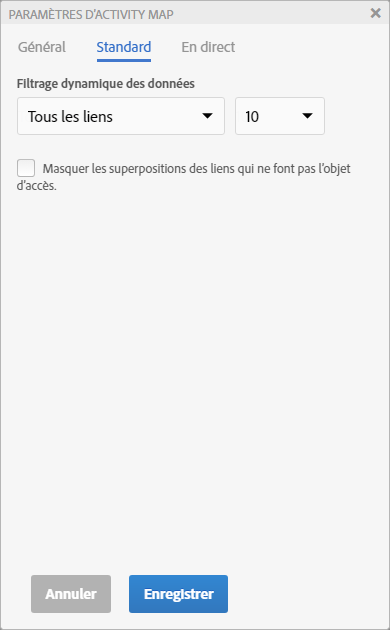
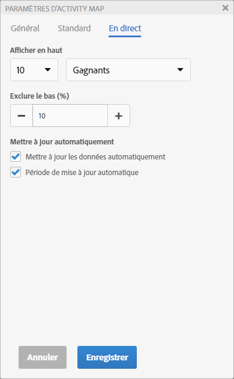
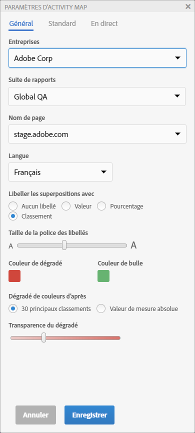

# Paramétrage d’Activity Map

Le panneau de configuration d’Activity Map vous permet de modifier les paramètres et les propriétés de tous les types de visualisations des superpositions.

Accédez au panneau de configuration d’Activity Map en cliquant sur l’icône de l’engrenage dans la barre d’outils d’Activity Map.

Le panneau de configuration affiche un contenu différent en fonction du mode d’application sélectionné. L’onglet Autre comprend des paramètres généraux.

| Standard | **[!UICONTROL Superpositions en dégradé]** ou **[!UICONTROL bulle]** |
|---|---|
| En direct | **[!UICONTROL Superpositions des gagnants et des perdants]** **[!UICONTROL en dégradé]** ou **[!UICONTROL bulle]** |
| Autre | Sélection de suite de rapports et sélection de langue |

## Paramètres de superposition en mode standard {#section_24DB95376E1A448494ECF3F57743FC19}

<table id="table_0244107DE6D142F2A1DA4882E0ED9826"> 
 <thead> 
  <tr> 
   <th colname="col2" class="entry"> Paramètres </th> 
   <th colname="col3" class="entry"> Description </th> 
  </tr> 
 </thead>
 <tbody> 
  <tr> 
   <td colname="col2">  Étiqueter les superpositions avec </td> 
   <td colname="col3"> 
    <ul id="ul_13AD02789F2D4904A35215A8FA230F3E"> 
     <li id="li_8DB71636D2074C69B0D94D3FB0CAFE28"> <b>Aucune étiquette</b> : uniquement applicable pour la superposition en dégradé. Dans ce cas, la couleur de la superposition donnera une idée du classement du lien </li> 
     <li id="li_39C98D7EA9514C1D8731B9D21C0E73A6"> <b>Valeur</b> : valeur brute totale pour ce lien. </li> 
     <li id="li_A5F583E45BCD4F2399398F9DCC7FE382"> <b>Pourcentage</b> : pourcentage de la mesure pour ce lien par rapport à la mesure totale pour la page. </li> 
     <li id="li_E4BF7D3B863E4B6C8E737CF29ADA9D67"> <b>Classement</b> : classement de ce lien parmi tous les liens présents sur la page rendue. </li> 
    </ul> </td> 
  </tr> 
  <tr> 
   <td colname="col2">  Taille de police de l’étiquette </td> 
   <td colname="col3"> Vous permet d’augmenter ou de réduire la taille de police de l’étiquette de la superposition à l’aide d’un curseur pour une meilleure lisibilité. </td> 
  </tr> 
  <tr> 
   <td colname="col2">  Afficher </td> 
   <td colname="col3">Sélectionnez Début, Fin ou Tous les liens pour les afficher dans la superposition. Si vous sélectionnez Début ou Fin, vous devez également sélectionner le nombre de liens à afficher. </td> 
  </tr> 
  <tr> 
   <td colname="col2"> Masquer les superpositions pour les liens qui n’ont reçu aucune visite. </td> 
   <td colname="col3"> Cette case à cocher vous permet de masquer les superpositions pour les liens qui n’ont reçu aucune visite, afin de limiter l’encombrement de l’interface. </td> 
  </tr> 
  <tr> 
   <td colname="col2">  Couleur du dégradé / Couleur de la bulle </td> 
   <td colname="col3">Faites votre choix parmi une sélection de couleurs pour afficher les classements des liens de superposition pour les visualisations des superpositions en dégradé ou bulle. </td> 
  </tr> 
  <tr> 
   <td colname="col2">  Couleur du dégradé basée sur </td> 
   <td colname="col3"> 
    <ul id="ul_1B5C2A44A9EB465D8B8E9AD91AF79D69"> 
     <li id="li_C983CB68B90B492BB0774254292B5961">  30 premiers classements : l’intensité des couleurs est normalisée pour les 30 premières valeurs. </li> 
     <li id="li_1E83431C8C734AB0BC82B5A66AED1189">  Valeur de mesure absolue : l’intensité des couleurs dépend de la valeur de mesure absolue. </li> 
    </ul> </td> 
  </tr> 
  <tr> 
   <td colname="col2">  Transparence du dégradé </td> 
   <td colname="col3">Sélectionnez le niveau de transparence pour les superpositions en dégradé. 
Ce paramètre n’affecte pas les superpositions bulle. 
 </td> 
  </tr> 
 </tbody> 
</table>

## Paramètres de superposition en mode réel {#section_D30F6E62FB5D404090B588F396A460AF}

| Paramètres | Description |
|---|---|
| **[!UICONTROL Afficher en haut]** | Sélectionnez les liens à afficher (ou tous) et les **[!UICONTROL gagnants]** ou **[!UICONTROL perdants]** (ou les deux) à afficher sous forme de superpositions. |
| **[!UICONTROL Exclure le bas (%)]** | Sélectionnez cette option pour éliminer les liens des gagnants et des perdants avec des données éparses. Filtrez les pourcentages inférieurs des changements de liens pour afficher uniquement les liens avec suffisamment de données pour présenter des gains ou des pertes significatives. Le pourcentage est calculé en fonction du nombre de liens sur la page. Par exemple, filtrer les 10 % inférieurs d’une liste de 200 liens filtrerait les 20 derniers liens. |
| **[!UICONTROL Mettre à jour les données automatiquement]** | Vous permet de décider si les données Analytics affichées dans l’interface doivent être mises à jour automatiquement lorsqu’une nouvelle période est calculée. |
| **[!UICONTROL Période de mise à jour automatique]** | Actualise la page web à chaque nouvelle récupération des données afin que les liens de la page soient mieux synchronisés avec les données collectées. |

## Autres paramètres {#section_697A12F099494D699A4BF498598178C5}

<table id="table_0F560236F8844FA0928CBB9C50D5ABEF"> 
 <tbody> 
  <tr> 
   <td colname="col1"> Suite de rapports </td> 
   <td colname="col2"> 
La liste des suites de rapports auxquelles vous avez accès ne se limite plus aux seules suites de rapports définies dans une balise de page web. Vous pouvez désormais remplacer la suite de rapports sélectionnée (correspondant à l’une des balises de la page) par une autre suite de rapports. Il n’est pas nécessaire que celle-ci soit liée à une balise sur la page. Si vous modifiez la suite de rapports sélectionnée dans les paramètres d’Activity Map, le processus d’enregistrement entraînera l’actualisation de tous les rapports Analytics affectés. 
 
 
Important : Les suites de rapports virtuelles sont uniquement compatibles avec le mode standard, et non le mode réel. Si vous vous trouvez en mode réel pour une suite de rapports standard, mais que vous sélectionnez une suite de rapports virtuelle dans cette boîte de dialogue, le mode standard s’affichera une fois que vous aurez cliqué sur OK. 
 
 
De plus, la commande Calendrier sera réinitialisée pour correspondre au type de calendrier de la suite de rapports (grégorien, vente au détail, personnalisé...). 
 </td> 
  </tr> 
  <tr> 
   <td colname="col1"> Langue </td> 
   <td colname="col2"> La sélection correspond aux langues proposées dans Adobe Analytics. </td> 
  </tr> 
  <tr> 
   <td colname="col1"> À propos de </td> 
   <td colname="col2"> Indique le nom et le numéro de version de l’application. </td> 
  </tr> 
 </tbody> 
</table>

