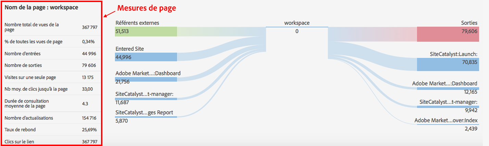

# Détails de la page

L’onglet Détails de la page affiche le rapport Page en tant que tableau et le rapport Flux de page en tant que rapport « papillon ».

## Rapport Page {#section_2335A9EFE57B4A7687B397DF2098CC6B}

Ce panneau affiche les mesures de trafic pour la page web visitée. Si vous accédez à une page web pour laquelle la balise de page Analytics n’est pas mise en œuvre, le panneau ne s’affichera pas.

## Rapport Flux de page {#section_D6EDE78CF7124758BF846E57ADABA234}

Le côté gauche comprend les pages précédentes et les référents (externes), qui peuvent également être développés pour afficher les quatre premières entrées de chaque catégorie.

Le côté droit comprend les quatre premières pages suivantes et le nombre de sorties.

Si une URL est suivie pour une page interne affichée dans cette section, la page s’affichera sous forme de lien. Par conséquent, vous pouvez cliquer sur cette page et poursuivre avec les pages présentant le plus d’affinité. Ce rapport vous permet de parcourir vos propriétés web de manière interactive dans une perspective d’analyse web.

Le rapport Flux de page est uniquement disponible en mode standard.

| **Flux de page** | **Description** |
|---|---|
| Référents externes | URL des autres sites renvoyant à la page actuelle. |
| Pages précédentes | Nomme la page interne dans la suite de rapports avant la page actuelle. |
| Pages suivantes | La page visitée après avoir quitté la page actuelle. |
| Sorties du site | Nombre de visiteurs ayant quitté le site après avoir consulté la page. |

