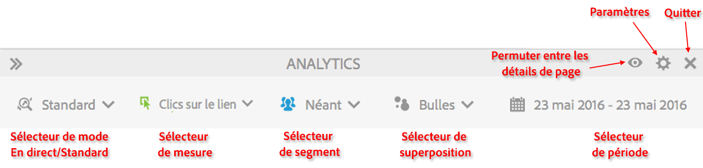
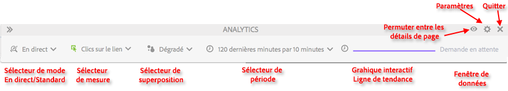

# Mode standard et mode réel

Activity Map propose deux modes de base permettant la création de rapports complémentaires sur l’activité de la page.

* Le mode standard, dans lequel le rapport [Liens sur la page](/help/analyze/activity-map/activitymap-links-report.md) affiche les données des liens allant d’un seul jour à plusieurs jours, regroupées sur toute la période.
* Le mode réel, qui affiche les tendances d’activité en temps réel.

Vous pouvez basculer entre les deux modes en cliquant sur le bouton Mode dans la barre d’outils.

## Mode standard {#section_0C755F30B7EC4A13A62AB9A391AF51E6}

En **mode standard**, vous pouvez sélectionner la période dans la barre d’outils comme indiqué ci-dessous.

Dans ce mode, les mesures de Commerce pour lesquelles « Participation » n’est pas activé sont affectées de façon linéaire. Par exemple, imaginons qu’un utilisateur clique sur « IPod mini » dans la page d’accueil, puis qu’il navigue dans 3 pages supplémentaires. À la 4e page, il achète un IPod mini pour 200 euros. Le lien « IPod mini » recevra une recette en participation de 200 EUR ainsi qu’une recette de 50 EUR (200 EUR/4) (recette affectée de façon linéaire).

Q : Que se passe-t-il si une page contient des liens ayant le même nom dans des régions différentes ? Est-ce que les deux liens sont crédités séparément étant donné qu’ils sont associés à des régions différentes mais qu’ils ont le même nom de lien sur une page ?

R : Cela dépend de la façon dont vous agrégez les données des liens. Dans Activity Map, nous tenons compte des informations ID de lien|Région pour une page donnée, de telle sorte que les données affectées s’appliquent à la combinaison « ID lien|Région ». Dans cette situation, étant donné que les régions sont distinctes, la combinaison lien|région sera différente et, par conséquent, toute recette affectée à la première combinaison lien|région sera différente de toute recette affectée pour le second lien. Mais dans l’interface utilisateur d’Adobe Analytics, vous pouvez simplement consulter le rapport sur l’ID de lien (au lieu du rapport Lien|Région) pour une page donnée (page ventilée par Lien). Dans ce cas, les recettes seront agrégées sur les deux régions.

## Mode réel {#section_D619B77D89A840F0B1C2DEA2715A516A}

En **mode réel**, les données Analytics sont affichées par incréments de 1 à 15 minutes, sous forme de tendances. Ce mode vise à analyser et à contrôler les tendances à court terme sur la page web.

Le mode réel répond aux besoins des organisations d’édition. Ces organisations ont besoin de contrôler les micro-tendances de la popularité des liens dans quelques pages clés. La possibilité de discerner rapidement les liens peu performants ou très performants est essentielle pour votre entreprise d’édition.

>[!IMPORTANT]
>
>Les suites de rapports virtuelles ne sont pas compatibles avec le mode réel, uniquement avec le mode standard.

