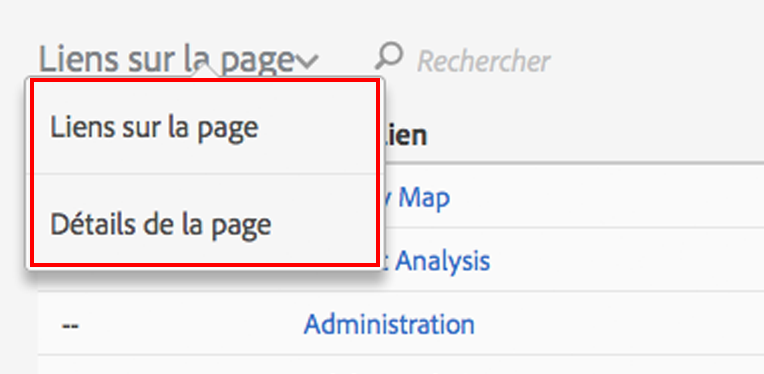

# Interface utilisateur d’Activity Map

L’interface utilisateur d’Activity Map est composée de deux parties:

* La fenêtre supérieure avec la page web, les superpositions injectées et la barre d’outils.
* Un panneau inférieur pour les rapports.

## Panneau supérieur {#section_2DA8ACD35D4C4ACBA32C13EFB5317E7C}

En haut de l’écran figure votre page web avec la [barre d’outils injectée](/help/analyze/activity-map/activitymap-standard-live.md) et les [superpositions de lien](/help/analyze/activity-map/activitymap-gainerslosers.md). Les classements bulle s’affichent au-dessus des liens pour vous permettre d’identifier le nombre total de clics.

Des détails supplémentaires sur les liens sont disponibles en survolant chaque superposition de lien :

## Panneau inférieur des rapports {#section_21B129D69B7A4F918E975E8E66DB02EE}

En bas de la page figurent les rapports [Liens sur la page](/help/analyze/activity-map/activitymap-links-report.md) et [Détails de la page](/help/analyze/activity-map/activitymap-page-flow.md), qui vous permettent d’afficher un résumé des statistiques actuelles de votre page web ainsi que des informations de flux de page.

Le rapport Liens sur la page vous offre un aperçu sous forme de tableur des liens de la page actuelle, dont des informations de clics supplémentaires. Le rapport Détails de la page présente des données d’analyse des pages qui ont été visitées avant et après la navigation vers la page actuellement affichée.

