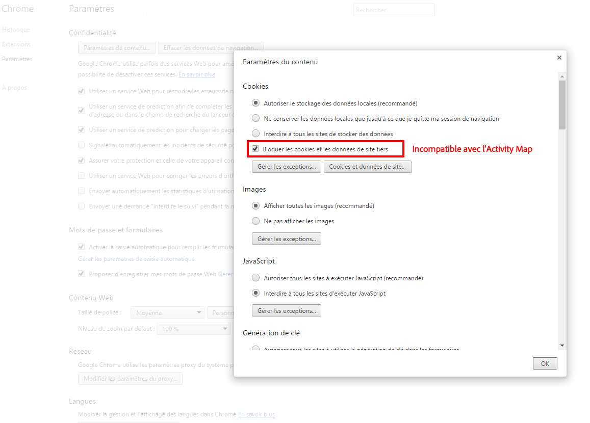
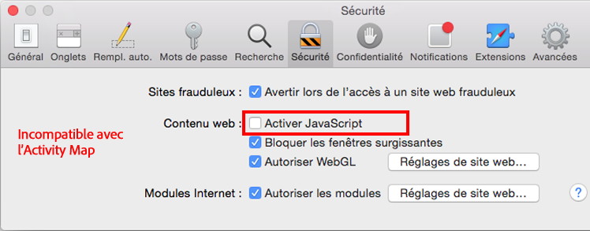

# Résolution des problèmes liés aux extensions du navigateur

Shows the browser parameters that are not compatible with the use of [!DNL Activity Map]. Désactivez ces paramètres.

## Chrome

## Firefox

## Safari

## Internet Explorer

