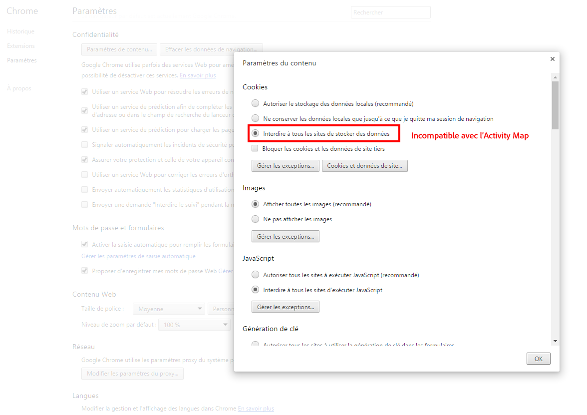

# Dépannage des extensions du navigateur

Affiche les paramètres du navigateur qui ne sont pas compatibles avec l'utilisation de Carte d'activités. Désactivez ces paramètres.

## Chrome

## Firefox

## Safari

## Internet Explorer

