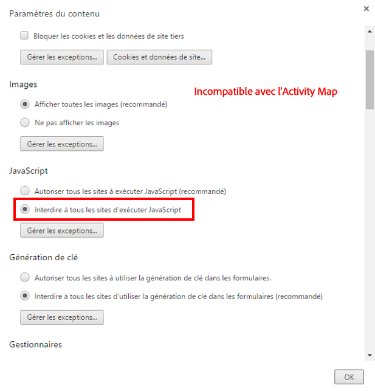
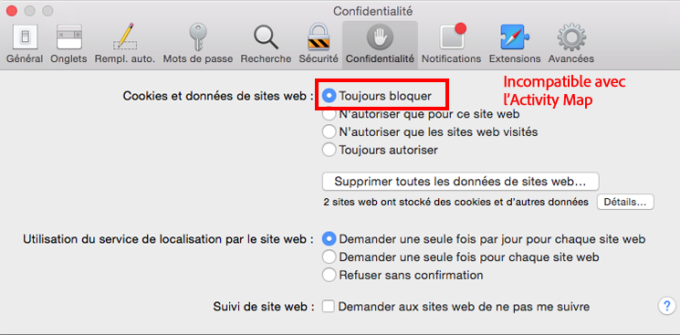

# Résolution des problèmes liés aux extensions du navigateur

Affiche les paramètres de navigateur qui ne sont pas compatibles avec l’utilisation d’Activity Map. Désactivez ces paramètres.

## Chrome

## Firefox

## Safari

## Internet Explorer

