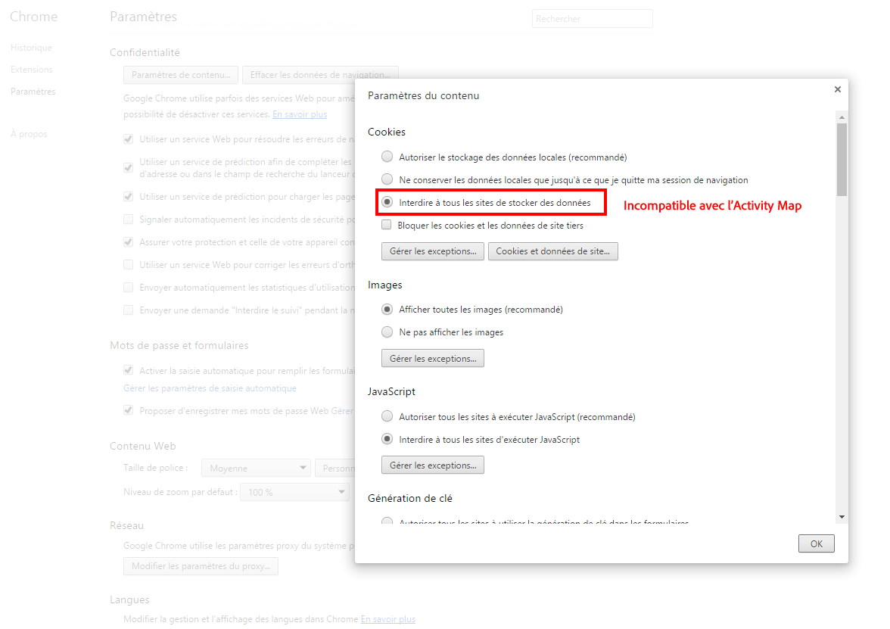
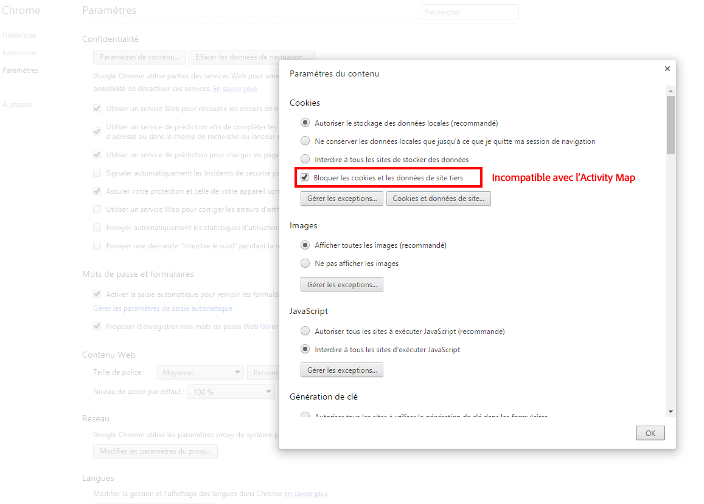
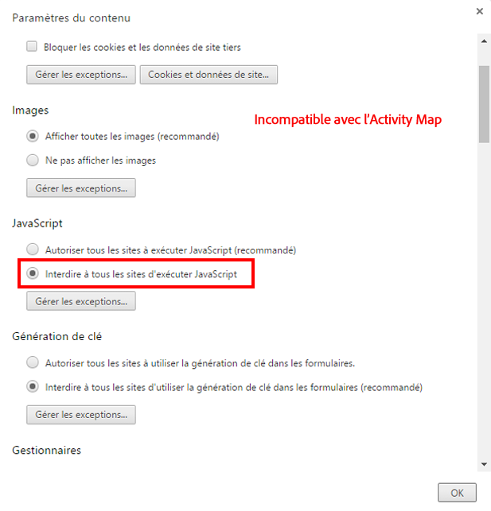
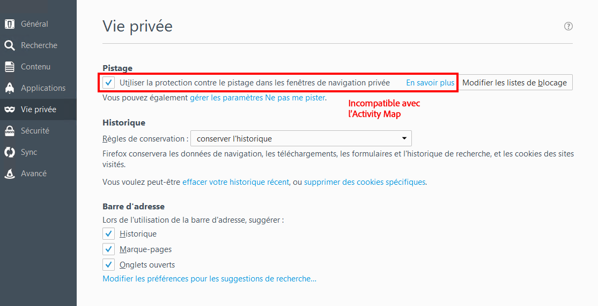
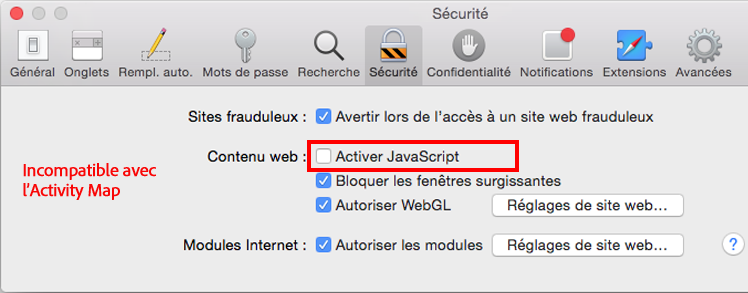
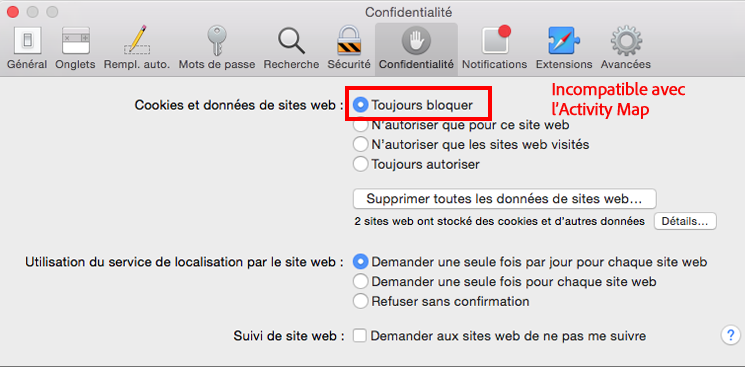
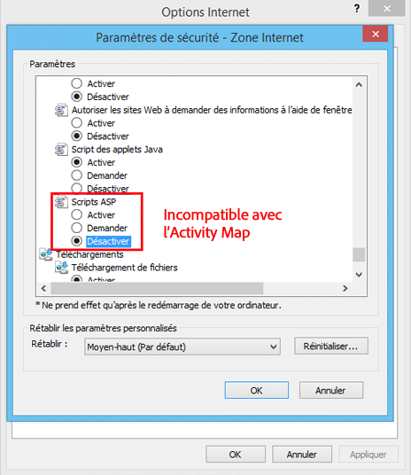

# Dépannage de la collecte de données Activity Map

Si vous ne voyez pas de données pour les dimensions Activity Map, utilisez cette page pour déterminer pourquoi.

## Confirmation de la collecte des données à l’aide du débogueur

Tout d’abord, assurez-vous que AppMeasurement collecte correctement les données Activity Map.

1. Téléchargez et installez l’ [extension Chrome du débogueur Adobe Experience Cloud](https://experienceleague.adobe.com/fr/docs/experience-platform/debugger/home).
2. Accédez à votre page web, puis cliquez sur un lien.
3. Au chargement de la page suivante, ouvrez le débogueur. Vérifiez que les variables de données contextuelles Activity Map sont sandrées entre `activitymap.` et `.activitymap` :

## Raisons possibles de l’absence de données Activity Map

Vérifiez chacun des éléments suivants pour vous assurer que les composants Activity Map sont présents :

* **AppMeasurement version** : l’Activity Map est pris en charge sur v1.6 et versions ultérieures. De nombreux problèmes de cas de périphérie sont résolus lorsque vous effectuez une mise à niveau vers la dernière version stable d’AppMeasurement.
* **Module Activity Map** : vérifiez si le module `AppMeasurement_Module_Activity_Map` est présent dans votre fichier `AppMeasurement.js`. Si votre mise en oeuvre utilise Adobe Experience Platform pour collecter des données, assurez-vous que l’option **[!UICONTROL Activer le ClickMap]** est cochée lors de la configuration de l’extension Analytics sous **[!UICONTROL Suivi des liens]**.
* **Le cookie `s_sq`** : Activity Map dépend du cookie `s_sq` pour la collecte de données.
   * Assurez-vous que la variable `cookieDomainPeriods` est correctement définie, en particulier pour les domaines régionaux tels que `*.co.uk` ou `*.co.jp`.
   * Assurez-vous que la variable `linkInternalFilters` est définie sur les valeurs souhaitées. Si un lien sur lequel l’utilisateur a cliqué ne correspond pas aux filtres internes, l’Activity Map le considère comme un lien de sortie et ne collecte pas de données.
* **Superposition Activity Map en cours d’exécution** : l’AppMeasurement ne suit pas les données de clics pour votre page web lorsque la superposition Activity Map est activée.

Affiche les paramètres de navigateur qui ne sont pas compatibles avec l’utilisation d’Activity Map. Adobe recommande de désactiver ces paramètres.

## Chrome

## Firefox

## Safari

## Internet Explorer

**Validation**

Interagissez avec les appels à l’aide de l’onglet Réseau de Developer Console :

1. Chargez le script de développement Launch sur le site.
1. En cas de clic sur les éléments, recherchez « /ee » dans l’onglet Réseau.

Adobe Experience Platform Debugger :

1. Téléchargez et installez l’[Adobe Experience Platform Debugger](https://chromewebstore.google.com/detail/adobe-experience-platform/bfnnokhpnncpkdmbokanobigaccjkpob).
1. Accédez à [!UICONTROL Journaux] > [!UICONTROL Edge] > [!UICONTROL Connexion à Edge].

* **L’appel d’interaction ne se déclenche pas dans l’onglet Réseau** : la collecte de données de clic dans un appel de collecte, filtrez avec `"/ee"` ou `"collect?"`.
* **Il n’y a pas d’affichage de charge utile pour l’appel de collecte** : l’appel de collecte est conçu de telle sorte que le suivi n’affecte pas la navigation vers d’autres sites, de sorte que la fonction de déchargement de document s’applique aux appels de collecte. Cette fonctionnalité n’aura aucun impact sur votre collecte de données, mais si vous devez valider sur la page, ajoutez `target="_blank"` à l’élément correspondant. Le lien s’ouvre dans un nouvel onglet.
