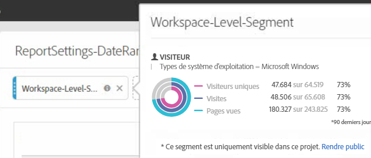
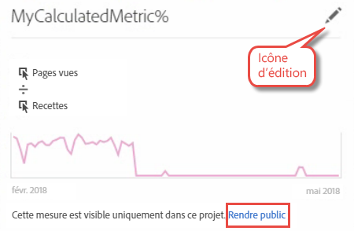

# FAQ Convertisseur de projets

## FAQ Convertisseur de projets {#topic_8231595303AD403E9322645A63632D57}

* [Problèmes de conversion connus](/help/analyze/ad-hoc-analysis/c-aha-project-converter/aha2aw-converter-faq.md#section_39C922A58B2E49C9877B363042801361)
* [FAQ sur les conversions](/help/analyze/ad-hoc-analysis/c-aha-project-converter/aha2aw-converter-faq.md#section_1E53FE373AF045978F939916124E194E)

## Problèmes de conversion connus {#section_39C922A58B2E49C9877B363042801361}

| Problème | Description |
|--- |--- |
| Granularité détaillée avec ventilations ou en colonnes | Lorsque des ventilations sont appliquées à la granularité détaillée ou si une granularité détaillée est présente dans les colonnes, le projet ne peut pas être converti pour Analysis Workspace.  Une solution possible consiste à supprimer la ventilation sur la granularité détaillée et à la supprimer des colonnes, puis à convertir le projet. Vous pouvez ensuite appliquer des ventilations à la granularité détaillée dans Analysis Workspace. |
| Mesure calculée interne utilisée avec un segment de colonne | Si vous utilisez une mesure calculée interne avec un segment de colonne, le projet ne peut pas être converti pour Analysis Workspace. Pour résoudre ce problème, supprimez les mesures calculées internes du projet avant la conversion, puis rajoutez-les dans Analysis Workspace. |

## FAQ sur les conversions {#section_1E53FE373AF045978F939916124E194E}

<table id="table_48CC119236C94835A6A512E989BE4200"> 
 <thead> 
  <tr> 
   <th colname="col1" class="entry"> Question </th> 
   <th colname="col2" class="entry"> Réponse </th> 
  </tr>
 </thead>
 <tbody> 
  <tr> 
   <td colname="col1"> 
<b>Q : Existe-t-il des fonctionnalités Ad Hoc Analysis non prises en charge par Analysis Workspace ?</b> 
 </td> 
   <td colname="col2"> 
R : Le rapport d’analyse de site n’est pas pris en charge par Analysis Workspace. Il existe également de légères différences entre les visualisations dans Ad Hoc Analysis et dans Workspace. Reportez-vous aux questions ci-dessous pour plus de détails. 
 </td> 
  </tr> 
  <tr> 
   <td colname="col1"> 
<b>Q : Comment sont convertis les paramètres du tableau ?</b> 
 </td> 
   <td colname="col2"> 
    <ul id="ul_A645A004FB094A1593439A6607FE9A6B"> 
     <li id="li_033CA771F08A4BC3B0BC52CDCCA03FF4"><b>Nombres de lignes affichées</b> : Workspace est programmé pour n’afficher que 10 lignes (personnalisation possible pour afficher jusqu’à 400 lignes à la fois), alors qu’Ad Hoc affichera jusqu’à 50 000 lignes par page. Veuillez noter que les données se trouvent toujours dans Workspace, programmé simplement par défaut à 10 lignes. </li> 
     <li id="li_A8B8890149334032A56D8D1C0F8691EA"><b>Recherche avancée :</b> les options de recherches multiples simultanées ne sont pas prises en charge. Seule une option de recherche (telle que Tous ces mots, La phrase exacte, Un de ces mots ou Aucun de ces mots) sera convertie dans Analysis Workspace. </li> 
    </ul> </td> 
  </tr> 
  <tr> 
   <td colname="col1"> 
<b>Q : Comment sont convertis les diagrammes / graphiques ?</b> 
 </td> 
   <td colname="col2"> 
R : Veuillez noter que les diagrammes et les graphiques sont appelés « visualisations » dans Workspace. 
 
    <ul id="ul_597F5AB826EF434295D0CABD0313CAD5"> 
     <li id="li_AFB2805418034721A9519D999128C0A8"><b>Paramètres</b> : les paramètres de visualisations tels que « Nombre d’éléments » ou « Nombre de barres » ne sont pas pris en charge par Workspace. </li> 
     <li id="li_D5C7EA8815344EDB8585CBB8E1AF583E"><b>Graphique en secteurs</b> : exportation en tant que <a href="https://marketing.adobe.com/resources/help/fr_FR/analytics/analysis-workspace/donut.html"  >visualisation en anneau</a>. Cette visualisation dans Workspace est limitée à 19 sections. </li> 
     <li id="li_91659FBFD77C4B3393D78447D658B7B4"><b>Graphique à bulles</b> : exporté en tant que <a href="https://marketing.adobe.com/resources/help/fr_FR/analytics/analysis-workspace/scatterplot.html"  >visualisation de dispersion</a>. Par défaut, la visualisation de dispersion déplace la première mesure sur l’axe X et la deuxième sur l’axe Y. S’il n’existe qu’une mesure, le graphique à bulles sera converti en visualisation en lignes. </li> 
     <li id="li_FA05085FFB1747EBAF63616AC2B8D59C"><b>Histogramme</b> : prise en charge d’un raisonnement différent par intervalles dans Workspace comparé à Ad Hoc Analysis. Par conséquent, il est converti en <a href="https://marketing.adobe.com/resources/help/fr_FR/analytics/analysis-workspace/bar.html"  >visualisation en barres</a>. </li> 
     <li id="li_959499D20796459CA0F6BBC8F0A8D808"><b>Graphique de dispersion</b> : dans les projets exportés dans Analysis Workspace, l’axe Y correspond à la première colonne, l’axe X à la seconde et le diamètre à la troisième. </li> 
     <li id="li_14E06D7A5106405A89A07B44FFD9A92D"><b>Tableaux Abandons</b> : pour afficher les tableaux Diminutions ou Abandons, faites un clic droit sur le point de contrôle et sélectionnez l’option Ventilation. </li> 
     <li id="li_240F43C386F04111A7632A8FCA37832C"><b>Périodes des rapports d’Abandons</b> : les périodes personnalisables de rapports n’ont pas été appliquées aux visualisations des Abandons. </li> 
     <li id="li_1FF5B3FD9E424E7190AF03FD4DD9D654"><b>Rapport de flux</b> : les flux seront déplacés vers un panneau séparé afin de préserver les périodes et la segmentation. </li> 
     <li id="li_BE8F8F6EC2EA49E18EF52539BC1700E0"><b>Entonnoir de conversion</b> : conversion en tableau à structure libre puisque non pris en charge par Analysis Workspace. Nous recommandons de remplacer les entonnoirs de conversion par des visualisations des Abandons, mais ces derniers se comporteront d’une façon légèrement différente. </li> 
    </ul> </td> 
  </tr> 
  <tr> 
   <td colname="col1"> 
<b>Q : Comment sont convertis les segments ?</b> 
 </td> 
   <td colname="col2"> 
    <ul id="ul_15D5B17461E2402DB07DF8B0A10AAC37"> 
     <li id="li_CF9C3D235A664B15B21D9F89DC5EF7D3">Les segments sont internes au projet converti (non publics). Ils peuvent être rendus publics, comme indiqué ici : 
 
 </li> 
     <li id="li_AE61DAEC5C0047349DD192EFEEDB0BF9">Les segments des espaces de travail Ad Hoc Analysis sont appliqués à l’échelle du projet / de l’espace de travail dans Workspace. </li> 
     <li id="li_B1559E2C18724FE189AF87D0BEF16811">Les segments des rapports Ad Hoc Analysis sont appliqués à l’échelle des colonnes de tableau dans Workspace. </li> 
     <li id="li_0E6DF6D44EA448A4A212BA2BB8E342CF">Les segments des tableaux Ad Hoc Analysis sont appliqués à l’échelle des colonnes dans Workspace. </li> 
    </ul> 
Les segments peuvent être modifiés dans le <a href="https://marketing.adobe.com/resources/help/fr_FR/analytics/segment/"  >créateur de segments</a>. 
 </td> 
  </tr> 
  <tr> 
   <td colname="col1"> 
<b>Q : Comment sont converties les périodes ?</b> 
 </td> 
   <td colname="col2"> 
    <ul id="ul_A24AB597F3CE4847AF00D49A9A72A395"> 
     <li id="li_24FD18AF64114445939C4FBC03F2D406">Les périodes « les X derniers jours » dans Ad Hoc Analysis <i>excluent</i> la date d’aujourd'hui, alors qu’Analysis Workspace <i>l’inclut</i>. Par conséquent, les périodes comme « les 90 derniers jours » peuvent ne pas correspondre parfaitement d’un outil à l’autre. Utilisez les périodes personnalisables pour retrouver la même période dans Analysis Workspace. </li> 
     <li id="li_AA4390470C494748B4B12030B1226720">Les périodes des espaces de travail Ad Hoc Analysis sont appliquées à l’échelle du projet / de l’espace de travail dans Workspace. </li> 
     <li id="li_B8F0CDD413154856A315D087FEC4D418">Les périodes des rapports Ad Hoc Analysis sont appliquées à l’échelle des colonnes de tableau dans Workspace. </li> 
    </ul> 
Les périodes personnalisables peuvent être modifiées sous Analytics &gt; Composants &gt; Périodes. 
 </td> 
  </tr> 
  <tr> 
   <td colname="col1"> 
<b>Q : Comment sont converties les mesures calculées ?</b> 
 </td> 
   <td colname="col2"> 
    <ul id="ul_ADA380D5D09B4223AAE4853D4C64F679"> 
     <li id="li_010572F793F54680ABE64117DAB7E800">Les mesures calculées sont internes au projet converti (non publiques). Elles peuvent être rendues publiques en effectuant un clic droit sur la mesure puis en cliquant sur Rendre public. 
 
 </li> 
     <li id="li_930546EC8FEB432C8810FAF93556FC9A">Tous les types de mesures calculées sont prises en charge pour l’exportation. </li> 
     <li id="li_DFF7C6F8BB2344928D49194DA0F6EC38"><b>Types d’attribution</b> : bien qu’Analysis Workspace n’affiche pas explicitement le type d’attribution des mesures calculées, l’exportation crée un type d’attribution qui correspond à celui présent dans Ad Hoc Analysis. </li> 
    </ul> 
Les attributions peuvent être modifiées dans le <a href="https://marketing.adobe.com/resources/help/fr_FR/analytics/calcmetrics/"  >créateur de mesures calculées</a> en cliquant sur l’icône de modification (crayon). 
 </td> 
  </tr> 
  <tr> 
   <td colname="col1"> 
<b>Q : Comment sont appliqués les paramètres des données globales d’Ad Hoc aux projets convertis ?</b> 
 </td> 
   <td colname="col2"> 
Il est possible qu’un projet exporté deux fois se comporte différemment à cause des paramètres de données globales. 
 
    <ul id="ul_E3827883DD8045FAAB359D7E85E3EEFA"> 
     <li id="li_1056CA4813C44638BEB070228AE6914C"><b>Compter les répétitions.</b> Tout paramètre appliqué durant l’exportation est appliqué au projet exporté dans Analysis Workspace. </li> 
     <li id="li_D5405E2862CF434CA82AA9DE000F4BBC"><b>Sources de données.</b> Dans Analysis Workspace, toutes les données Analytics sont affichées, y compris les sources de données. </li> 
    </ul> </td> 
  </tr> 
  <tr> 
   <td colname="col1"> 
<b>Q : Si mon projet Ad Hoc Analysis est programmé, la programmation sera-t-elle convertie dans Analysis Workspace ?</b> 
 </td> 
   <td colname="col2"> 
Non, les programmations ne sont pas converties. Dans Analysis Workspace, ouvrez le projet que vous désirez programmer et allez dans Partager &gt; Envoyer un fichier en programmation afin de définir une nouvelle programmation. Assurez-vous d’annuler le projet programmé dans Ad Hoc Analysis. 
 </td> 
  </tr> 
  <tr> 
   <td colname="col1"> 
<b>Q : Existe-t-il des différences de noms entre les deux outils ?</b> 
 </td> 
   <td colname="col2"> 
R : Oui. Reportez-vous à la <a href="https://marketing.adobe.com/resources/help/fr_FR/analytics/analysis-workspace/adhocanalysis_vs_analysisworkspace.html"  >Comparaison des termes clés</a> dans la documentation d’Analysis Workspace. 
 </td> 
  </tr> 
 </tbody> 
</table>

