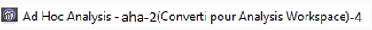
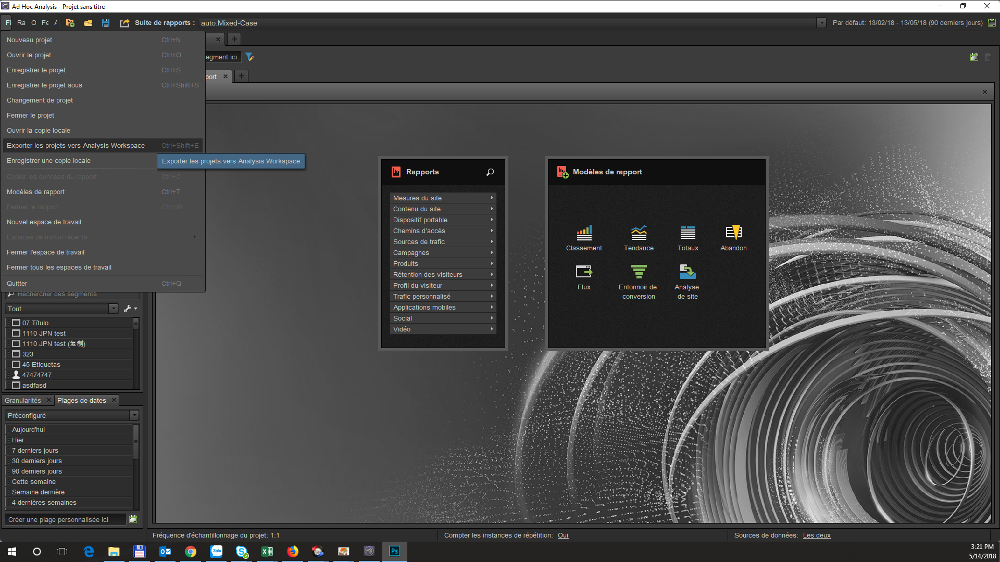
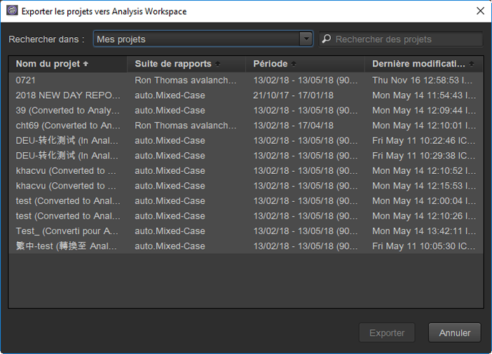
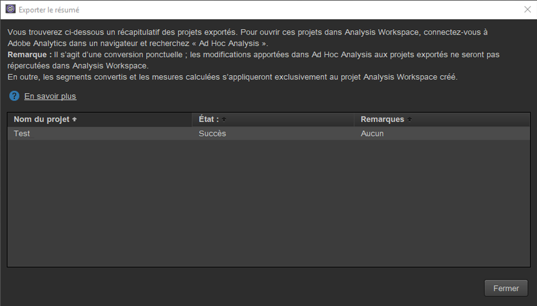
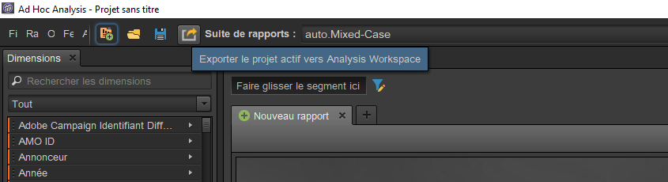

# Conversion des projets dans Ad Hoc Analysis

## Conversion des projets dans Ad Hoc Analysis {#topic_5A55F73488704C5D8E42CDD04B5984DE}

Avant de convertir vos projets, veuillez noter que :

* Pour convertir des projets, vous devez être connecté à Ad Hoc Analysis en tant qu’administrateur ou en tant que non-administrateur autorisé à utiliser Analysis Workspace.
* Puisqu’il s’agit d’une conversion unique, aucune des modifications apportées ultérieurement aux projets Ad Hoc convertis ne sera prise en compte dans Analysis Workspace. Vous avez cependant la possibilité de reconvertir le projet.
* Tous les projets Ad Hoc Analysis convertis resteront accessibles dans Ad Hoc et le nombre de conversions effectuées sera ajouté entre parenthèses dans leur titre. Exemple :

   

Deux options s’offrent à vous pour convertir des projets Ad Hoc Analysis :

* sélectionner des projets à convertir dans une liste ;
* convertir uniquement les projets ouverts.

**Sélectionner des projets dans une liste**

1. Dans Ad Hoc Analysis, cliquez sur **[!UICONTROL Fichier]** > **[!UICONTROL Convertir les projets en Analysis Workspace]**.

   

1. Dans la boîte de dialogue **[!UICONTROL Convertir les projets en Analysis Workspace]**, sélectionnez le projet à convertir ou appuyez sur la touche  +  pour sélectionner la liste entière.

   

1. Cliquez sur **[!UICONTROL Convertir]**.
1. Un [!UICONTROL résumé de conversion] reprend maintenant tous les projets qui ont été convertis, lesquels sont associés à des colonnes faisant état de leur statut de conversion : succès ou échouée et au code d’erreur, le cas échéant. Contactez l’assistance d’Adobe, muni de l’« `Error-Id: <Error-Code>` » pour un diagnostic plus poussé.

   

**Convertir des projets en cours**

1. Dans Ad Hoc Analysis, ouvrez un projet que vous souhaitez convertir.
1. Cliquez sur **[!UICONTROL Convertir un projet en cours en Analysis Workspace.]** 

1. Un [!UICONTROL résumé de conversion] reprend maintenant tous les projets qui ont été convertis, lesquels sont associés à des colonnes faisant état de leur statut de conversion : succès ou échouée et au code d’erreur, le cas échéant. Contactez l’assistance d’Adobe, muni de l’« `Error-Id: <Error-Code>` » pour un diagnostic plus poussé.
