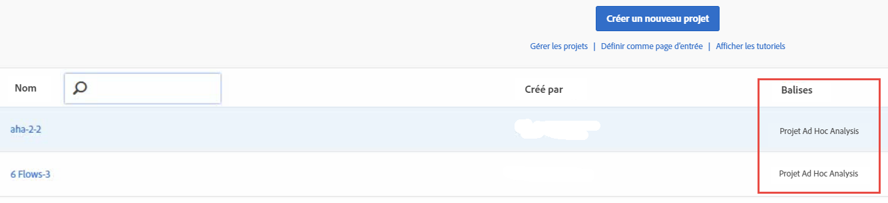

# Affichage des projets convertis dans Analysis Workspace

Avant d’afficher vos projets dans Workspace, veuillez consulter la [FAQ](/help/analyze/ad-hoc-analysis/c-aha-project-converter/aha2aw-converter-faq.md#topic_8231595303AD403E9322645A63632D57) ainsi que les [différences terminologiques](/help/analyze/ad-hoc-analysis/c-aha-project-converter/aha2aw-converter-faq.md#topic_8231595303AD403E9322645A63632D57) entre Ad Hoc Analysis et Workspace.

1. Rendez-vous dans **[!UICONTROL Analytics]** > **[!UICONTROL Workspace]**. Veuillez noter que les projets convertis à partir d’Ad Hoc Analysis sont balisés « Projet Ad Hoc Analysis ».

   

1. Cliquez sur le nom du projet pour l’afficher.
1. Effectuez d’autres changements à ce projet si vous le désirez. Veuillez noter que ces changements ne seront pas pris en compte dans Ad Hoc Analysis.

