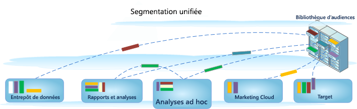

# Création de segments

Ad Hoc Analysis s’intègre à l’environnement de segmentation Analytics, ce qui permet de créer, partager, gérer et appliquer des segments de visiteurs dans les produits Adobe. Ad Hoc Analysis offre une interface utilisateur basée sur Java au créateur de segments et au gestionnaire de segments, qui sont identiques aux outils Web utilisés par d’autres outils d’Analytics, ce qui permet de faire correspondre les appels au serveur et de proposer les mêmes fonctionnalités à partir d’une console basée sur Java.

Les Ad Hoc Analysis contiennent les anciennes fonctionnalités pour créer des segments et de nouvelles fonctionnalités telles que le [gestionnaire de segments](https://marketing.adobe.com/resources/help/fr_FR/analytics/segment/seg_manage.html) qui permet de configurer un [processus](https://marketing.adobe.com/resources/help/fr_FR/analytics/segment/seg_workflow.html) de gestion des segments. Comme toujours, vous pouvez créer et enregistrer des segments dans le [créateur de segments](https://marketing.adobe.com/resources/help/fr_FR/analytics/segment/seg_build.html) ou [générer des segments à partir d’un rapport sur les abandons](https://marketing.adobe.com/resources/help/fr_FR/analytics/segment/t_seg_fallout.html) depuis la console des Ad Hoc Analysis, puis les enregistrer dans la bibliothèque d’audiences pour un accès et une application généraux. 

## Segmentation unifiée dans Ad Hoc Analysis {#section_5FA03A06DE054448AD519CE30C39E294}

Pour obtenir des informations et des instructions pour la création et la gestion de segments dans l’environnement de la segmentation unifiée, notamment les fonctionnalités des analyses ad hoc, reportez-vous à la documentation sur la [segmentation unifiée](https://marketing.adobe.com/resources/help/fr_FR/analytics/segment/index.html).

* [Nouvelles fonctionnalités](/help/analyze/ad-hoc-analysis/c-content-ref.md#section_BD58629D1A9346BF879E229FA6BEC7A2)
* [Modifications des définitions de segment](https://marketing.adobe.com/resources/help/fr_FR/analytics/segment/seg_definition.html)
* [Qu’est-il advenu de mes segments existants ?](/help/analyze/ad-hoc-analysis/c-content-ref.md#section_76CF47142D1A4FB6A0718AD9073049FE)
* [Qu’est-il advenu de mes dossiers de segments existants ?](/help/analyze/ad-hoc-analysis/c-content-ref.md#section_FB04DCF775694E69B761DCA53F301C30)
* [Puis-je gérer tous les segments d’Analytics dans le gestionnaire de segments ?](/help/analyze/ad-hoc-analysis/c-content-ref.md#section_AF5EDD72C74A4739BD40C4AF125CE489)
* [Qu’est-ce qu’un conteneur d’accès ? Est-ce différent d’un conteneur Page vue ?](/help/analyze/ad-hoc-analysis/c-content-ref.md#section_65BBE60A836C4001938830DDA15DC256)
* [Quels droits et privilèges dois-je posséder pour utiliser, créer et gérer des segments ?](/help/analyze/ad-hoc-analysis/c-content-ref.md#section_648DFA3A882146C485A84ED014EEC707)
* [Que dois-je faire avec les segments en double qui ont le...](/help/analyze/ad-hoc-analysis/c-content-ref.md#section_E2C3A1B4B4274D1B86CAA9C0359D049C)
* [Quels sont les conseils d’Adobe pour nettoyer les segments ?](/help/analyze/ad-hoc-analysis/c-content-ref.md#section_3AC2D265F9084557A24C6FB39DC6EE49)
* [Pourquoi ne puis-je pas supprimer ce segment ?](/help/analyze/ad-hoc-analysis/c-content-ref.md#section_0FEB6711031A4ABCA915CDA745ECF38D)
* [Informations supplémentaires sur vos segments existants](/help/analyze/ad-hoc-analysis/c-content-ref.md#section_83ACAB256F394DCD8B424D8920BDD853)

## Fonctionnalités {#section_BD58629D1A9346BF879E229FA6BEC7A2}

* Les [segments](https://marketing.adobe.com/resources/help/fr_FR/analytics/segment/seg_overview.html) fonctionnent dans toutes les suites de rapports. Auparavant, ils étaient propres à une suite de rapports.
* Le [gestionnaire de segments](https://marketing.adobe.com/resources/help/fr_FR/analytics/segment/seg_manage.html) permet de configurer des [processus](https://marketing.adobe.com/resources/help/fr_FR/analytics/segment/seg_workflow.html) pour le partage, le marquage, la vérification et l’approbation des segments.

* Le [créateur de segments](https://marketing.adobe.com/resources/help/fr_FR/analytics/segment/seg_build_ui.html) a été mis à jour pour simplifier la création de segments.
* Vous pouvez [marquer les segments](https://marketing.adobe.com/resources/help/fr_FR/analytics/segment/seg_tag.html) pour les organiser et les rechercher ultérieurement au lieu d’utiliser des dossiers. Par le passé, vous utilisiez des dossiers (dans les [!DNL ad hoc analysis]) pour organiser vos segments.

* Vous pouvez créer des [segments séquentiels](https://marketing.adobe.com/resources/help/fr_FR/analytics/segment/seg_sequential.html) en dehors des Ad Hoc Analysis.
* 

>[!NOTE]
>
>Dans Ad Hoc Analysis, vous ne pouvez pas ajouter de plages de dates aux segments. Cette fonctionnalité est disponible dans Analysis Workspace. Vous ne pouvez pas non plus utiliser le séquencement Seulement avant/Seulement après dans les Ad Hoc Analysis.

## Qu’est-il advenu de mes segments existants ? {#section_76CF47142D1A4FB6A0718AD9073049FE}

Les segments existants continuent à fonctionner de la même manière qu’avant l’introduction de la segmentation Analytics. Tout rapport auquel ces segments sont appliqués continuera à fonctionner correctement.

La plupart des segments prédéfinis et de suite précédents seront migrés sous forme de [modèles de segment](https://marketing.adobe.com/resources/help/fr_FR/analytics/segment/seg_templates.html) dans le créateur de segments. Les modèles de segments sont utilisés pour créer rapidement des segments personnalisés avec des audiences courantes. Ils ne peuvent pas être directement appliqués à un rapport, mais peuvent être facilement enregistrés dans un segment personnalisé.

## Qu’est-il advenu de mes dossiers de segments existants ? {#section_FB04DCF775694E69B761DCA53F301C30}

Le gestionnaire de segments utilise des [balises](https://marketing.adobe.com/resources/help/fr_FR/analytics/segment/seg_tag.html) à la place de dossiers (Ad Hoc Analysis). Les noms de vos dossiers sont automatiquement convertis en balises qui sont appliquées aux segments respectifs.

## Puis-je gérer tous les segments Analytics dans le Gestionnaire de segments ? {#section_AF5EDD72C74A4739BD40C4AF125CE489}

Dans le gestionnaire de segments des Ad Hoc Analysis, vous pouvez uniquement afficher les segments qui vous appartiennent (ceux que vous avez créés) et ceux qui sont directement partagés avec vous.

## Qu’est-ce qu’un conteneur d’accès ? Est-ce différent d’un conteneur Page vue ? {#section_65BBE60A836C4001938830DDA15DC256}

Le conteneur Page vue a été renommé en conteneur Accès pour indiquer qu’il segmente tous les types de données et pas seulement les pages vues. Par exemple, les appels de suivi de lien et les appels [!DNL trackAction] des kits SDK mobiles sont tous inclus ou exclus par le conteneur Accès.

Notez qu’aucune modification n’a été apportée au fonctionnement de ce conteneur, il a simplement été renommé.

## Quels droits et privilèges dois-je posséder pour utiliser, créer et gérer des segments ? {#section_648DFA3A882146C485A84ED014EEC707}

Tous les utilisateurs sont autorisés à créer et à modifier des segments personnels. Ces segments peuvent être partagés directement avec tout autre utilisateur d’Analytics.

Les administrateurs peuvent modifier les segments, [les partager](https://marketing.adobe.com/resources/help/fr_FR/analytics/segment/t_seg_share.html) avec des groupes et [définir des droits](https://marketing.adobe.com/resources/help/fr_FR/analytics/segment/seg_rights.html) d’accès aux segments pour l’entreprise.

## Que dois-je faire des segments en double portant le même nom mais ayant des définitions différentes ? {#section_E2C3A1B4B4274D1B86CAA9C0359D049C}

Comme les segments fonctionnent dans plusieurs suites de rapports, il est possible que certains de vos segments portent le même nom. Il est conseillé d’effectuer les opérations suivantes :

* renommer les segments portant le même nom mais ayant des définitions différentes, ou
* supprimer les segments qui ne sont plus utiles.

## Quels sont les conseils d’Adobe pour nettoyer les segments ? {#section_3AC2D265F9084557A24C6FB39DC6EE49}

* Marquez tous les segments avec une balise héritée.
* Examinez les segments à votre disposition.
* Ajoutez les segments à la bibliothèque de segments lorsque cela est possible.
* Approuvez les segments canoniques.
* Marquez les segments en fonction des bonnes pratiques.

## Pourquoi ne puis-je pas supprimer ce segment ? {#section_0FEB6711031A4ABCA915CDA745ECF38D}

Si le segment a été [publié sur Experience Cloud](https://marketing.adobe.com/resources/help/fr_FR/mcloud/t_publish_audience_segment.html), vous ne pouvez pas le supprimer ni le modifier. Vous pouvez toutefois le copier et modifier la version copiée.

## Informations supplémentaires sur vos segments existants {#section_83ACAB256F394DCD8B424D8920BDD853}

<table id="table_0AE814A64D2A48ABB28402C4303F420E"> 
 <thead> 
  <tr> 
   <th colname="col1" class="entry"> Catégorie de segment </th> 
   <th colname="col2" class="entry"> Que sont devenus ces segments ? </th> 
  </tr> 
 </thead>
 <tbody> 
  <tr> 
   <td colname="col1"> Segments favoris (Ad Hoc Analysis) </td> 
   <td colname="col2">Ces segments des Ad Hoc Analysis s’affichent sous forme de segments standard dans Adobe Analytics. 
Ils ne doivent pas être confondus avec la fonctionnalité Favoris du Gestionnaire de segments qui permet de marquer les segments comme favoris. 
 </td> 
  </tr> 
  <tr> 
   <td colname="col1">Segments préconfigurés : 
    <ul id="ul_BBF3C3F4D41A40AF98DA9DA6D299AD03"> 
     <li id="li_B65A004BDF8743FDABCD3332AEB8A010">Visites sur une seule page </li> 
     <li id="li_908CF5F964154C9D9EBBAC2A900DCB49">Visites depuis des périphériques mobiles </li> 
     <li id="li_4A715F49AA374463B501D731261A3A4C">Visites depuis la recherche naturelle </li> 
     <li id="li_67CE51237EC34FD4B33942BA14584EBF">Visites d’une recherche payante </li> 
     <li id="li_C3820743178A4E9F9E5E5B5C47401DF2">Visites avec cookie d’identifiant visiteur </li> 
    </ul> </td> 
   <td colname="col2"> 
Ces segments seront migrés sous forme de <a href="https://marketing.adobe.com/resources/help/fr_FR/analytics/segment/seg_templates.html"  >modèles de segments</a> dans le créateur de segments. 
 
Les rapports existants auxquels sont appliqués ces segments continueront de fonctionner correctement. 
 </td> 
  </tr> 
  <tr> 
   <td colname="col1">Segments Experience Cloud (Suite) : 
    <ul id="ul_6968AFF6DEDA4BC8A7885B07CC1F57DF"> 
     <li id="li_073D9496F0C64AEB855855D01E65C1BA">Non-acheteurs </li> 
     <li id="li_8958FD4272A14E16A9AA08216E8BC573">Acheteurs </li> 
     <li id="li_1436D7C9651D4AC38E10662DEDDD2B95">Premières visites </li> 
     <li id="li_69F42B4F6107407792B0014804A8AF7B">Visites depuis les sites sociaux </li> 
     <li id="li_29CA111186BE475C943E9F8450BDE8C8">Visites de plus de 10 minutes* </li> 
     <li id="li_1FEF207959DC4D2E9FC925DD43177AA0">Visites avec 5+ visites précédentes* </li> 
     <li id="li_219AB1D4FD7E469C9076A23D2CCC7C2C">Visites depuis Facebook* </li> 
    </ul> </td> 
   <td colname="col2"> 
 La plupart de ces segments (à l’exception de ceux signalés par un astérisque) seront migrés sous forme de <a href="https://marketing.adobe.com/resources/help/fr_FR/analytics/segment/seg_templates.html"  >modèles de segment</a> dans le créateur de segments. En outre, plusieurs nouveaux modèles de segments ont été ajoutés. 
 
Les rapports existants auxquels sont appliqués ces segments continueront de fonctionner correctement. 
 </td> 
  </tr> 
  <tr> 
   <td colname="col1">Segments d’administrateur 
(également appelés segments « globaux ») 
 </td> 
   <td colname="col2"> 
 Les segments d’<b>administrateur</b> seront migrés vers la nouvelle interface de segment et s’afficheront en tant que segments partagés avec tout le monde. 
 
Le propriétaire de ces segments est défini sur l’administrateur doté du compte le plus ancien dans la liste des administrateurs de la société de connexion. Toutefois, tous les administrateurs peuvent supprimer, modifier et partager ces segments. 
 
L’interface de gestion des segments d’Admin Console dans laquelle les administrateurs ont créé et géré ces segments globaux n’est plus disponible. Les administrateurs doivent utiliser le nouveau créateur de segments pour créer des segments et les partager avec les groupes et les personnes appropriés ou avec tout le monde. 
 </td> 
  </tr> 
 </tbody> 
</table>

