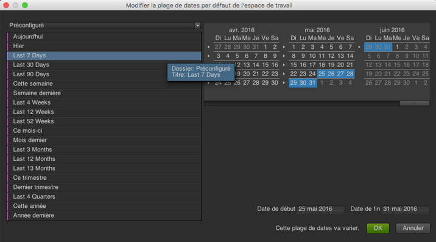

# Dates et plages de dates

Dans le calendrier, vous pouvez soit indiquer des dates ou des plages de dates, soit sélectionner un paramètre prédéfini. Vous pouvez effectuer des sélections dans le calendrier aux niveaux du projet, de l’espace de travail et du rapport. La période d’un projet correspond à la date par défaut. Cependant, la période d’un espace de travail remplace celle du projet. De même, la période d’un projet remplace les paramètres de date d’un espace de travail et d’un projet. Vous ne pouvez pas sélectionner une période en dehors de la plage de disponibilité de vos données.

## Dates et plages de dates {#concept_AB32765013F449908B5964AB622C75FF}

Dans le calendrier, vous pouvez soit indiquer des dates ou des plages de dates, soit sélectionner un paramètre prédéfini. Vous pouvez effectuer des sélections dans le calendrier aux niveaux du projet, de l’espace de travail et du rapport. La période d’un projet correspond à la date par défaut. Cependant, la période d’un espace de travail remplace celle du projet. De même, la période d’un projet remplace les paramètres de date d’un espace de travail et d’un projet. Vous ne pouvez pas sélectionner une période en dehors de la plage de disponibilité de vos données.

 L’option **[!UICONTROL Effacer la date]** activée indique qu’une période est spécifiée au niveau du rapport.

Vous pouvez également faire glisser des dates (et des dimensions Heure) dans le rapport ou le [!UICONTROL Générateur de tableau]. Vous pouvez sélectionner des jours, des semaines, des mois, des années ou une date variable. Si vous utilisez le calendrier personnalisé dans les Reports and Analytics marketing, une suite de rapports hérite de ces paramètres et met à jour le rapport en conséquence.

Lors de la sélection d’une période au cours de la création d’un projet, l’option Préconfigurée à gauche vous permettra de définir une date flottante, contrairement au calendrier à droite. La mention « Cette plage de dates va varier » en regard du bouton **[!UICONTROL OK]** vous permet de déterminer facilement si votre période est flottante.

> [!NOTE] Si vous avez besoin d’aide pour exécuter des rapports existants, contactez votre gestionnaire de compte.

## Tranches de dates héritées {#concept_53AA34DB3CE647608CAF4B41D6EAF45E}

Au second semestre 2010, Adobe a commencé à migrer les suites de rapports vers une plateforme de données unifiée en vue d’améliorer le traitement et le stockage des données. Les données qui existaient avant la migration sont considérées comme des données héritées (ou historiques) cantonnées à un trimestre ou à une année du calendrier.

<!-- 

c_legacy_data.xml

 -->

**Pour accéder à des tranches de dates historiques**

1. [Créez](/help/analyze/ad-hoc-analysis/c-getting-started.md) ou ouvrez un projet.
1. Ouvrez le [calendrier](/help/analyze/ad-hoc-analysis/c-dates.md), puis sélectionnez **[!UICONTROL Trimestre]** ou **[!UICONTROL Année]**.

> [!NOTE] Les tranches de dates historiques se limitent à un trimestre ou à une année. Vous ne pouvez pas afficher les données chevauchant la limite entre les tranches de dates héritées et la nouvelle plateforme de traitement. Ceci entraînerait une erreur. En outre, les périodes s’appliquent uniquement au calendrier grégorien, et non aux calendriers personnalisés.

