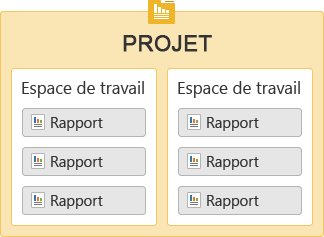
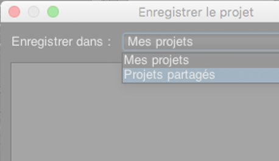

# Prise en main d’Ad Hoc Analysis {#concept_48936BA28FAE42DB81F1B2CD4726EB17}

>[!Important]
>Le 6 août 2018, Adobe a annoncé la prochaine fin de vie d’Ad Hoc Analysis, dont la date sera communiquée dès que possible. Pour plus d’informations, notamment sur les versions de Java compatibles durant cette période, voir [https://adobe.ly/discoverworkspace](https://adobe.ly/discoverworkspace).

Vous pouvez effectuer une analyse avancée instantanée de l’activité d’un site Web. Vous pouvez consulter plusieurs rapports simultanément et appliquer des segments sur plusieurs dimensions. Vous pouvez analyser les données du point de vue micro et macro afin de mesurer leur impact sur les mesures importantes d’un point de vue commercial.

Grâce à ces fonctionnalités, vous pouvez répondre aux questions sur le trafic du site, la répartition démographique des visiteurs, les recettes et les mouvements de produits. Vous pouvez ensuite filtrer, trier et segmenter les données afin de répondre à des questions précises. Les résultats sont pratiquement instantanés, ce qui permet d’analyser rapidement les effets d’une combinaison de différents facteurs.

<table id="table_C9C0444687FC418580F996E1D2ADB61A"> 
 <thead> 
  <tr> 
   <th colname="col1" class="entry"> Tâches de mise en route </th> 
   <th colname="col2" class="entry"> Description </th> 
  </tr> 
 </thead>
 <tbody> 
  <tr> 
   <td colname="col1"> 
1. Connexion à Adobe Analytics. 
 </td> 
   <td colname="col2"> 
Rendez-vous sur <a href="https://marketing.adobe.com"  >marketing.adobe.com</a> et connectez-vous à l’aide de vos informations d’identification Adobe Analytics. 
 </td> 
  </tr> 
  <tr> 
   <td colname="col1"> 
2. Lancement Ad Hoc Analysis. 
 </td> 
   <td colname="col2">Cliquez sur Adobe Analytics &gt; Outils &gt; Ad Hoc Analysis, puis sur le bouton Lancer Ad Hoc Analysis. 
 
Remarque : Si vous ne voyez pas le bouton <b>Lancer Ad Hoc Analysis</b> sur cette page, assurez-vous que l’administrateur vous a ajouté au groupe <i>Utilisateurs de la licence Ad Hoc Analysis</i> dans les outils d’administration. 
 
 </td> 
  </tr> 
  <tr> 
   <td colname="col1"> 
3. Création d’un projet. 
 </td> 
   <td colname="col2"> 
Sélectionnez une suite de rapports sur la page de démarrage, puis cliquez sur Créer un projet. 
 
Voir <a href="/help/analyze/ad-hoc-analysis/c-getting-started.md"   >Projets et espaces de travail</a>. 
 </td> 
  </tr> 
  <tr> 
   <td colname="col1"> 
4. Ouverture d’un rapport. 
 </td> 
   <td colname="col2"> 
Recherchez un rapport à l’aide du menu standard du rapport Marketing Cloud. Vous pouvez également choisir un modèle. 
 
Pour plus d’informations, voir <a href="/help/analyze/ad-hoc-analysis/c-getting-started.md"   >Modèles de rapport</a>. 
 </td> 
  </tr> 
  <tr> 
   <td colname="col1"> 
5. Configuration du rapport. 
 </td> 
   <td colname="col2"> 
Effectuez les tâches suivantes pour configurer des rapports : 
 
    <ul id="ul_0D2E8C614F2A4899A376BCEECEA374C6"> 
     <li id="li_FA925D52A8FD4DFAB0C88B797B24E72B"> Créer des segments afin d’effectuer une analyse plus approfondie des données </li> 
     <li id="li_5E91632551D2473BA8BD0637CDC1A9F6"> Ajouter des mesures, des dimensions et des segments au <a href="/help/analyze/ad-hoc-analysis/c-tablebuilder.md"   >Générateur de tableau</a> </li> 
     <li id="li_019316C9A94B4A8C8A77D07C04E50278">Configuration des <a href="/help/analyze/ad-hoc-analysis/c-dates.md"   >plages de dates</a> </li> 
     <li id="li_2B33B325D5EE420AB412B73AD1D231C5"> <a href="/help/analyze/ad-hoc-analysis/c-schedule.md"   > Planifier</a> l’envoi des rapports </li> 
    </ul> 
Parcourez ce système d’aide à la recherche des informations dont vous avez besoin. 
 </td> 
  </tr> 
 </tbody> 
</table>

## Configuration système recommandée {#concept_6691331B45174290BD9B839806A9B52D}

Bien que les rapports fonctionnent convenablement avec la plupart des navigateurs Web, leur apparence et leur fonctionnement sont optimisés sur les systèmes qui satisfont à certaines exigences.

<!-- 

c_sys_reqs.xml

 -->

> [!NOTE] À compter de juillet 2018, Ad Hoc Analysis ne prendra en charge que Java 8 ou version ultérieure. Si vous choisissez d’exécuter Ad Hoc Analysis sur Java 7 après la version de maintenance de juillet 2018, Adobe ne prendra plus en charge votre mise en œuvre d’Ad Hoc Analysis.

* Carte vidéo compatible avec OpenGL 2.0
* Cookies : obligatoires
* Système d’exploitation : Windows et Mac OS.
* Macromedia Flash Player : version 6 ou ultérieure
* Résolution du moniteur : 800 x 600 (résolution de 1 024 x 768 recommandée)
* Profondeur de couleur : 16 bits ou plus élevée
* JavaScript : activé
* Version Java : Java 1.7 ou version ultérieure (Voir la remarque ci-dessus)

   Si vous ne disposez pas de la version Java appropriée, le système l’installe automatiquement. Si la version de Java installée n’est pas compatible, les Ad Hoc Analysis téléchargent les mises à jour et vous invitent à les installer.

## Instructions de mise à niveau de Java {#section_E4C0C6492FF24636A0FF71A59331111D}

À compter de juillet 2018, Ad Hoc Analysis ne prendra en charge que Java 8 ou version ultérieure. Si vous choisissez d’exécuter Ad Hoc Analysis sur Java 7 après la version de maintenance de juillet 2018, Adobe ne prendra plus en charge votre mise en œuvre d’Ad Hoc Analysis.

Nos fichiers .jar sont protégés par un chiffrement sécurisé de 256 bits qui n’est pas pris en charge par les versions de Java antérieures à 1.7.0_76. Ce certificat 256 bits nous permet de vous offrir une sécurité optimale.

Si vous disposez toujours de Java 7, vous devez le mettre à niveau avant la version de maintenance de juillet 2018. Procédez comme suit :

* Si vous êtes autorisé à installer des programmes sur votre machine :

   1. Rendez-vous sur https://www.java.com.
   1. Cliquez sur **[!UICONTROL Téléchargement gratuit de Java]**.
   1. Cliquez sur **[!UICONTROL Accepter et lancer le téléchargement gratuit]**.
   1. Installez la dernière version de Java correspondant à votre système d’exploitation.

* Si vous **n’êtes pas** autorisé à installer des programmes sur votre machine :

   1. Contactez votre service informatique pour installer la dernière version de Java.

## Lancement des Ad Hoc Analysis {#concept_B1CE3C1E6D1A4311B9835BEB69812E55}

<!-- 

c_login.xml

 -->

Vous pouvez vous connecter à partir d’[!DNL Experience Cloud] ou d’une URL. Si vous vous connectez à partir des Reports and Analytics, vous êtes automatiquement connecté. La connexion à l’aide d’une URL est nécessaire seulement si vous accédez à l’URL des Ad Hoc Analysis à partir d’un autre emplacement, comme un lien ou un menu de favoris.

## Connexion à partir d’Experience Cloud {#task_128ED319F3AE49ED886EA3DFA8D0987F}

Procédure décrivant comment se connecter à partir d’[!DNL Experience Cloud].

<!-- 

t_login_suite.xml

 -->

1. Dans un navigateur, accédez à [!DNL marketing.adobe.com].
1. Entrez le nom de votre société et vos nom d’utilisateur et mot de passe. Cliquez ensuite sur **[!UICONTROL Se connecter]**.
1. Cliquez sur **[!UICONTROL Adobe Analytics]** > **[!UICONTROL Outils]** > **[!UICONTROL Ad Hoc Analysis]**.

   Si vous ne voyez pas le bouton **Lancer Ad Hoc Analysis** sur cette page, assurez-vous que l’administrateur vous a ajouté au groupe *Utilisateurs de la licence Ad Hoc Analysis* dans les outils d’administration.
1. Cliquez sur **[!UICONTROL Lancer Ad Hoc Analysis]**.
1. Enregistrez le fichier [!DNL discover.jnlp] en local.

   Vous pouvez exécuter ce fichier enregistré lorsque vous souhaitez lancer les Ad Hoc Analysis.

## Projets et espaces de travail {#concept_FAE346335B0347A192C6C806C775D72B}

Un projet définit le jeu de données importé, y compris une suite de rapports et une période. Il se compose d’un nombre indéterminé de rapports, avec tous leurs paramètres, mesures, dimensions et segments. Vous pouvez démarrer un nouveau projet, charger un projet enregistré ou charger le projet enregistré automatiquement.

<!-- 

c_projects.xml

 -->

Vous pouvez regrouper des rapports au sein d’un *espace de travail*. Un projet peut contenir plusieurs espaces de travail composés, à leur tour, de plusieurs rapports. La relation entre ces éléments se présente sous une forme imbriquée :

Vous ne pouvez ouvrir qu’un seul projet à la fois. Vous pouvez cependant ouvrir plusieurs espaces de travail dans un projet. Plusieurs rapports peuvent être ouverts dans chaque espace de travail.

La période par défaut d’un nouveau projet équivaut aux [!UICONTROL 90 derniers jours].

## Commencer un projet {#task_918A4539134E4E62B00486DCB8D3D403}

Cette procédure explique comment lancer un projet.

<!-- 

t_project_start.xml

 -->

1. Connectez-vous.
1. Ouvrez un projet enregistré ou cliquez sur **[!UICONTROL Créer un projet]**.
1. Recherchez un rapport ou sélectionnez un modèle.

## Ouvrir un espace de travail récemment enregistré {#task_DE4A54180BC24E9DAEC98E2171DC6B40}

Cette procédure explique comment ouvrir des espaces de travail récemment enregistrés.

<!-- 

t_recent_workspace.xml

 -->

1. Cliquez sur **[!UICONTROL Fichier]** > **[!UICONTROL Espace de travail récent]**.

   Vous pouvez ouvrir jusqu’à cinq espaces de travail récents. Les espaces de travail récents ne sont plus disponibles après la fermeture de la session.

## Partage de projets {#task_5911780D90164F3A8A677C8BC719750D}

Les projets partagés seront disponibles pour tous les utilisateurs des Ad Hoc Analysis dans l’entreprise.

<!-- 

t_share_projects.xml

 -->

1. Accédez à **[!UICONTROL Fichier]** > **[!UICONTROL Enregistrer sous]**.
1. Sélectionnez **[!UICONTROL Projets partagés]** dans le menu déroulant **[!UICONTROL Enregistrer dans :]**.

   

1. Cliquez sur **[!UICONTROL Enregistrer]** pour enregistrer le projet.

   Les projets partagés peuvent être ouverts en sélectionnant **[!UICONTROL Fichier]** > **[!UICONTROL Ouvrir]** > **[!UICONTROL Projets partagés]**.

   >[!NOTE]
   >
   >Vous pouvez supprimer vos propres projets partagés dans la boîte de dialogue permettant de partager des projets en sélectionnant un ou plusieurs projets.

## Renommer un espace de travail {#task_0DB177DD6DB54B7F9FE60A0B3FC7CFC3}

Cette procédure explique comment renommer un espace de travail.

<!-- 

t_rename_workspace.xml

 -->

1. Cliquez sur le nom de l’espace de travail avec le bouton droit de la souris.
1. Sélectionnez **[!UICONTROL Renommer l’espace de travail]**.
1. Entrez un nom, puis cliquez sur **[!UICONTROL OK]**.

## Ouverture d’un projet local {#task_1B3EF63A80C74776B24B99D80EAC74AC}

Procédure expliquant comment ouvrir une copie locale d’un projet.

<!-- 

t_open_local_project.xml

 -->

1. Cliquez sur **[!UICONTROL Fichier]** > **[!UICONTROL Ouvrir la copie locale]**.
1. Naviguez jusqu’au fichier local [!DNL .dproj], puis cliquez sur **[!UICONTROL Ouvrir]**.

## Modèles de rapport {#concept_370F674C5B4C45368731AA801C5A45F8}

Les modèles constituent les points de départ du type d’analyse que vous souhaitez effectuer. Un modèle peut être un canevas vierge (tel qu’un rapport Abandon ou Classement). Il peut également s’agir d’un rapport qui commence par des mesures et des dimensions par défaut.

<!-- 

c_templates.xml

 -->

Vous pouvez accéder à des modèles lors de la création d’un projet (**[!UICONTROL Fichier]** > **[!UICONTROL Nouveau projet]**) ou en ajoutant un espace de travail ou un rapport.

| Modèle | Description |
|--- |--- |
| Classement | Fournit un canevas vierge sur lequel vous pouvez construire un tableau. Par exemple, un rapport Pages classe les pages de votre site en fonction du trafic, tandis que le tableau détaillé affiche les pourcentages et valeurs numériques pour des mesures telles que Pages vues et Recettes. |
| Tendance | Ces rapports vous permettent d’examiner la tendance des conversions et des événements selon une granularité temporelle sélectionnée (Heure, Jour, Semaine, Mois, Trimestre ou Année) au cours d’une période de rapport. |
| Totaux | Rapport destiné aux décideurs qui affiche des chiffres essentiels. Il contient les données relatives aux recettes totales, aux pages vues et aux commandes. |
| Abandon | Ce modèle vous permet de créer un entonnoir qui affiche des taux de conversion et d’abandon entre des points de contrôle. Vous pouvez, par exemple, effectuer le suivi des points d’abandon d’un visiteur au cours d’un processus d’achat. |
| Flux | Affiche les chemins empruntés le plus souvent par les utilisateurs pour parcourir les pages, sections de site et serveurs. |
| Entonnoir de conversion | Affiche des pourcentages de conversion entre des événements de mesure spécifiques. Vous pouvez utiliser ces rapports pour connaître le nombre de clics publicitaires qui génèrent des ventes et le nombre d’unités vendues. |
| Analyse de site | Outil de cheminement de site en trois dimensions qui affiche le cheminement des visiteurs sur des pages et événements spécifiés. |
| Groupe d’orientation virtuel | Ce rapport sélectionne, de manière aléatoire, une visite parmi les autres et fournit de nombreuses informations à son sujet. Vous pouvez utiliser ce rapport pour créer des groupes d’orientation à partir de votre population de visiteurs. |

## Ouvrir un rapport {#task_0AC455CDA198497AA546622FB05F300D}

Vous pouvez ouvrir un rapport ou un modèle lors de la création d’un projet ou à partir d’un projet existant. Utilisez un modèle pour créer un rapport en partant de zéro.

<!-- 

t_reports_opening.xml

 -->

Plusieurs méthodes permettent d’ouvrir un rapport :

* Sur la page [!UICONTROL Nouveau rapport], recherchez un rapport ou sélectionnez un modèle.
* Cliquez sur **[!UICONTROL Rapports]** dans le menu, puis sélectionnez un rapport ou un modèle de rapport.
* Lancez un rapport à partir d’une dimension : cliquez sur le nom d’une dimension avec le bouton droit de la souris, puis sélectionnez **[!UICONTROL Exécuter le rapport]** > **`report name`**.
