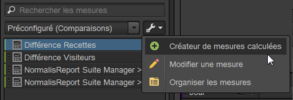

# Mesures

Les mesures sont des informations quantitatives sur l’activité des visiteurs, telles que les affichages, les clics publicitaires, les actualisations (ou rechargements), la durée moyenne de consultation, les dates, les unités, les commandes, les recettes, etc. Les mesures et les données associées s’affichent dans les colonnes des rapports.

## Mesures {#concept_46A67930CFDB4A078225C5B189688AF3}

Les mesures sont des informations quantitatives sur l’activité des visiteurs, telles que les affichages, les clics publicitaires, les actualisations (ou rechargements), la durée moyenne de consultation, les dates, les unités, les commandes, les recettes, etc. Les mesures et les données associées s’affichent dans les colonnes des rapports.

Les mesures standard incluent :

* **Trafic** : affiche des données concernant le volume des visiteurs.
* **Conversion** : affiche des données sur les événements de succès de votre site Web. Ces événements de succès peuvent inclure les achats, les téléchargements ou toute autre action que vous voulez amener les utilisateurs à effectuer.
* **Calculé** : mesures personnalisables créées en combinant d’autres mesures. Par exemple, vous pouvez créer une mesure qui soustrait le coût par mot-clé et le coût des produits des recettes pour obtenir les recettes nettes. Vous pouvez ensuite diviser ce montant par le nombre total de commandes pour calculer les recettes nettes moyennes par commande.

Voir les [définitions des mesures](https://docs.adobe.com/content/help/en/analytics/components/variables/metrics/metricslist.html) dans la *référence sur les analyses* pour en savoir plus sur la manière dont sont utilisées les mesures dans les produits [!DNL Experience Cloud].

You can use the [!UICONTROL Organize Metrics] tool to create new folders for your metrics. Vous pouvez ensuite grouper les mesures à votre gré. L’outil d’organisation vous permet de copier les mesures existantes dans vos dossiers personnalisés par simple glisser-déposer.

Lorsque vous créez des dossiers, nommez-les, puis organisez-y les mesures à votre gré. Vous ne pouvez pas modifier les dossiers par défaut, à l’exception des dossiers Favoris et Mesures calculées.

## Organisation des mesures {#task_17C844A9387042EAA9983E1E554846B1}

Procédure décrivant comment organiser les mesures et créer des dossiers de mesures.

<!-- 

t_organize_metrics.xml

 -->

1. Dans le volet [!UICONTROL Metrics] d’outils, cliquez sur **[!UICONTROL More Actions]**. ( 

   )
1. Cliquez sur **[!UICONTROL Organize Metrics]**.
1. Click **[!UICONTROL New]** to create a folder.
1. Sélectionnez les mesures dans d’autres dossiers, puis faites glisser la sélection vers le nouveau dossier.
1. Cliquez sur **[!UICONTROL OK]**.

   >[!NOTE]
   >
   >Lorsque vous supprimez un dossier, toutes les mesures qu’il contient sont supprimées du projet actuellement sélectionné.

## Ajout de mesures à un rapport {#task_747DD1718B3F4776B83A115D0BE8754C}

Procédure décrivant comment ajouter des mesures à un rapport.

<!-- 

t_add_metrics_dsc.xml

 -->

1. In the [!UICONTROL Metrics] tool pane, locate the metric.

   Vous pouvez localiser les mesures dans le champ de recherche ou en parcourant les dossiers de mesures.

1. Drag the metric to the report table or [!UICONTROL Table Builder].

   You may want to specify default metrics in [!UICONTROL Settings] in advance, if you want to reduce the need to repeatedly add metrics to a report.

   See [Ranked Tab - Definitions](/help/analyze/ad-hoc-analysis/c-global-settings.md#reference_FB9BADD7E3DA42C1BB2A02A6E9D5C1CF).

## Créateur de mesures calculées {#concept_F8E213CE786A43FB93847C5BA883A29C}

Le créateur de mesures calculées dans les Ad Hoc Analysis est désormais lié aux mesures calculées unifiées d’Analytics. Son interface utilisateur est similaire au créateur de mesures calculées d’Analytics.

<!-- 

c_calc_metric_builder.xml

 -->

Pour plus d’informations sur la création et la gestion des mesures calculées, consultez le [guide des mesures calculées](https://docs.adobe.com/content/help/fr-FR/analytics/components/calculated-metrics/cm-overview.html).

Procédez comme suit pour accéder au créateur de mesures calculées dans les Ad Hoc Analysis :

1. Dans le [!UICONTROL Metrics] volet, cliquez sur **[!UICONTROL More Options]**, puis **[!UICONTROL Calculated Metrics Builder]**.

   

1. L’interface du créateur de mesures calculées vous permet de glisser-déposer des mesures, des segments et des fonctions afin de créer vos mesures personnalisées :

   

