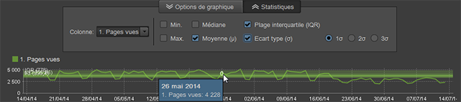

# Rapports - Aperçu

Les rapports standard affichent des données relatives à l’activité du site Web et des visiteurs, des schémas de trafic, des données de référence, des campagnes publicitaires, des données sur la fidélisation des visiteurs, des données de produit, etc. Vous pouvez exécuter des rapports et accéder ensuite à des outils pour configurer des segments, des mesures et des comparaisons de rapport.

## Rapports - Aperçu {#concept_41459A705F2048EEA4EFA80F6BD9FFAB}

Les rapports standard affichent des données relatives à l’activité du site Web et des visiteurs, des schémas de trafic, des données de référence, des campagnes publicitaires, des données sur la fidélisation des visiteurs, des données de produit, etc. Vous pouvez exécuter des rapports et accéder ensuite à des outils pour configurer des segments, des mesures et des comparaisons de rapport.

Vous pouvez rassembler des données personnalisées pour créer des rapports plus spécifiques à votre site web. Si, par exemple, votre site web dispose d’une fonction de recherche, vous pouvez suivre les termes de recherche soumis et créer un rapport contenant ces termes et les résultats des recherches.

Le jeu de rapports standard porte sur des sujets communs à tous les sites web. Voici un aperçu des rapports :

* Données de site web
* Données relatives aux visiteurs
* Schémas de trafic
* Données relatives aux référents
* Campagnes publicitaires
* Rétention des visiteurs
* Informations sur les produits

Si vous utilisez des Reports and Analytics marketing, les types de rapports et les menus seront familiers. Les Ad Hoc Analysis classent les rapports en fonction des types suivants :

**Rapports récapitulatifs**

Inclut des rapports, tels que [!UICONTROL Totaux], qui affichent des données d’aperçu rapide. Ces rapports sont destinés aux cadres qui veulent accéder à une vue d’ensemble des données.

**Rapports de conversion**

Les rapports de conversion fournissent une analyse exhaustive, précise et détaillée de l’activité des clients. Les mesures proposées (gestion des campagnes, cycle de ventes, abandons et conversions de clients, par exemple) vous permettent de mesurer les transactions de commerce électronique, les sources des ventes, l’efficacité de la publicité, la fidélité de la clientèle, etc.

**Rapports sur le trafic**

Les rapports sur le trafic vous donnent une vue détaillée des visiteurs et de la façon dont ils interagissent avec votre site Web.

* d’analyser les aspects critiques du comportement des visiteurs ;
* de surveiller et de comprendre les schémas de trafic ;
* de déterminer quel est le contenu le plus populaire du site ;
* de segmenter les visiteurs en fonction de critères mesurables.

## Campagnes {#concept_A407CDF1D4AA49BAB396A1666E67FC87}

Affichent des informations sur l’efficacité de vos efforts publicitaires. Ils identifient les types d’initiatives publicitaires qui suscitent le plus de trafic et les employés chargés de mener à bien ces initiatives.

<!-- 

c_reports_campaigns.xml

 -->

Ces rapports sont généralement personnalisés et diffèrent par conséquent d’un analyste à l’autre. Pour plus d’informations, voir [Gestionnaire de campagnes](https://marketing.adobe.com/resources/help/en_US/reference/campaign_manager_admin.html) dans l’aide d’[!DNL Admin Console].

## Calculs statistiques {#concept_83FF70DB7895435E985699FE9012D585}

Vous pouvez personnaliser les statistiques par défaut pour qu’elles s’affichent dans un rapport de classement.

<!-- 

c_Statistical_Calculation_ad_hoc.xml

 -->

D’autres calculs statistiques par défaut peuvent être ajoutés aux rapports de classement pour qu’ils s’affichent lors de l’exécution des rapports, notamment la moyenne, la médiane, l’écart type et d’autres calculs mathématiques pour répondre à vos besoins spécifiques en matière de rapport.

**Pour ouvrir les calculs statistiques pour les rapports de classement :**

1. Select **[!UICONTROL Tools]** &gt; **[!UICONTROL Ranked]** from the menu.

1. Sélectionnez **[!UICONTROL Paramètres]**.
1. Sélectionnez **[!UICONTROL Statistiques par défaut]**.

**[!UICONTROL Ignorer les zéros dans les calculs statistiques]**. Sélectionnez cette option pour ignorer les zéros et veiller à ce que les moyennes déjà calculées ne soient pas modifiées par l’ajout d’une autre mesure. Toutes les statistiques sont concernées par ce paramètre (il n’a toutefois aucun effet sur la fonction Somme).

| Calcul | Description |
|--- |--- |
| Max | Identifie la valeur la plus grande dans toutes les lignes d’un jeu de données spécifié. |
| min | Identifie la valeur la plus petite dans toutes les lignes d’un jeu de données spécifié. |
| Somme | Calcul de toutes les valeurs de chaque ligne du jeu de données.  Par exemple, la somme agrège toutes les visites par visiteur plutôt que de comptabiliser le visiteur qu’une seule fois (indépendamment du nombre de visites). Il s’agit d’un total des points de données collectés. |
| Moyenne | Il s’agit de la moyenne arithmétique des valeurs des lignes d’un jeu de données. Elle est calculée en divisant la somme par le nombre (somme/nombre). La moyenne est influencée par des données éloignées, contrairement à la médiane qui est généralement utilisée pour des répartitions obliques. |
| Écart type | L’écart type montre l’écart qu’il existe par rapport à la moyenne attendue. Un écart type moins élevé indique que les points de données sont proches de la moyenne. Un écart type plus élevé indique que les points de données sont répartis dans une grande plage de valeurs. |
| Médiane | La médiane correspond à la valeur numérique qui sépare la moitié supérieure des données à la moitié inférieure pour les lignes d’un jeu de données. Contrairement à la moyenne, la médiane est généralement utilisée pour éviter les valeurs éloignées. |
| Quartiles | Un quartile est un ensemble de valeurs d’un jeu de données qui est identifié par trois points qui divisent le jeu de données en quatre groupes égaux, chacun comprenant un quart du jeu de données. Le premier quartile est le 25ème percentile et le troisième quartile, le 75ème percentile. (Le second quartile est la médiane et le quatrième quartile est la somme.) |
| Nombre | Renvoie le nombre de lignes d’un jeu de données. |

## Exemple de moyenne par rapport aux calculs des totaux d’une mesure {#section_7C49196503964FB0A429FA347BC92D09}

La fonction Moyenne utilise le même calcul que dans les colonnes de données de Microsoft Excel. Cela signifie que la **moyenne** d’un ratio (lors de la détermination du taux de rebond moyen, par exemple) correspond à la moyenne des ratios et non au ratio des moyennes. Le ratio des moyennes inclut le **total** de la mesure de taux de rebond.

<table id="table_9EC56B15C6A340DA8917CB0DBCAC2355"> 
 <thead> 
  <tr> 
   <th colname="col1" align="center" class="entry"> Date </th> 
   <th colname="col2" align="center" class="entry"> Visites uniques </th> 
   <th colname="col3" align="center" class="entry"> Entrées </th> 
   <th colname="col4" align="center" class="entry"> Taux de rebond </th> 
   <th colname="col5" align="center" class="entry"> </th> 
  </tr>
 </thead>
 <tbody> 
  <tr valign="top"> 
   <td colname="col1"> 
Juin 2013 
 
Juillet 2013 
 
Août 2013 
 </td> 
   <td colname="col2" align="center"> 
344 
 
297 
 
41 
 </td> 
   <td colname="col3" align="center"> 
1000 
 
1000 
 
1000 
 </td> 
   <td colname="col4" align="center"> 
34.4% 
 
29.7% 
 
41.0% 
 </td> 
   <td colname="col5"> </td> 
  </tr> 
  <tr valign="top"> 
   <td colname="col1" align="center" valign="middle"><b>Moyenne</b> </td> 
   <td colname="col2" valign="middle"> (344+297+41)/3 </td> 
   <td colname="col3" valign="middle"> (1000+1000+100)/3 </td> 
   <td colname="col4" valign="middle" align="right"> (34.4 + 29.7 + 41.0) / 3 = <b>35.0</b>% </td> 
   <td colname="col5" valign="middle"><b>Moyenne des ratios</b> </td> 
  </tr> 
  <tr valign="top"> 
   <td colname="col1" align="center" valign="middle"><b>Total de la mesure</b> </td> 
   <td colname="col2" valign="middle"> 682 </td> 
   <td colname="col3" valign="middle"> 2100 </td> 
   <td colname="col4" valign="middle" align="right"> 682 / 2100 = <b>32.0</b>% </td> 
   <td colname="col5" valign="middle"><b>Ratio des moyennes</b> </td> 
  </tr> 
 </tbody> 
</table>

## Superpositions de calculs statistiques {#concept_97E1B32DAC734C7B9F8899717283CEEC}

Les Ad Hoc Analysis fournissent désormais des visualisations superposées des calculs statistiques pour les rapports qui affichent des données au fil du temps (minutes, heures, jours, semaines). 

<!-- 

c_overlay_calculations.xml

 -->

Dans un rapport qui identifie les données sur une période donnée, le bouton **[!UICONTROL Statistiques]permet de sélectionner des calculs qui s’affichent sous forme de superpositions dans la chronologie du rapport.**

In addition to standard [Statistical Calculations](/help/analyze/ad-hoc-analysis/c-overview-standard-reports.md#concept_83FF70DB7895435E985699FE9012D585), you can select the 1st, 2nd, and 3rd standard deviations in the overlays.

## Gestionnaire de groupe {#concept_E1433974A61144858E87334C006982B2}

Rather than using a single page in a report, you can group multiple pages and use them as categories for starting, intermediate, or destination location in the [!UICONTROL Fallout] and [!UICONTROL Site Analysis] reports. Vous pouvez modifier les groupes à partir du menu principal ou du rapport. Les catégories que vous avez créées dans les Reports and Analytics marketing apparaissent également dans la liste [!UICONTROL Sélecteur de points de contrôle].

<!-- 

c_groups.xml

 -->

Click **[!UICONTROL Tools]** &gt; **[!UICONTROL Group Manager]**.
