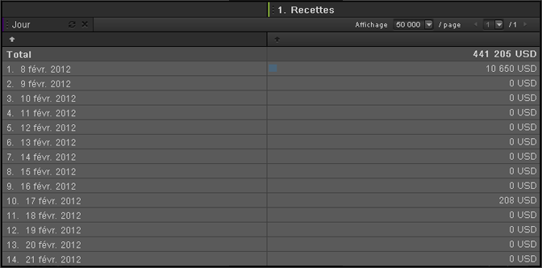

# Heure

Heure est une dimension de rapport qui s’avère particulièrement utile pour établir des tendances sur diverses unités de temps : heures, jours, semaines et plages de dates. Par exemple, un rapport Produits affiche les recettes générées par un produit au cours de la période sélectionnée. Vous pouvez ajouter une dimension Jour afin d’afficher la tendance pour chaque jour de la période de rapport. Les options de granularité disponibles pour cette dimension sont : Heure, Jour, Semaine, Mois, Trimestre et Année. Les plages de dates prédéfinies sont notamment Aujourd’hui, Hier et 7 derniers jours.

## Heure {#concept_CB64A0A2150C471FB0B0B42516905887}

Heure est une dimension de rapport qui s’avère particulièrement utile pour établir des tendances sur diverses unités de temps : heures, jours, semaines et plages de dates. Par exemple, un rapport Produits affiche les recettes générées par un produit au cours de la période sélectionnée. Vous pouvez ajouter une dimension Jour afin d’afficher la tendance pour chaque jour de la période de rapport. Les options de granularité disponibles pour cette dimension sont : Heure, Jour, Semaine, Mois, Trimestre et Année. Les plages de dates prédéfinies sont notamment Aujourd’hui, Hier et 7 derniers jours.

Pour ajouter des dimensions Heure, faites glisser une ou plusieurs plages de dates depuis le volet de l’outil Heure vers le tableau du rapport ou le Générateur de tableau.

Cet exemple affiche une dimension Jour de type Tendance, accompagnée de recettes.

## Heure - Définitions {#reference_6E718B78E437438E825DB9262086A987}

Le panneau Heure vous permet de sélectionner des périodes et des tendances prédéfinies, puis de faire glisser vos sélections vers le [!UICONTROL Générateur de tableau] ou la grille de rapport.

<!-- 

r_time_panel.xml

 -->

| Champ | Définition |
|--- |--- |
| Plages de dates | Ce champ vous permet de sélectionner une ou plusieurs périodes et de (la) les faire glisser vers le Générateur de tableau ou la grille de rapport. Vous pouvez visualiser les périodes sous la forme de ventilations dans des lignes ou sous la forme d’en-têtes de colonne. Vous pouvez sélectionner des périodes telles que Jour, Semaine et Mois, ou opter pour des plages de dates personnalisées. Si vous utilisez un calendrier personnalisé dans SiteCatalyst, votre suite de rapports hérite de ces paramètres. |
| Suivi des tendances | Permet d’effectuer un suivi des tendances couvrant une heure, un jour, une semaine, un mois, etc. Lorsque vous faites glisser des éléments du champ Suivi des tendances vers le rapport, vous visualisez les données selon un paramètre temporel qui est déterminé par la plage de dates spécifiée dans le calendrier. |
