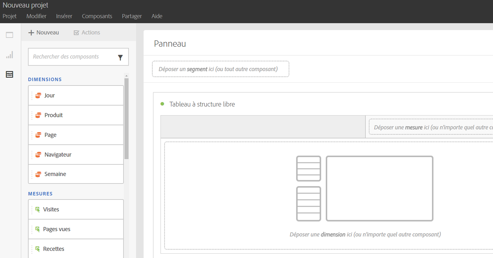
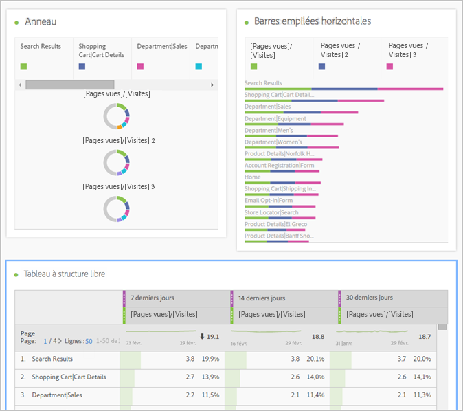
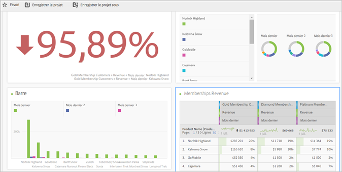
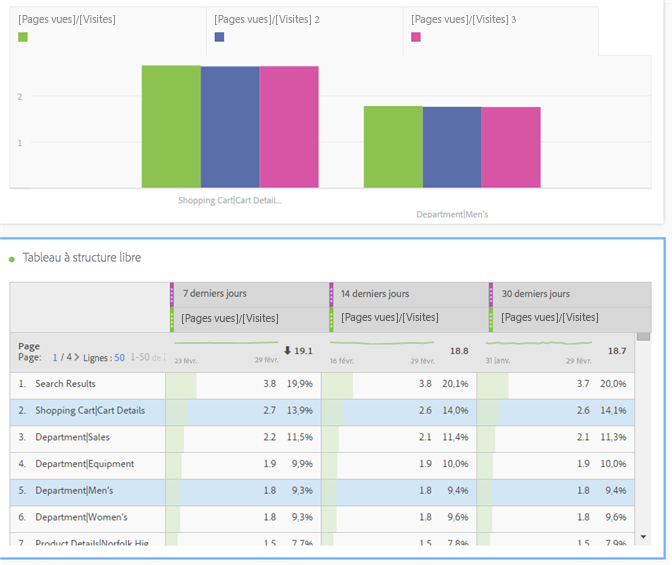
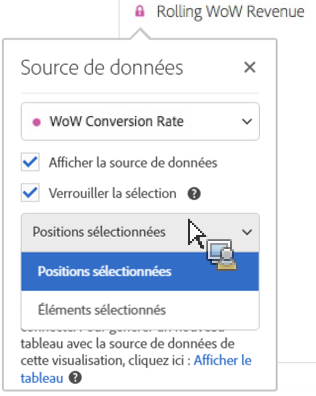
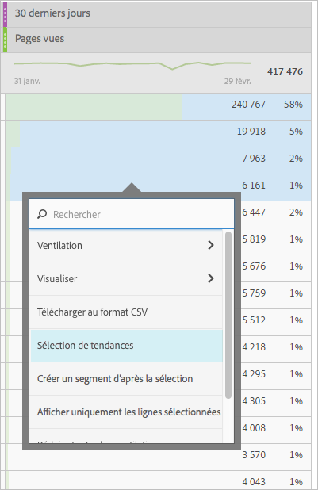
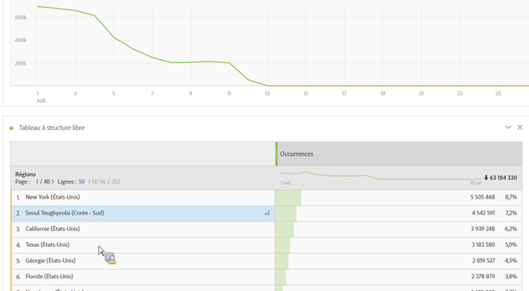
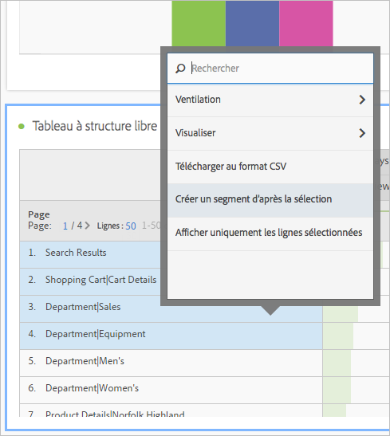
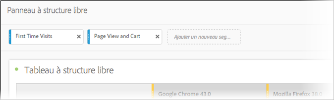

# Aperçu d’Analysis Workspace

Analysis Workspace élimine toutes les limites courantes d’un rapport Analytics unique. Il offre un canevas robuste et souple permettant de créer des projets d’analyses personnalisés. Faites glisser des tableaux de données, des visualisations et des composants (dimensions, mesures, segments et granularités temporelles) sur un projet. Créez instantanément des ventilations et des segments, des cohortes pour analyse, ainsi que des alertes, comparez des segments, analysez les flux et les abandons, et traitez et planifiez les rapports pour les partager avec n’importe qui dans votre entreprise.

**[!UICONTROL Analytics]** &gt; **[!UICONTROL Workspace]**

## Vidéo de présentation {#section_B99BF8A326D94ECB91BD69C9888AD10C}

>[!VIDEO](https://www.youtube.com/watch?v=IHOy-QsvVcA)

Vous trouverez [ici](https://www.youtube.com/playlist?list=PL2tCx83mn7GuNnQdYGOtlyCu0V5mEZ8sS) la liste complète de sélections YouTube.

>[!NOTE]
>
>Voir [Nouveautés d’Analysis Workspace](/help/analyze/analysis-workspace/new-features-in-analysis-workspace.md) pour des mises à jour des fonctionnalités.

## Contrôle complet des éléments et des composants de projet {#section_B7E3EDA3EDEE407D833F4FDB69646EEC}

Analysis Workspace offre liberté et flexibilité :

* Faire glisser des composants (dimensions, mesures, segments et granularités temporelles)
* Faire glisser plusieurs visualisations sur le projet
* Déplacer, redimensionner et empiler des visualisations à l’emplacement de votre choix dans un projet

Voir [Création d’un projet Analysis Workspace](/help/analyze/analysis-workspace/build-workspace-project/t-freeform-project.md) pour en savoir plus.

## Visualisations multiples dans un projet {#section_B7670740C2D44130B21DAF0873280DA5}

Faites glisser autant de visualisations que vous le souhaitez sur un projet.

Créez un projet indiquant le pourcentage de modifications, avec plusieurs visualisations correspondant aux cellules dans un tableau de données à structure libre.

Voir [Création d’un projet Analysis Workspace](/help/analyze/analysis-workspace/build-workspace-project/t-freeform-project.md) pour en savoir plus.

## Intra-liens vers les panneaux et les visualisations {#section_253EA04E067F4A29A8B54CE2B7631086}

En plus des capacités de [modification de texte enrichi](/help/analyze/analysis-workspace/visualizations/text.md) d’Analysis Workspace, vous pouvez insérer des liens vers des panneaux et des visualisations spécifiques dans un projet depuis une zone de texte, par exemple pour créer une table des matières d’un projet. Ces liens peuvent être partagés comme n’importe quel lien de projet, afin de rediriger un utilisateur vers une visualisation ou un panneau spécifique au sein d’un projet. De nouvelles options contextuelles, nommées « Obtenir un lien vers le panneau » et « Obtenir un lien vers la visualisation », ont été ajoutées. Pour ajouter des intra-liens à votre projet, procédez comme suit :

1. Faites glisser une visualisation de texte dans un projet, par exemple près d’une visualisation ou d’un tableau auquel il convient d’ajouter davantage de contexte.
1. Renseignez la zone de texte avec, par exemple, une table des matières, puis surlignez un élément à lier à un panneau ou à une visualisation, par exemple les mesures de succès.

   

1. Accédez à ce panneau ou à cette visualisation, puis cliquez avec le bouton droit sur son en-tête.
1. Faites défiler l’écran et sélectionnez **[!UICONTROL Obtenir un lien vers le panneau]** ou **[!UICONTROL Obtenir un lien vers la visualisation]** :

   

1. Copiez ce lien, puis ajoutez-le au lien hypertexte Mesures de succès dans la visualisation de texte. Cliquez sur la coche pour enregistrer le texte.

Quand un utilisateur clique sur un lien, les panneaux ou visualisations réduits dans le projet sont agrandis afin d’être visibles.

> [!NOTE] Cette option est disponible également depuis l’option contextuelle **[!UICONTROL Modifier la description]**.

## Lien vers d’autres projets {#section_AE886C367C3E4F189B65B1BD9BCDBD8C}

Pour renvoyer les utilisateurs vers d’autres projets susceptibles de les intéresser, sélectionnez **[!UICONTROL Partager]** &gt; **[!UICONTROL Obtenir le lien du projet]**, puis incorporez ce lien dans les descriptions du projet, par exemple.

## Visualisation dynamique des cellules sélectionnées {#section_182CEC285E4547EBA4608D5F70C9D5D7}

Sélectionnez des cellules individuelles et observez les visualisations changer dynamiquement. [Synchronisez et verrouillez](/help/analyze/analysis-workspace/analysis-workspace-features.md#section_9D66A001586F49CEB0C565581E44957C) une visualisation avec les cellules sélectionnées.

## Verrouillage d’éléments ou de positions sélectionnés {#section_9D66A001586F49CEB0C565581E44957C}

Verrouillez les visualisations pour contrôler quelles sources de tableaux de données à structure libre correspondent aux visualisations.

Voir [Gestion des sources de données](/help/analyze/analysis-workspace/visualizations/t-sync-visualization.md).

## Visualisations des tendances d’après les cellules sélectionnées {#section_34930C967C104C2B9092BA8DCF2BF81A}

Créez une visualisation d’après les cellules sélectionnées (clic droit &gt; **[!UICONTROL Sélection de tendances]**).

Les sélections de tendances sont maintenant **liées** au tableau ci-dessous, de sorte que si vous sélectionnez une autre ligne du tableau, le tableau des tendances reflétera cette ligne.

## Dimensions et ventilations d’éléments de dimension {#section_1380C1F9E51E4BFB8C5D35E7A53BC70D}

En tant que détaillant, vous pouvez approfondir davantage encore l’analyse de vos campagnes afin de comprendre comment mieux mobiliser vos clients. Ventilez vos données de différentes manières en fonction de vos besoins ; créez des requêtes à l’aide de mesures, de dimensions, de segments, de chronologies pertinentes et autres valeurs de ventilation d’analyse.

Voir [Ventilation des dimensions](/help/analyze/analysis-workspace/components/dimensions/t-breakdown-fa.md).

## Segments des sélections de tableaux {#section_73BC3688089B426D969B3D5B606DA970}

Sélectionnez des cellules du tableau à structure libre et créez un segment d’après la sélection.

Comparez plusieurs segments et créez et appliquez instantanément des segments. Vous pouvez appliquer plusieurs segments afin de vous focaliser sur des clients spécifiques d’après leur comportement et leur interaction, puis les comparer et les contraster.

Déposez un segment sur le panneau d’analyse à structure libre au niveau du projet ; le segment est alors appliqué au projet entier.

Voir [Segments](/help/analyze/analysis-workspace/components/t-freeform-project-segment.md).

## Balisage des projets et des composants {#section_F54D688132A541F2982326D5E022B90D}

Vous pouvez appliquer des balises aux projets et aux composants dans Analysis Workspace :

* Appliquez ou créez des balises au niveau du projet dans le panneau Informations. (

* Cliquez avec le bouton droit de la souris sur ces composants pour les baliser (ou créez des balises) à partir du panneau Composants.
* Utilisez le caractère # dans le champ Rechercher pour localiser les balises.

## Actions des composants {#section_CBF4D0A5F63E4B0883077B8D852B800B}

Dans le menu Actions, vous réalisez les actions au niveau du composant en haut du rail gauche des composants. Sélectionnez un composant, puis cliquez sur **[!UICONTROL Actions]** pour afficher les actions.

| Action des composants | Description |
|--- |--- |
| Baliser | Organisez ou gérez les composants en leur appliquant des balises. Il apparaît ensuite dans le gestionnaire de composants correspondant, par exemple : Analytics &gt; Composants &gt; Segments ou Analytics &gt; Composants &gt; Projets. |
| Favori | Ajoutez le composant à votre liste de favoris. Il apparaît ensuite dans le gestionnaire de composants correspondant, par exemple : Analytics &gt; Composants &gt; Segments ou Analytics &gt; Composants &gt; Projets  . |
| Approuver | Approuvez le composant pour le rendre canonique. Il apparaît ensuite dans le gestionnaire de composants correspondant, par exemple : Analytics &gt; Composants &gt; Segments ou Analytics &gt; Composants &gt; Projets. |
| Partager | S’applique seulement aux segments. |
| Supprimer | S’applique seulement aux segments. |

Voir [Visualisations](/help/analyze/analysis-workspace/visualizations/freeform-analysis-visualizations.md) pour en savoir plus.

## Descriptions d’autres fonctions {#section_5F06AE43C0194CFDBCA7EE0EA3C30B05}

**Ce que vous pouvez faire glisser et empiler**

Composants

* Dimensions
* Segments
* Mesures
* Périodes
* Granularités temporelles (heure, jour, semaine, etc.).

**Tableaux à structure libre et visualisations multiples**

Aucune limite technique ne restreint le nombre de tableaux à structure libre et de visualisations que vous pouvez ajouter au panneau. Vous pouvez également exécuter une nouvelle visualisation (ou l’exporter au format CSV) pour chaque tableau à structure libre ou la sélection de lignes d’un tableau.

**Organisation, tri et copie des colonnes**

* Paramètres prédéfinis de tri des plages de dates (ne comprennent pas les plages de dates personnalisées).
* Ctrl (ou Commande) + clic + faire glisser une colonne copie la colonne ; quand vous faites glisser la copie, elle est collée à ce nouvel emplacement dans le tableau.

Pour en savoir plus, voir [Touches de raccourci disponibles dans Analysis Workspace](/help/analyze/analysis-workspace/build-workspace-project/fa-shortcut-keys.md).

**Sélections et actions**

Sélectionnez des lignes et des colonnes comme vous le faites dans Excel. Puis agissez sur ces sélections. Par exemple :

* créez des visualisations des sélections ;
* copiez-les dans le Presse-papiers (Ctrl ou Commande + C) ;
* ventilez plusieurs lignes sélectionnées : sélectionnez des lignes puis faites glisser une dimension sur la sélection. Ou cliquez avec le bouton droit de la souris sur la sélection et utilisez le menu Ventilation.

**Enregistrement automatique et modifications non enregistrées**

Vous serez invité à enregistrer vos modifications si vous tentez de fermer le navigateur (ou utilisez le bouton Retour) alors que le projet n’a pas été enregistré. En cas de plantage du système, vous recevrez au chargement du projet une alerte vous invitant à le restaurer à son état antérieur.

Les projets existants (qui ne sont pas nouveaux) s’enregistrent automatiquement seulement en cas de blocage du navigateur ou dans d’autres circonstances, quand vous n’avez pas eu l’occasion de les enregistrer.

**Toutes les visites**

Un segment par défaut propre à Analysis Workspace. *`All Visits`* présente les totaux correspondant aux composants que vous avez ajoutés au tableau.

**Mesures calculées**

Utilisez les calculs de la même façon que vous utilisez les mesures standard.

Voir [Mesures calculées](https://marketing.adobe.com/resources/help/en_US/analytics/calcmetrics/).
