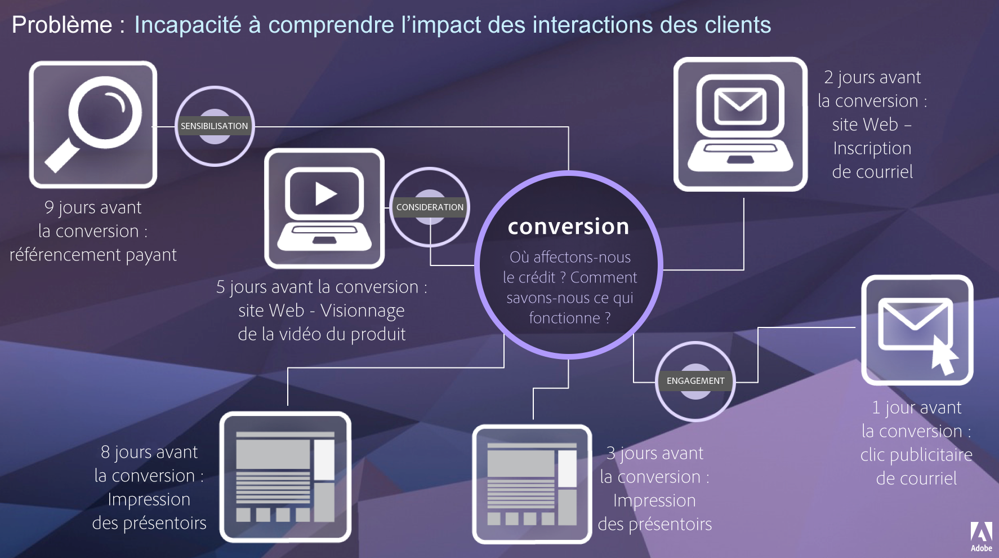

# Attribution IQ

L’Attribution IQ est un ensemble de fonctionnalités d’Adobe Analytics qui fournit des informations supplémentaires sur la manière dont les efforts de marketing contribuent à une conversion.

Un parcours client donné n’est pas linéaire et est souvent imprévisible. Chaque client a son propre rythme. Il lui arrive souvent de revenir sur ses pas, de s’arrêter, de redémarrer ou d’adopter un autre comportement non linéaire. En raison de ces actions organiques, il est difficile de connaître l’impact des efforts marketing tout au long du parcours client. Cela complique également les efforts visant à relier plusieurs canaux de données.

L’Attribution IQ d’Adobe Analytics permet aux équipes de renseignement modernes de comprendre comment un engagement significatif se manifeste tout au long du parcours client, en identifiant les points d’inflexion qui amènent les clients à cibler les résultats. Une compréhension de cet aspect du parcours client optimise efficacement les initiatives de marketing.

Adobe Analytics améliore l’attribution en vous permettant de :

* définir l’attribution à des médias autres que ceux achetés : tout canal, dimension, mesure ou événement peut être appliqué aux modèles (par exemple, recherche interne) et pas seulement aux campagnes marketing ;
* utiliser la comparaison illimitée de modèles d’attribution : comparez dynamiquement autant de modèles que vous le souhaitez ;
* éviter les changements de mise en œuvre : avec le traitement de la période de rapport et les sessions contextuelles, le contexte du parcours client peut être intégré et appliqué lors de l’exécution ;
* construire la session qui correspond le mieux à votre scénario d’attribution ;
* ventiler l’attribution par segments : comparez facilement la performance de vos canaux marketing sur n’importe quel segment important (par exemple, les nouveaux clients par rapport aux clients réguliers, le produit X par rapport au produit Y, le niveau de fidélité ou la valeur vie client (CLV)) ;
* inspecter le croisement des canaux et l’analyse multi-touch : utilisation des histogrammes et diagrammes de Venn ainsi que des résultats de l’attribution des tendances ;
* analyser visuellement des séquences marketing importantes : explorez les chemins d’accès qui ont mené à la conversion sur le plan visuel par le biais de visualisations à plusieurs nœuds de flux et d’abandons ;
* créer des mesures calculées : utilisez n’importe quel nombre de méthodes d’attribution.

## Fonctionnalités {#features}

Attribution IQ propose les fonctionnalités suivantes :

* [Panneau Attribution :](c-panels/attribution/attribution.md)
