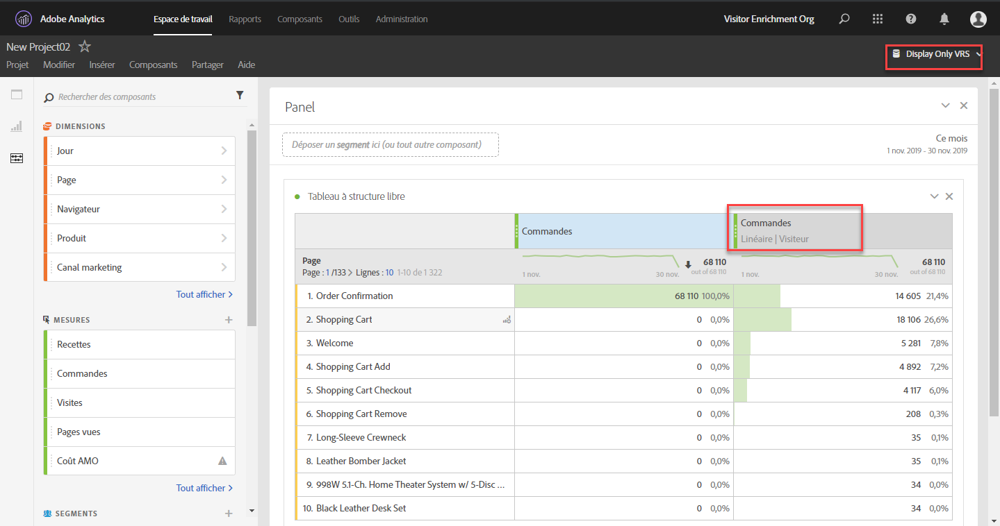

# FAQ sur l’Attribution

+++## Qu’est-ce que l’élément de ligne « Aucun » lors de l’utilisation de l’attribution ?

L’élément de ligne « Aucun » est un élement fourre-tout qui représente toutes les conversions survenues sans points de contact dans l’intervalle de recherche en amont. Pour réduire le nombre de conversions attribuées à l’élément de ligne « Aucun », essayez d’utiliser un intervalle de recherche en amont personnalisé avec une période de recherche en amont plus longue.

+++

+++## Pourquoi est-ce que je vois parfois des dates hors de mon créneau de rapport lors de l’utilisation de modèles d’attribution ?

Certaines mesures basées sur les visites, telles que les [entrées](/help/components/metrics/entries.md) ou le [taux de rebond](/help/components/metrics/bounce-rate.md), peuvent attribuer des données à une période antérieure à celle du créneau du compte rendu des performances. Cette situation est due aux modèles d’attribution qui utilisent une période de recherche arrière, ce qui détermine jusqu’où l’attribution doit remonter pour créditer les mesures. Le scénario le plus courant se produit lorsque les visites englobent minuit. Par exemple :

1. Un utilisateur visite votre page d’accueil le 7 septembre à 23 h 55.
1. Il consulte plusieurs pages, et la dernière consultation a lieu le 8 septembre à 00 h 05.
1. Une semaine plus tard, vous lancez un rapport de tendance quotidienne sur une période allant du 8 au 14 septembre.

Les mesures basées sur les accès, telles que les [pages vues](/help/components/metrics/page-views.md), produiraient la sortie attendue : les tendances de données quotidiennes du 8 au 14 septembre. Cependant, les mesures basées sur les visites afficheraient également la visite du 7 septembre ci-dessus. L’entrée attribuée à la visite s’est produite le 7 septembre et la période de recherche arrière est, par défaut, comprise entre le 1er et le 31 septembre.

Dans cet exemple, le taux de rebond affiche toujours 0 % le 7 septembre. Cette mesure est définie sous la forme `Bounces divided by Entries`, une mesure basée sur les accès divisée par une mesure basée sur les visites. Les rebonds se composent d’une seule demande d’image, de sorte qu’ils ne peuvent pas s’étendre sur plusieurs jours. Les rebonds du 7 septembre se sont produits en dehors du créneau du compte rendu des performances, provoquant ainsi le taux de rebond garanti de 0 % pour cette journée. D’autres mesures basées sur les accès afficheraient également 0 pour le 7 septembre dans ce rapport, puisque ces accès ne se trouvent pas non plus dans le créneau du compte rendu des performances.

Prenons un autre exemple semblable. La seule différence entre l’exemple suivant et celui ci-dessus se trouve au niveau des dates :

1. Un utilisateur visite votre page d’accueil le 31 août à 23 h 55.
1. Il consulte plusieurs pages, et la dernière consultation a lieu le 1er septembre à 00 h 05.
1. Une semaine plus tard, vous lancez un rapport de tendance quotidienne sur une période allant du 1er au 7 septembre.

Dans cet exemple, les entrées et le taux de rebond n’afficheraient pas les données du 31 août. La période de recherche arrière et le créneau du compte rendu des performances démarrent tous les deux le 1er septembre, de sorte que les données ne peuvent pas être attribuées à partir du 31 août.

+++

+++## Quand dois-je utiliser une recherche en amont de l’attribution de visites, de visiteurs et visiteuses ou personnalisée ?

Le choix d’une recherche en amont de l’attribution dépend de votre cas d’utilisation. Si les conversions prennent généralement plus longtemps qu’une visite unique, une recherche en amont des visiteurs ou personnalisée est recommandée. Pour les cycles de conversion plus longs, il est préférable d’utiliser des intervalles de recherche en amont personnalisés, car ce sont les seuls types qui permettent d’extraire des données avant le créneau de rapport.

+++

+++## Comment les props et les eVars se comparent-ils lors de l’utilisation de l’attribution ?

L’attribution est recalculée au moment de l’exécution du rapport. Il n’y a donc aucune différence entre prop et eVar (ou toute autre dimension) pour la modélisation d’attribution. Les props peuvent persister à l’aide de n’importe quel intervalle de recherche en amont ou modèle d’attribution, et les paramètres d’attribution/expiration des eVars sont ignorés.

+++

+++## Les modèles d’attribution sont-ils disponibles dans d’autres fonctionnalités d’Analytics, telles que les flux de données ou Data Warehouse ?

Non. Les modèles d’attribution utilisent le traitement de la période de rapport, disponible uniquement dans Analysis Workspace. Pour plus d’informations, reportez-vous à la section [Traitement de la période de rapport](/help/components/vrs/vrs-report-time-processing.md).

+++

+++## Les modèles d’attribution ne sont-ils disponibles que si j’utilise une suite de rapports virtuelle avec le traitement de la période de rapport activé ?

Les modèles d’attribution sont disponibles en dehors des suites de rapports virtuelles. Bien qu’ils utilisent le traitement de la période de rapport sur le serveur principal, les modèles d’attribution sont disponibles pour les suites de rapports standard et les suites de rapports virtuelles.

+++

+++## Quelles sont les dimensions et les mesures non prises en charge ?

Le panneau d’attribution prend en charge toutes les dimensions. Voici les mesures non prises en charge :

* Toutes les mesures calculées
* Visiteurs uniques
* Visites
* Occurrences
* Pages vues
* Mesures d’A4T
* Mesures de durée de la visite
* Rebonds
* Taux de rebond
* Entrées
* Sorties
* Pages introuvables
* Recherches
* Visites de page unique
* Accès unique

+++

+++## L’attribution fonctionne-t-elle avec des classifications ?

Oui, les classifications sont entièrement prises en charge.

+++

+++## L’attribution fonctionne-t-elle avec des sources de données ?

Oui, la plupart des sources de données sont prises en charge. L’attribution n’est pas possible avec les sources de données de niveau résumé, car elles ne sont pas liées à un identifiant de visiteur ou visiteuse Analytics.

Les sources de données des ID de transaction sont traitées comme tout autre accès. Les sources de données des ID de transaction n’utilisent pas le traitement spécial qui est normalement utilisé dans les rapports traditionnels. En d’autres termes, lors de l’utilisation du traitement de la période de rapport, les accès à l’ID de transaction comportent des valeurs d’eVar propagées à partir des accès qui se produisent près de l’horodatage de l’accès à l’ID de transaction. Les valeurs ne seront pas propagées à partir des accès qui se sont produits près du moment de la transaction d’origine.

Lorsque cela est possible, l’attribution repose sur la valeur de colonne MID envoyée dans un événement dans la source de données, plutôt que sur une valeur persistante. Le modèle d’attribution est appliqué à la volée aux valeurs des colonnes MID dans la source de données. Par exemple, lorsque vous utilisez l’attribution « Dernière touche », le modèle commence à partir de chaque instance d’une mesure et remonte de manière séquentielle dans les accès jusqu’à ce que le modèle atteigne la dernière valeur observée dans la colonne MID.

Lorsque cela n’est pas possible, l’attribution utilise la valeur MID dans l’« enregistrement précédent » de la source de données pour l’évaluation. Cet enregistrement précédent peut ne pas être ordonné de manière séquentielle par horodatage, étant donné qu’AA ne prend pas en charge les données en désordre.

Étant donné que les enregistrements ne sont pas classés de manière séquentielle, les valeurs attendues de l’application de la persistance peuvent avoir une incidence sur le temps qui s’écoule entre l’horodatage de l’ID de transaction fourni et la transaction d’origine.

+++

+++## L’attribution fonctionne-t-elle avec l’intégration d’Advertising Analytics ?

Les dimensions des métadonnées, telles que le type de correspondance et le mot-clé, fonctionnent avec l’attribution. Cependant, les mesures (y compris les impressions, le coût, les clics, la position moyenne et la note de qualité moyenne) utilisent des sources de données de niveau résumé et sont donc incompatibles.

+++

+++## Comment l’attribution fonctionne-t-elle avec les canaux marketing ?

Lorsque les canaux marketing ont été introduits pour la première fois, ils ne disposaient que des dimensions Première touche et Dernière touche. Les dimensions Première touche/Dernière touche explicites ne sont plus nécessaires avec la version actuelle de l’attribution. Adobe fournit des dimensions [!UICONTROL Canal marketing] et [!UICONTROL Détails sur les canaux marketing] génériques afin que vous puissiez les utiliser avec le modèle d’attribution de votre choix. Ces dimensions génériques se comportent de la même manière que les dimensions de [!UICONTROL canal Dernière touche], mais sont étiquetées différemment pour éviter toute confusion lors de l’utilisation de canaux marketing avec un modèle d’attribution différent.

Étant donné que les dimensions de canal marketing dépendent d’une définition de visite traditionnelle (définie par leurs règles de traitement), la définition de visite ne peut pas être modifiée à l’aide de suites de rapports virtuelles.

+++

+++## Comment l’attribution fonctionne-t-elle avec les variables à plusieurs valeurs, telles que les variables de liste ?

Certaines dimensions d’Analytics peuvent contenir plusieurs valeurs sur un seul accès. Les variables de liste et la variable Products sont des exemples courants.

Lorsque l’attribution est appliquée à des accès à plusieurs valeurs, toutes les valeurs d’un même accès reçoivent le même crédit. Comme plusieurs valeurs peuvent recevoir ce crédit, le total du rapport peut être différent de celui de chaque élément de ligne. Le total du rapport est dédupliqué, tandis que chaque élément de dimension individuel reçoit un crédit approprié.

+++

+++## Comment l’attribution fonctionne-t-elle avec la segmentation ?

L’attribution s’exécute toujours avant la segmentation et la segmentation s’exécute avant l’application des filtres de rapport. Ce concept s’applique également aux suites de rapports virtuelles utilisant des segments.

Par exemple, si vous créez une suite de rapports virtuelle avec un segment « Afficher les accès » appliqué, vous pouvez voir d’autres canaux dans un tableau à l’aide de certains modèles d’attribution.

>[!NOTE]
>
>Si un segment supprime les accès contenant votre mesure, ces instances de mesure ne sont attribuées à aucune dimension. Cependant, un filtre de rapport similaire masque simplement certains éléments de dimension, sans aucun impact sur les mesures traitées par le modèle d’attribution. Par conséquent, un segment peut renvoyer des valeurs inférieures à celles d’un filtre avec une définition comparable.

+++
