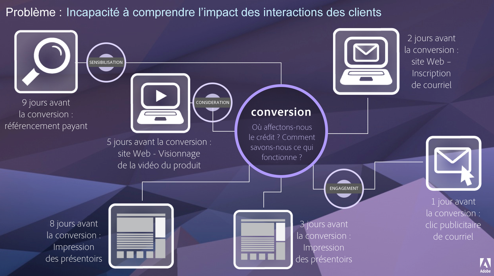

# Présentation d’Attribution

Attribution permet aux analystes de personnaliser la manière dont les éléments de dimension obtiennent du crédit pour les événements de succès. Par exemple :

1. Un visiteur sur votre site clique sur un lien de référencement payant vers l’une de vos pages de produits. La personne ajoute le produit au panier, mais ne l’achète pas.
2. Le lendemain, elle voit une publication d’un ami ou d’une amie sur les médias sociaux, elle clique sur le lien, puis effectue l’achat.

Dans certains rapports, vous voudrez peut-être attribuer la commande au référencement payant. Dans d’autres rapports, vous voudrez peut-être attribuer la commande à Social. Attribution vous permet de contrôler cet aspect des rapports. Toutes les entreprises disposant d’Adobe Analytics Ultimate, Prime, Select ou Foundation peuvent en bénéficier. Si vous vous demandez quel type de contrat vous avez conclu avec Adobe, contactez l’équipe Adobe en charge des comptes de votre entreprise.

## Valeur d’Attribution

Un parcours client donné n’est pas linéaire et est souvent imprévisible. Chaque client a son propre rythme. Il lui arrive souvent de revenir sur ses pas, de s’arrêter, de redémarrer ou d’adopter un autre comportement non linéaire. En raison de ces actions organiques, il est difficile de connaître l’impact des efforts marketing tout au long du parcours client. Cela complique également les efforts visant à relier plusieurs canaux de données.

Adobe Analytics améliore l’attribution en vous permettant de :

* définir l’attribution à des médias autres que ceux achetés : tout canal, dimension, mesure ou événement peut être appliqué aux modèles (par exemple, recherche interne) et pas seulement aux campagnes marketing ;
* utiliser la comparaison illimitée de modèles d’attribution : comparez dynamiquement autant de modèles que vous le souhaitez ;
* éviter les changements de mise en œuvre : avec le traitement de la période de rapport et les sessions contextuelles, le contexte du parcours client peut être intégré et appliqué lors de l’exécution ;
* construire la session qui correspond le mieux à votre scénario d’attribution ;
* ventiler l’attribution par segments : comparez facilement la performance de vos canaux marketing sur n’importe quel segment important (par exemple, les nouveaux clients par rapport aux clients réguliers, le produit X par rapport au produit Y, le niveau de fidélité ou la valeur vie client (CLV)) ;
* inspecter le croisement des canaux et l’analyse multi-touch : utilisation des histogrammes et diagrammes de Venn ainsi que des résultats de l’attribution des tendances ;
* analyser visuellement des séquences marketing importantes : explorez les chemins d’accès qui ont mené à la conversion sur le plan visuel par le biais de visualisations à plusieurs nœuds de flux et d’abandons ;
* créer des mesures calculées : utilisez n’importe quel nombre de méthodes d’attribution.

## Fonctionnalités

Attribution propose les fonctionnalités suivantes :

* [Panneau Attribution](../c-panels/attribution.md) : comparez rapidement les dimensions et les mesures avec différents modèles d’attribution.
* [Appliquer l’attribution à une mesure](../visualizations/freeform-table/column-row-settings/column-settings.md) : utilisez une attribution autre que celle par défaut sur une mesure d’un projet.
* [Appliquer l’attribution à une répartition](../components/dimensions/t-breakdown-fa.md) : utilisez une attribution autre que celle par défaut sur une répartition.
* [Comparer des modèles d’attribution](../components/apply-create-metrics.md) : comparez rapidement les différents modèles d’attribution pour n’importe quelle mesure.

## Vidéos

>[!BEGINSHADEBOX]

Voir  [Attribution dans les tableaux à structure libre](https://video.tv.adobe.com/v/39107?quality=12&learn=on&captions=fre_fr){target="_blank"} pour une vidéo de démonstration.

>[!ENDSHADEBOX]

>[!BEGINSHADEBOX]

Voir  [Attribution dans les mesures calculées](https://video.tv.adobe.com/v/41477?quality=12&learn=on&captions=fre_fr){target="_blank"} pour une vidéo de démonstration.

>[!ENDSHADEBOX]

>[!BEGINSHADEBOX]

Voir  [Utilisation du panneau Attribution](https://video.tv.adobe.com/v/39110?quality=12&learn=on&captions=fre_fr){target="_blank"} pour une vidéo de démonstration.

>[!ENDSHADEBOX]

>[!BEGINSHADEBOX]

Voir  [Ajout de comparaisons côte à côte de modèles d’attribution](https://video.tv.adobe.com/v/327793?quality=12&learn=on&captions=fre_fr){target="_blank"} pour une vidéo de démonstration.

>[!ENDSHADEBOX]

## Outils Adobe Analytics ne prenant pas en charge Attribution

Les outils qui ne prennent pas en charge l’API Analytics 2.0, comme Report Builder, ne prennent pas en charge Attribution.