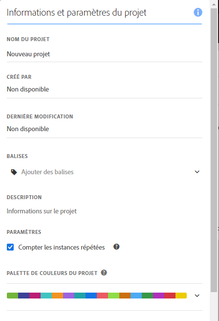
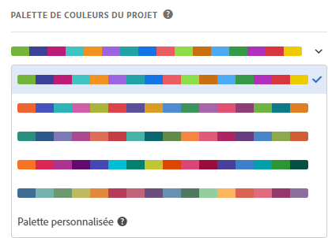

# Palettes de couleurs de visualisations {#visualization-color-palettes}

>[!CONTEXTUALHELP]
>id="workspace_project_colorpalette"
>title="Palette de couleurs du projet"
>abstract="Modifiez la palette de couleurs utilisée dans ce projet."

Vous pouvez modifier la palette de couleurs de visualisation utilisée dans Workspace en choisissant une autre palette de couleurs ou en spécifiant votre propre palette susceptible de correspondre aux couleurs de la marque de votre entreprise. Cette fonctionnalité affecte la plupart des visualisations dans Workspace, mais n’a **aucune** incidence sur la visualisation de la [!UICONTROL Synthèse des modifications], le formatage conditionnel dans les tableaux [!UICONTROL à structure libre] et la visualisation des [!UICONTROL cartes].

>[!NOTE]
>
>La prise en charge des palettes de couleurs n’est pas activée pour Internet Explorer 11.

Remarque :

* Vous pouvez choisir parmi cinq palettes de couleurs prédéfinies. La palette par défaut et la palette ci-dessous ont été optimisées pour un contraste optimal et sont toutes deux plus accessibles pour les personnes daltoniennes.
* Les palettes de couleurs trois à cinq en dessous des deux premières ont été optimisées pour l’harmonie des couleurs.

## Changer de [!UICONTROL palette de couleurs] :

>[!BEGINSHADEBOX]

Voir  [Utilisation d’une palette de couleurs personnalisée](https://video.tv.adobe.com/v/328083?quality=12&learn=on&captions=fre_fr){target="_blank"} pour une vidéo de démonstration.

>[!ENDSHADEBOX]

1. Sélectionnez **[!UICONTROL Workspace]** > **[!UICONTROL Projet]** > **[!UICONTROL Informations et paramètres du projet]**.
1. Dans la liste déroulante **[!UICONTROL Palette de couleurs du projet]**, vous pouvez choisir l’un des cinq modèles de couleurs prédéfinis.

   

1. Pour spécifier votre propre palette, sélectionnez **[!UICONTROL Palette personnalisée]** en dessous des options prédéfinies.
1. Indiquez jusqu’à 16 valeurs hexadécimales séparées par une virgule (par exemple, #00a4e4) correspondant aux couleurs que vous souhaitez utiliser. Si, par exemple, vous ne souhaitez utiliser que quatre valeurs, ces couleurs seront automatiquement répétées dans les visualisations contenant plus de couleurs.
