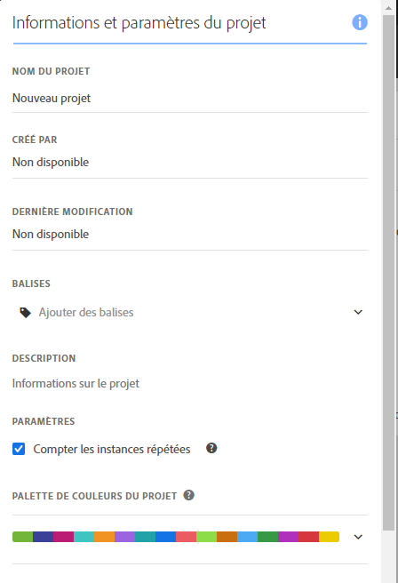
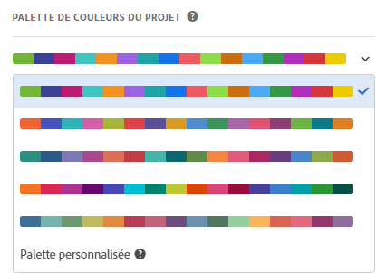

# Palettes de couleurs de visualisations {#visualization-color-palette}

<!-- markdownlint-disable MD034 -->

>[!CONTEXTUALHELP]
>id="workspace_project_colorpalette"
>title="Palette de couleurs du projet"
>abstract="Modifiez la palette de couleurs utilisée dans ce projet."

<!-- markdownlint-enable MD034 -->

Vous pouvez modifier la palette de couleurs de visualisation utilisée dans Workspace. Vous pouvez sélectionner une palette de couleurs prédéfinie ou spécifier votre propre palette correspondant aux couleurs de marque de votre entreprise. Cette fonction affecte la plupart des visualisations dans Workspace, mais n’a **AUCUNE** incidence sur le Résumé des changements, le formatage conditionnel dans les tableaux à structure libre et la visualisation des cartes.

>[!NOTE]
>
>La prise en charge des palettes de couleurs n’est pas activée pour Internet Explorer 11.

Remarque :

* Vous pouvez choisir parmi six palettes de couleurs prédéfinies. Le contraste de la palette par défaut et de la palette ci-dessous a été optimisé, et elles sont toutes deux plus accessibles pour les personnes daltoniennes.
* Les autres palettes ont été optimisées pour l’harmonie des couleurs.

## Changer de palette de couleurs :

1. Accédez à **[!UICONTROL Workspace]** > **[!UICONTROL Projet]** > **[!UICONTROL Informations et paramètres du projet]**.
1. Dans le menu déroulant **[!UICONTROL Palette de couleurs du projet]**, vous pouvez sélectionner l’un des modèles de couleurs prédéfinis.
1. Pour spécifier votre propre palette, sélectionnez **[!UICONTROL Palette personnalisée]** en dessous des options prédéfinies.
1. Spécifiez jusqu’à 16 valeurs hexadécimales délimitées par des virgules (par exemple, `#00a4e4`) pour créer votre propre palette de couleurs. Si, par exemple, vous ne spécifiez que quatre valeurs, les couleurs sont répétées automatiquement dans les visualisations qui contiennent davantage de couleurs.

<!--
# Visualization Color Palettes {#visualization-color-palettes}

>[!CONTEXTUALHELP]
>id="workspace_project_colorpalette"
>title="Project color palette"
>abstract="Change the color palette used in this project."

You can change the visualization color palette used in Workspace by choosing a different color palette or by specifying your own palette that could match your company's branding colors. This feature affects most visualizations in Workspace, but it does **not** affect [!UICONTROL Summary Change], conditional formatting in [!UICONTROL Freeform] tables, and the [!UICONTROL Map] visualization.

>[!NOTE]
>
>Color palette support is not enabled for Internet Explorer 11.

Keep in mind:

* There are five pre-set color palettes to choose from. The default palette and the one below have been optimized for optimal contrast and are both more accessible for those who are color blind.
* The third to the fifth color palettes below the top two have been optimized for color harmony.

## Change your [!UICONTROL color palette]:

>[!BEGINSHADEBOX]

See  [Using a custom color palette](https://video.tv.adobe.com/v/23876?quality=12&learn=on){target="_blank"} for a demo video.

>[!ENDSHADEBOX]

1. Navigate to **[!UICONTROL Workspace]** > **[!UICONTROL Project]** > **[!UICONTROL Project Info & Settings]**.
1. From the **[!UICONTROL Project Color Palette]** drop-down list, you can pick one of five pre-set color schemes.

   

1. To specify your own palette, select **[!UICONTROL Custom Palette]** below the pre-set options.
1. Specify up to 16 comma-separated hexadecimal values (for example, #00a4e4) for the colors you intend to use. If, for example, you want to use only four values, these colors will automatically be repeated in visualizations that contain more colors.
-->