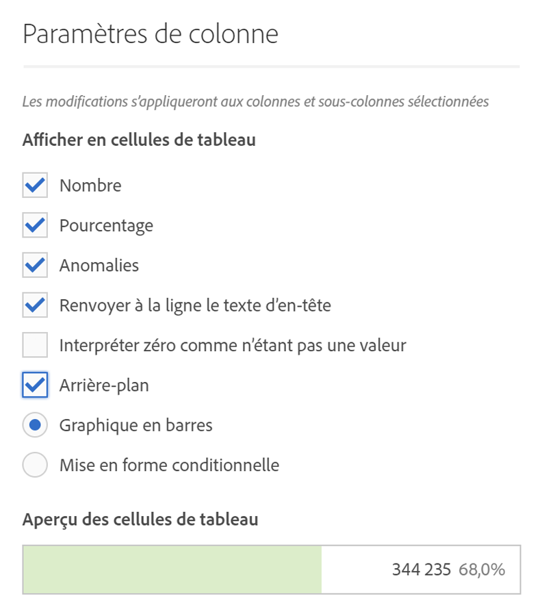
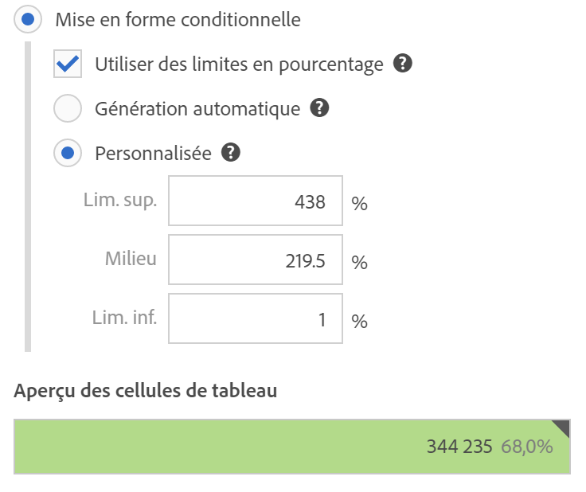

# Paramètres des colonnes

Grâce aux paramètres de colonne, vous pouvez configurer la mise en forme des colonnes, dont certains éléments peuvent être conditionnels.

## Paramètres des colonnes {#section_C5A9C13553BF4BFDAD7FACE0139AECA3}

Pour accéder aux [!UICONTROL Paramètres de colonne], faites glisser un tableau à structure libre vers le projet, puis cliquez sur l’icône en forme d’engrenage dans l’en-tête de la colonne.

Vous pouvez modifier les paramètres **pour plusieurs colonnes à la fois**. Sélectionnez plusieurs colonnes et cliquez sur l’icône des paramètres de n’importe laquelle de ces colonnes. Toute modification que vous apportez s’applique à toutes les colonnes comportant des cellules sélectionnées.

| Élément | Description |
|--- |--- |
| Nombre | Détermine si une cellule affiche/masque la valeur numérique pour la mesure. Par exemple, si la mesure est Pages vues, la valeur numérique correspond au nombre de pages vues pour l’élément de ligne. |
| Pourcentage | Détermine si une cellule affiche/masque la valeur de pourcentage pour la mesure. Par exemple, si la mesure est Pages vues, la valeur de pourcentage correspond au nombre de pages vues pour l’élément de ligne, divisé par le nombre total de pages vues pour la colonne.  Remarque : Nous pouvons désormais afficher les pourcentages supérieurs à 100 %, pour plus de précision. Nous avons également rehaussé le plafond supérieur à 1 000 % afin de garantir que les colonnes puissent s’adapter à une largeur trop importante. |
| Anomalies | Détermine si la détection des anomalies est exécutée sur les valeurs de cette colonne. |
| Renvoyer à la ligne le texte d’en-tête | Permet de renvoyer à la ligne le texte de l’en-tête dans les tableaux à structure libre afin de rendre les en-têtes plus lisibles et les tableaux plus faciles à partager. Cette option est utile pour le rendu .pdf et pour les mesures dont le nom est long. Activé par défaut. |
| Interpréter zéro comme n’étant pas une valeur | Pour les cellules dont la valeur est 0, détermine s’il convient d’afficher un 0 ou une cellule vierge. Ce paramètre est utile lorsque vous examinez les données pour chaque jour d’un mois et que certains jours n’ont pas encore eu lieu.  Des cellules vierges peuvent être affichées au lieu de 0 pour les dates futures. Les diagrammes respectent également ce paramètre (c.-à-d. qu’ils n’affichent pas une ligne ou une barre avec des valeurs 0 lorsque ce paramètre est activé). |
| Contexte | Détermine si une cellule affiche/masque toute la mise en forme de cellule, y compris le graphique en barres et la mise en forme conditionnelle. |
| Graphique en barres | Affiche un graphique en barres horizontal représentant la valeur de la cellule par rapport au total de la colonne. |
| Mise en forme conditionnelle | Voir la section suivante. |
| Aperçu des cellules de tableau | Affiche un aperçu de l’aspect de chaque cellule après application des options de mise en forme actuellement sélectionnées. |

## Mise en forme conditionnelle {#section_3DD847151DA14914888A70FC4FD7BDFB}

La mise en forme conditionnelle applique la mise en forme aux limites supérieure, moyenne et inférieure que vous pouvez définir. L’application d’une mise en forme conditionnelle (couleurs, etc.) dans les tableaux à structure libre est également activée automatiquement sur les ventilations, sauf si des limites « personnalisées » sont sélectionnées.

| Élément | Description |
|--- |--- |
| Mise en forme conditionnelle | Applique les couleurs suivantes aux cellules, selon la valeur des données : <ul><li>Vert : valeurs élevées</li><li>Jaune : valeurs moyennes</li><li>Rouge : faibles valeurs</li></ul> Le remplacement d’une dimension du tableau réinitialise les limites de la mise en forme conditionnelle. Le remplacement d’une mesure recalcule les limites de cette colonne (lorsqu’une mesure se trouve sur l’axe des abscisses et une dimension sur l’axe des ordonnées). |
| Utiliser des limites en pourcentage | Permet d’utiliser des limites supérieure, moyenne et inférieure qui reposent sur des valeurs en pourcentage pour chaque mesure. Cette option fonctionne avec les mesures qui reposent uniquement sur des pourcentages (comme Taux de rebond) et celles qui reposent sur un nombre et un pourcentage (comme Pages vues). |
| Génération automatique | Génère automatiquement des limites pour la mise en forme conditionnelle. La limite supérieure est la valeur la plus élevée de cette colonne. La limite inférieure est la valeur la plus faible et la valeur moyenne est la moyenne entre les limites supérieure et inférieure. |
| Personnalisé | Vous pouvez affecter manuellement les valeurs des champs Limite supérieure, Milieu et Limite inférieure pour la mise en forme conditionnelle. Vous disposez ainsi de la flexibilité nécessaire pour déterminer si la valeur d’une colonne devient bonne, moyenne ou mauvaise. |
| Aperçu des cellules de tableau | Affiche un aperçu de l’aspect de chaque cellule après application des options de mise en forme actuellement sélectionnées. |

>[!MORELIKETHIS]
>
>* [Gestion des sources de données](/help/analyze/analysis-workspace/visualizations/t-sync-visualization.md)

