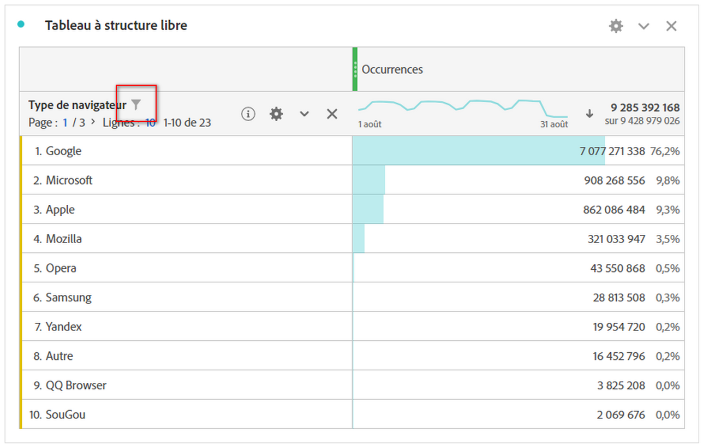
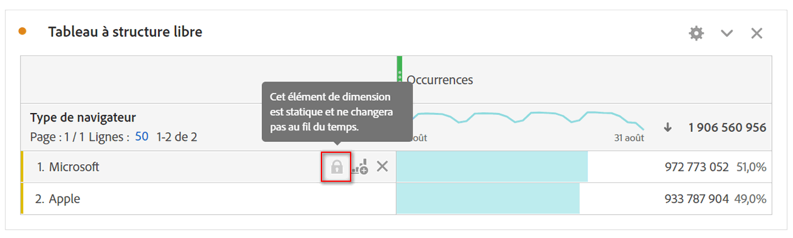
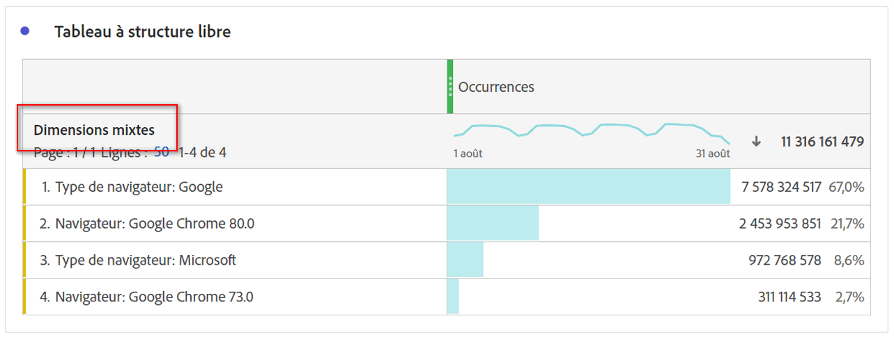

# Éléments de dimension dynamiques ou statiques dans les tableaux à structure libre

Dans les tableaux à structure libre, les rangées et les colonnes peuvent contenir diverses valeurs de composant. Ces valeurs peuvent être dynamiques (changer avec le temps) ou statiques (ne pas changer avec le temps), selon l’analyse que vous souhaitez construire.

## Éléments de dimension dynamique

Les éléments de dimension dynamique changent avec le temps et dépendent de la mesure triée par dans le tableau à structure libre. Les éléments de dimension dynamique sont préférés lorsque vous souhaitez analyser les principaux éléments pour une période donnée.

Lorsque vous déposez une dimension dans un tableau à structure libre, des lignes dynamiques sont renvoyées. Ils représentent les principaux éléments qui correspondent à la dimension pour une mesure et une période données. Vous pouvez également déposer une dimension dans des colonnes de tableau à structure libre et la dimension se développe automatiquement dans les 5 premiers éléments de dimension.

Par exemple, lorsque vous faites glisser la dimension Type de navigateur dans le tableau, les principaux éléments de dimension Type de navigateur (par exemple Microsoft, Apple, Google, etc.) revient dynamiquement aux rangées du tableau. Si vous les insérez dans une colonne, les 5 premiers éléments de dimension Type de navigateur renvoient dynamiquement.

Les éléments de dimension dynamique disposent de l’option de filtre de ligne et n’ont **pas** de verrou et d’icônes X.

## Éléments de dimension statique

Les éléments de dimension statique ne changent pas avec le temps ; il s’agit de composants fixes qui sont toujours renvoyés dans un tableau à structure libre. Les éléments de dimension statique sont préférés lorsque vous souhaitez toujours analyser le même élément, qu’il s’agisse de campagnes spécifiques ou de jours spécifiques dans la semaine.

Chaque fois que vous sélectionnez et déposez manuellement des valeurs de composant spécifiques (dimension, mesure, segment, plage de dates) dans un tableau, le résultat est une liste statique de lignes ou de colonnes. Vous pouvez également créer des éléments de dimension statique si vous choisissez :

* Dans les lignes, cliquez avec le bouton droit de la souris > [!UICONTROL Afficher uniquement les lignes sélectionnées.]
* Dans les colonnes, cliquez avec le bouton droit de la souris > [!UICONTROL Rendre l’élément statique]

Par exemple, lorsque vous faites glisser des éléments de type navigateur spécifiques tels que Microsoft et Apple, ces deux éléments spécifiques sont toujours extraits dans le tableau.

Les éléments de dimension statique **ne disposent pas** de l’option de filtre de ligne. A la place, des icônes de verrouillage et X sont présentes sur chaque élément. Cliquez sur l’icône X pour supprimer cet élément de dimension du tableau.

## Éléments de dimension mixtes

Les éléments de dimension de différentes dimensions peuvent être ajoutés au même tableau. Dans ces cas, l’en-tête de ligne indique &quot;Dimensions mixtes&quot;. Ces éléments de dimension sont statiques. Par exemple, l’ajout d’éléments de dimension spécifiques de la dimension Type de navigateur et d’autres éléments de dimension de la dimension Navigateur.

## Lignes totales de forme libre

Les lignes dynamiques et statiques se comportent différemment dans la ligne de total à structure libre. Par défaut:

* Les lignes dynamiques sont additionnées de mesures côté serveur et de duplicata, telles que les visites ou les visiteurs.
* Les lignes statiques sont additionnées côté client et **ne déduisent pas** les mesures de duplicata. Pour calculer le total des lignes côté serveur, définissez le paramètre Ligne sur **Afficher le total** général. [En savoir plus](https://docs.adobe.com/content/help/fr-FR/analytics/analyze/analysis-workspace/build-workspace-project/workspace-totals.html)
