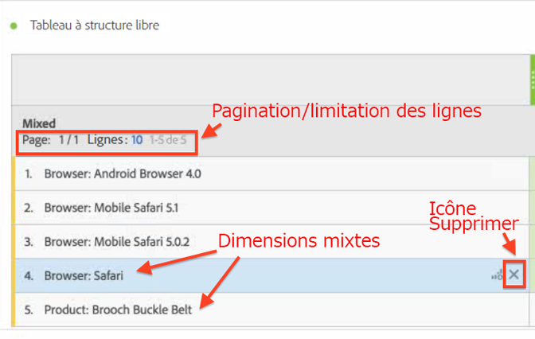
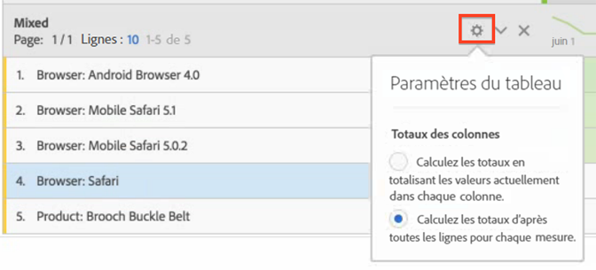

# Lignes statiques et dynamiques

Quand vous faites glisser une dimension sur un tableau d’Analysis Workspace, des lignes « dynamiques » sont générées, ce qui signifie que tous les éléments qui correspondent à la dimension, pour une mesure donnée, sont reportés dans le tableau.

Par exemple, si vous faites glisser la dimension Navigateur dans le tableau, tous les éléments de dimension (navigateur Android, Safari mobile, Firefox, etc.) sont reportés dans le tableau de manière dynamique.

En comparaison, chaque fois que vous sélectionnez et faites glisser manuellement une mesure, un segment, une classe de données ou une dimension individuelle dans un tableau, il en résulte une ligne ou une liste codée en dur ou « statique ». Vous pouvez maintenant interagir sur une ligne statique de différentes façons :

* Cliquez sur l’icône Aperçu dans une ligne statique pour prévisualiser les segments, les mesures et les plages de dates.
* Cliquez sur l’icône X pour supprimer cette ligne du tableau.
* Limitez le nombre de lignes affichées et activez la pagination.
* Ajoutez des éléments de dimension mixtes. Par exemple, ajoutez un élément issu d’une dimension de navigateur et un autre élément issu d’une dimension de produit.

   En voici une illustration :

   

En outre, (seulement) lorsque vous êtes en mode de ligne statique, vous pouvez maintenant changer le mode de calcul du nombre total de colonnes. Il vous suffit de cliquer sur l’icône d’engrenage et de permuter entre ces deux options :

| Option | Description |
|---|---|
| (Par défaut) Calculer les totaux en totalisant les valeurs actuellement dans chaque colonne. | Cette option calcule seulement les lignes figurant actuellement dans le tableau. (Calcul côté client) |
| Calculez les totaux d’après toutes les lignes pour chaque mesure. | Cette option comprend tous les éléments de cette dimension, même ceux qui ne sont pas répertoriés dans le tableau. (Calcul côté serveur) |

