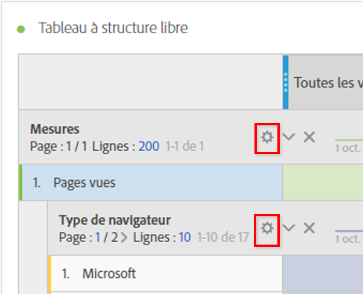

# Paramètres des lignes

Les configurations des lignes varient selon le composant déposé dans le tableau. Pour accéder aux paramètres de ligne d’un tableau, cliquez sur l’icône Paramètres en regard d’une dimension, d’un segment, d’une mesure, d’une période ou d’une ventilation :

| Paramètre | Description |
|--- |--- |
| Aligner les dates | Il s’agit d’un paramètre au niveau du tableau qui aligne les dates de chaque colonne sur tous les débuts de la même ligne. L’alignement des dates est activé par défaut lorsqu’une dimension temporelle est utilisée dans les lignes du tableau et que différentes plages de dates sont appliquées dans les colonnes. Par exemple, dans un tableau quotidien auquel les colonnes d’octobre et de septembre sont appliquées, la colonne de gauche se début avec le 1er octobre et la colonne de droite avec le 1er septembre. |
| Ventilation par position | Par défaut, ce paramètre est désactivé et les ventilations sont fixes en éléments de ligne statiques. Supposons, par exemple, que vous ventiliez les 3 premiers éléments de dimension Page (Page d’accueil, Résultats de la recherche, Passage en caisse) par Canal marketing. Ensuite, vous quittez le projet et revenez deux semaines plus tard. Lors de l&#39;ouverture du projet à nouveau, les 3 premières pages ont changé et maintenant, la page d&#39;accueil, les résultats de la recherche et le passage en caisse sont les 4-6 premières pages. Par défaut, les ventilations de vos Canaux marketing apparaîtront toujours sous Page d’accueil, Résultats de la recherche et Passage en caisse, même si elles se trouvent maintenant dans les lignes 4 à 6.   En revanche, la **ventilation par position** répartit toujours les 3 premiers éléments, quelle que soit leur nature. En vous reportant à notre exemple, lorsque vous rouvrez votre projet, les ventilations du Canal marketing seront liées aux 3 premières pages du tableau, et non à la page d’accueil, aux résultats de la recherche et à l’extraction qui se trouvent maintenant dans les lignes 4 à 6. |
| Pourcentages | **Le paramètre par défaut est de calculer les pourcentages par colonne** ; les pourcentages visibles dans une colonne sont calculés en fonction du total de la colonne.  **Calculer les pourcentages par ligne **force le tableau à structure libre à calculer les pourcentages de cellules sur la ligne par rapport au bas de la colonne, avec le total général comme dénominateur. Cette fonctionnalité est particulièrement utile pour les pourcentages de tendance. Ce paramètre est activé par défaut lors de l’utilisation de l’icône Visualiser. |
| Totaux des colonnes | Ces paramètres sont disponibles uniquement pour les lignes statiques.   **Afficher sous forme de somme des lignes** actuelles affiche la somme des lignes côté client du tableau, ce qui signifie que le total *ne déduira pas* les mesures de duplicata telles que les visites ou les visiteurs.   **Afficher le total** général affiche une somme côté serveur, ce qui signifie que le total déduira les mesures de duplicata. |
