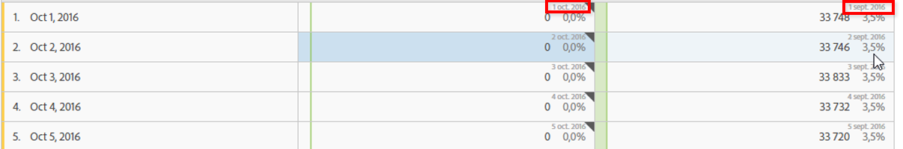

# Paramètres de ligne

Les configurations des lignes varient selon le composant déposé dans le tableau.

Vous pouvez aussi gérer les lignes sélectionnées à l’aide des [options contextuelles (clic avec le bouton droit) dans un tableau](../../../../analyze/analysis-workspace/visualizations/freeform-table.md#concept_0D2E24FCCBAF4194AA941448860E422F).

Pour accéder aux paramètres de ligne d’un tableau, cliquez sur l’icône Paramètres en regard d’une dimension, d’un segment, d’une mesure, d’une période ou d’une ventilation :

<table id="table_7ACE6413DB1F40349ED2860020F92E55"> 
 <thead> 
  <tr> 
   <th colname="col1" class="entry"> Paramètre de ligne </th> 
   <th colname="col2" class="entry"> Description </th> 
  </tr>
 </thead>
 <tbody> 
  <tr> 
   <td colname="col1"> 
<a href="../../../../analyze/analysis-workspace/components/calendar-date-ranges/time-comparison.md#concept_93BCAD81B7A54ABBBA5CD9E419F6F764" format="dita" scope="local"> Comparaison de dates</a> 
 </td> 
   <td colname="col2"> 
<b>Harmonisez les dates de chaque colonne afin qu’elles commencent à la même ligne. </b> 
 
Si vous harmonisez les dates, par exemple dans le cadre d’une comparaison d’un mois à l’autre entre octobre et septembre 2016, la colonne de gauche commence au 1er octobre et la colonne de droite au 1er septembre : 
 
 
 
Option désactivée par défaut. 
 </td> 
  </tr> 
  <tr> 
   <td colname="col1"> 
Pourcentages 
 </td> 
   <td colname="col2"> 
<b>Calculer les pourcentages par ligne</b> 
 
Oblige le tableau à structure libre à calculer les pourcentages des cellules par ligne, et non pas par colonne. Cette fonctionnalité est particulièrement utile pour les pourcentages de tendance. Elle est activée par défaut lorsque l’icône Visualiser est utilisée. 
 </td> 
  </tr> 
  <tr> 
   <td colname="col1"> 
Totaux des colonnes 
 </td> 
   <td colname="col2"> 
Ce paramètre est accessible uniquement pour les <a href="../../../../analyze/analysis-workspace/build-workspace-project/column-row-settings/manual-vs-dynamic-rows.md#concept_C50E7DFBC0504C72A973123192F487D8" format="dita" scope="local"> lignes manuelles (statiques)</a> (quand vous avez sélectionné un ensemble fini d’éléments), et non pour les lignes dynamiques (quand vous déposez une dimension qui répertorie tous les éléments). 
Remarque : Le paramètre est désactivé pour les lignes manuelles de <i>mesure</i>, puisque le cumul des mesures en dehors des lignes actuelles d’un tableau n’aurait aucun sens. 
 
 
<b>Calculer les totaux en totalisant les valeurs actuellement dans chaque colonne (activée par défaut) :</b> 
 
Cette option calcule seulement les lignes figurant actuellement dans le tableau. (Calcul côté client) 
 
<b>Calculer les totaux d’après toutes les lignes pour chaque mesure (désactivée par défaut) :</b> 
 
Cette option comprend tous les éléments de cette dimension, même ceux qui ne sont pas répertoriés dans le tableau. (Calcul côté serveur) 
 </td> 
  </tr> 
  <tr> 
   <td colname="col1"> 
Ventilations 
 </td> 
   <td colname="col2"> 
<b>Ventilation par position :</b> 
 
Ventilez les données en fonction d’une position fixe dans un tableau à structure libre. Vous pouvez par exemple spécifier que les sept premières lignes du tableau sont toujours ventilées. 
 
Auparavant, la liste des valeurs de la ventilation était « verrouillée ». Il en résultait certains problèmes : si, par exemple, vous ventiliez la  Date  par  Page , vous obteniez une liste des 50 premières pages correspondant à la période sélectionnée. Si vous enregistriez ce rapport puis l’exécutiez à nouveau un mois plus tard, il est probable que les 50 premières pages auraient changé. Toutefois, Analysis Workspace utilisait les résultats de la ventilation d’origine et renvoyait les mêmes pages, avec pour période le mois en cours.) 
 
Pour ventiler des données en fonction d’une position fixe : 
 
    <ol id="ol_A396A11566AA4F52BC3ABBC373CEF477"> 
     <li id="li_BDAB1E9A48D44944A4F7C31F1182B923">Ventilez quelques lignes du tableau. </li> 
     <li id="li_C5610437D3714CCEB9F3C771864B4336">Cliquez sur l’icône de paramètres (engrenage) en regard de la ligne de tableau à définir sur une position fixe. </li> 
     <li id="li_675E429DC3B94201978166F9408D30B1">Activez la case à cocher en regard de l’option Ventilation par position. </li> 
     <li id="li_E8A417D0D6D1438CAE825843BA0A7060">Changez l’ordre de tri ou la plage de dates. Vous remarquerez que les ventilations sont maintenant liées à la position des lignes, et non aux lignes codées en dur. </li> 
    </ol> 
Option désactivée par défaut. 
 </td> 
  </tr> 
 </tbody> 
</table>

