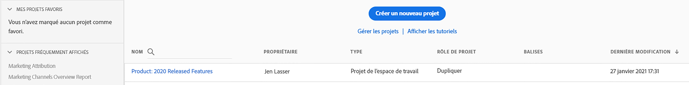
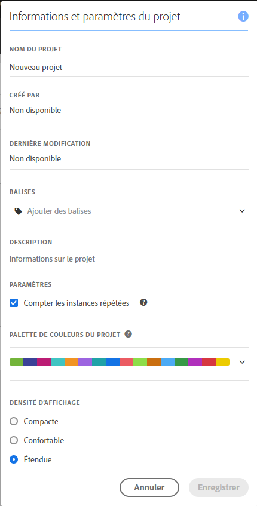
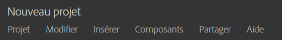
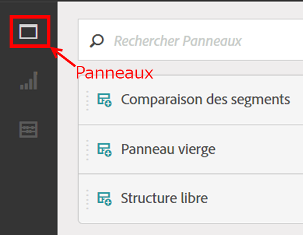
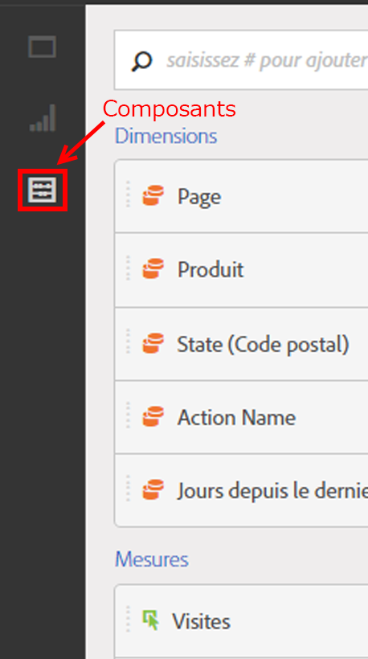

# Aperçu de la création d’un projet

**[!UICONTROL Analytics]** &gt; **[!UICONTROL Workspace]**

Créez un projet Analytics durable quelle que soit la combinaison de visualisations, de composants de rapports et de tableaux de données. Cet environnement reprend nombre des fonctions du créateur de tableaux d’Ad Hoc Analysis dans Analytics.

Dans Analysis Workspace, comparez et disséquez les données de façons inédites. Par exemple, configurez des rapports de classement et apportez des modifications itératives immédiates à la requête de données, puis accédez et manipulez les valeurs au niveau de la création de rapports.

La requête parvient directement au moteur de production de rapports. Vous pouvez apporter des modifications en ligne sans solliciter d’autres rapports pour créer votre analyse. Les résultats sont renvoyés immédiatement, sans que le navigateur soit actualisé.

## Page de liste de projets de l’Workspace {#section_39AA007D7C384F4E869F842F1C7B11F8}

Quand vous sélectionnez **[!UICONTROL Analytics]** &gt; **[!UICONTROL Workspace]** pour la première fois, la page répertorie tous les projets dont vous êtes responsable ou auxquels vous avez accès. Cliquez sur **[!UICONTROL Définir comme page d’entrée]** pour définir cette page comme page d’entrée d’Adobe Analytics. (Si cette option n’est pas visible, comme dans l’illustration ci-après, cette page est déjà définie comme page d’entrée.)

La page de liste de projets de l’Workspace présente les informations suivantes :

| Élément | Description |
|---|---|
| Projet [Modèles](/help/analyze/analysis-workspace/build-workspace-project/starter-projects.md) | Utilisez ces modèles de projet prérenseignés tels quels ou adaptez-les en fonction de vos besoins (en ajoutant ou en remplaçant des mesures ou des visualisations, par exemple) et enregistrez-les sous un nouveau nom. |
| [Créer un projet](/help/analyze/analysis-workspace/build-workspace-project/t-freeform-project.md) | Cliquez sur ce lien pour démarrer un projet entièrement nouveau. |
| Gérer les projets | Cliquez sur ce lien pour accéder au Gestionnaire de composants des projets ( **[!UICONTROL Analytics]** &gt; **[!UICONTROL Composants]** &gt; **[!UICONTROL Projets]**), où sont répertoriés tous les projets et où vous pouvez baliser, partager, supprimer, renommer, approuver ou copier les projets et les exporter au format CSV. |
| Afficher les tutoriels | Permet d’accéder aux [vidéos YouTube Analysis Workspace](https://www.youtube.com/playlist?list=PL2tCx83mn7GuNnQdYGOtlyCu0V5mEZ8sS). |
| Nom | Nom du projet de l’Workspace. |
| Créé par | Personne qui a créé ce projet (vous ou quelqu’un qui a partagé le projet avec vous). |
| Balises | Balises appliquées au projet, dans le Gestionnaire des composants des projets ou sous **[!UICONTROL Workspace]** &gt; **[!UICONTROL Projet]** &gt; **[!UICONTROL Informations et paramètres du projet]**. |
| Dernière modification | Date et heure de dernière modification du projet. |

## Informations et paramètres du projet {#section_63773D0B9E4543E88068ECECB9EEB4C6}

**[!UICONTROL Workspace]** &gt; **[!UICONTROL Projet]** &gt; **[!UICONTROL Informations et paramètres du projet]**

**[!UICONTROL Les Informations et paramètres du projet]** fournissent des informations sur le projet actuellement actif.

| Paramètre | Description |
|---|---|
| Nom du projet | Nom donné au projet. Double-cliquez dessus pour le modifier. |
| Créé par | Nom du titulaire du projet. |
| Dernière modification | Date de la dernière modification du projet. |
| Balises | Répertorie les balises appliquées à un projet afin de faciliter la catégorisation. Vous pouvez également baliser les projets tout en les enregistrant. Les balises d’un projet sont répertoriées dans la colonne [!UICONTROL Balises] de la page d’entrée de l’Workspace. |
| Description | Une description est utile pour clarifier l’objet d’un projet. Double-cliquez dessus pour la modifier. |
| Compter les instances répétées | Ce paramètre indique si les instances répétées sont comptabilisées dans les rapports. S’il existe plusieurs valeurs consécutives pour la même variable, vous pouvez les comptabiliser comme une seule instance ou comme plusieurs instances de la variable. |
| Modèle de couleurs de visualisation | Vous pouvez modifier le modèle de couleurs utilisé dans Workspace en choisissant une autre palette de couleurs ou en spécifiant votre propre palette. Cette fonction affecte de nombreux éléments dans Workspace, y compris la plupart des visualisations. |
| Densité d’affichage | Permet de voir plus de données sur l’écran en réduisant l’espacement vertical du rail gauche, dans les tableaux à structure libre et dans les tableaux de cohortes. |

## Menu Projets {#section_850CDFCB86A64EB0A0AD5B9E0FCB7013}

Le menu Projets supérieur ressemble à ce qui suit :

Les sous-menus contiennent les options suivantes.

> [!NOTE] Les options marquées d’un astérisque (*) s’affichent uniquement avec les projets **enregistrés**.

| Projet | Modifier | Insérer | Composants | Partager | Aide |
|---|---|---|---|---|---|
| Nouveau | Annuler | Nouveau panneau | Nouveau segment | Partager le projet | Vidéos |
| Ouvrir | Effacer | Nouveau panneau à structure libre | Nouvelle mesure | Obtenir le lien du projet* | Touches de raccourci |
| Enregistrer | Effacer tout | Nouveau panneau de comparaison des segments | Nouvelle période | Envoyer le fichier maintenant* | Forum d’aide |
| Enregistrer sous* |  | Nouveau tableau à structure libre | Nouvelle alerte | Envoyer le fichier selon le calendrier* |  |
| Définir comme page d’entrée* |  | Nouvelle ligne | Actualiser les composants | Traiter les données du projet |  |
| Actualiser le projet |  | Nouvelle barre |  |  |  |
| Télécharger CSV |  |  |  |  |  |
| Télécharger un PDF* |  |  |  |  |  |
| Informations et paramètres du projet |  |  |  |  |  |

## Rail de gauche {#section_271295C26EC840ABB2A8E7EC0498B60E}

Le rail de gauche comprend trois icônes, qui permettent d’accéder aux panneaux, aux [visualisations](/help/analyze/analysis-workspace/visualizations/freeform-analysis-visualizations.md) et aux [composants](/help/analyze/analysis-workspace/components/analysis-workspace-components.md) (dimensions, mesures, segments, périodes) en un seul clic :

  

Un **[!UICONTROL panneau vierge]** a été ajouté à la liste des panneaux accessibles depuis le rail de gauche. Pour créer un **panneau de cohortes**, faites glisser un panneau vierge dans une visualisation Tableau de cohortes.
