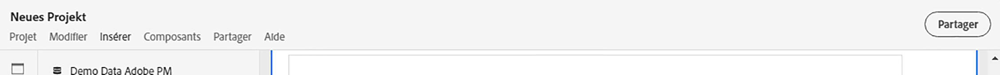
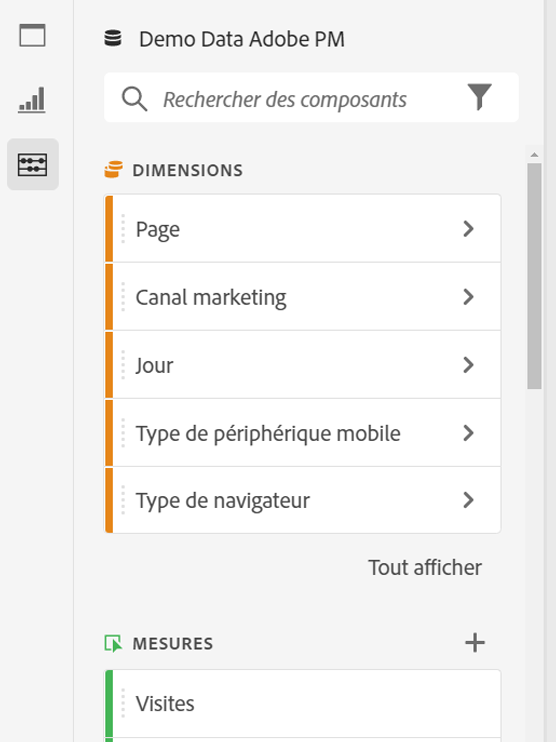
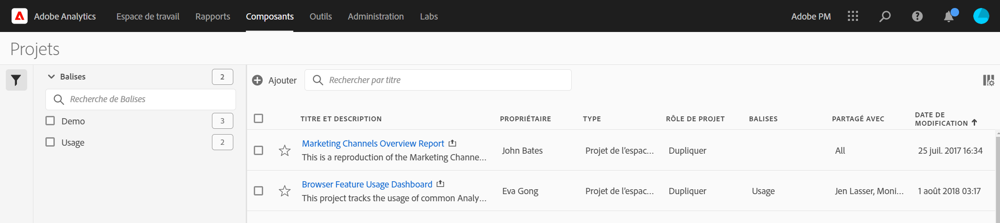

# Présentation des projets

Les projets Workspace vous permettent de combiner des composants de données, des tableaux et des visualisations afin d’élaborer votre analyse et de la partager avec qui vous le souhaitez au sein de votre entreprise. Avant de démarrer votre premier projet, découvrez comment accéder à vos projets, les parcourir et les gérer.

Regardez cette vidéo sur la création d’un projet Workspace :

>[!VIDEO](https://video.tv.adobe.com/v/334076/?quality=12)

## Liste de projets {#project-list}

Quand vous sélectionnez **[!UICONTROL Analytics]** > **[!UICONTROL Workspace]** pour la première fois, la page répertorie tous les projets dont vous êtes propriétaire ou qui ont été partagés avec vous. Il s’agit également de la page de destination d’Adobe Analytics, sauf si vous avez précédemment défini une page de destination personnalisée.

La page Projets contient les informations suivantes :

>[!NOTE]
>
>Certaines colonnes ne sont pas affichées par défaut. Pour personnaliser les colonnes affichées, cliquez sur le bouton **Personnalisation du tableau** icon .

| Élément | Description |
|---|---|
| [Modifier les préférences](/help/analyze/analysis-workspace/user-preferences.md) | Gérez les paramètres d’Analysis Workspace et de ses composants associés pour tous les nouveaux projets ou panneaux que vous créez. |
| [Créer un dossier](/help/analyze/analysis-workspace/build-workspace-project/workspace-folders/create-folders.md) | Ajoutez un nouveau dossier ou sous-dossier à la liste des projets et dossiers. |
| [Créer un projet](/help/analyze/analysis-workspace/home.md) | Démarrez un nouveau projet à partir de zéro ou d’un [modèle](https://experienceleague.adobe.com/docs/analytics/analyze/analysis-workspace/build-workspace-project/starter-projects.html?lang=fr#analysis-workspace). |
| Afficher plus | Affiche les options de création d’un projet vierge ou d’une fiche d’évaluation mobile, [affichage des tutoriels de formation](https://experienceleague.adobe.com/docs/analytics-learn/tutorials/analysis-workspace/analysis-workspace-basics/analysis-workspace-introduction.html?lang=fr)ou [affichage des notes de mise à jour](/help/release-notes/latest.md). |
| Afficher les dossiers et les projets | Indiquez si la structure de dossiers des projets doit être affichée. Pour plus d’informations, consultez [À propos des dossiers dans Analytics](/help/analyze/analysis-workspace/build-workspace-project/workspace-folders/about-folders.md). |
| Personnaliser le tableau (icône) | Permet de personnaliser les informations affichées pour chaque projet sur la page Projets . |
| Nom | Nom du projet de Workspace. |
| Type | Indique s’il s’agit d’un projet Workspace, d’un dossier ou d’un [Fiche d’évaluation mobile](https://experienceleague.adobe.com/docs/analytics/analyze/mobapp/home.html?lang=fr). |
| Balises | Balises appliquées au projet. |
| Planifié | Indique si les projets doivent être envoyés par courrier électronique aux destinataires selon un calendrier. Voir [Planification de projets](/help/analyze/analysis-workspace/curate-share/t-schedule-report.md). |
| Lien partagé (n’importe qui) | Les projets peuvent être partagés avec n’importe qui, même avec des personnes qui n’ont pas accès à Analysis Workspace. Cette colonne indique si les projets ont été partagés de cette manière. Voir [Partage d’un projet avec quiconque (aucune connexion requise)](/help/analyze/analysis-workspace/curate-share/share-projects.md#share-public-link) in [Partage de projets](/help/analyze/analysis-workspace/curate-share/share-projects.md) pour plus d’informations. |
| Suite de rapports | Suite de rapports à laquelle le projet est associé. |
| [Rôle de projet](https://experienceleague.adobe.com/docs/analytics/analyze/analysis-workspace/curate-share/share-projects.html?lang=fr) | Indique votre rôle pour ce projet : propriétaires, modifier, dupliquer, afficher. |
| Propriétaire | Personne qui a créé ce projet (vous ou quelqu’un qui a partagé le projet avec vous). |
| Partagé avec | Utilisateurs avec lesquels le projet a été partagé. |
| Dernière modification | Date et heure de dernière modification du projet. |
| Dernière ouverture | Date et heure de la dernière ouverture du projet. |
| Identifiant du projet | ID du projet. |
| Période la plus longue | La période la plus longue du projet. |
| Nombre de requêtes | Nombre total de requêtes contenues dans le projet. |
| Emplacement | Dossier dans lequel réside le projet. |

## Barre de menus {#menu-bar}

Dans un projet, le menu fournit des options relatives à la gestion du projet, à l’ajout de composants, à la recherche d’aide et bien plus. Chaque option de menu est également accessible à partir des [raccourcis](https://experienceleague.adobe.com/docs/analytics/analyze/analysis-workspace/build-workspace-project/fa-shortcut-keys.html?lang=fr) clavier.

| Élément de menu | Description |
|---|---|
| Projet | Inclut des actions courantes pour la gestion de projet, notamment Nouveau, Ouvrir, Enregistrer, Enregistrer sous et [Enregistrer comme modèle](https://experienceleague.adobe.com/docs/analytics/analyze/analysis-workspace/build-workspace-project/starter-projects.html?lang=fr). Vous pouvez également actualiser l’intégralité du projet pour récupérer les données et définitions les plus récentes en cliquant sur Actualiser le projet. Les options de [téléchargement CSV et PDF](https://experienceleague.adobe.com/docs/analytics/analyze/analysis-workspace/curate-share/download-send.html?lang=fr) vous permettent d’exporter des données à partir de Workspace. Les [informations et paramètres du projet](https://experienceleague.adobe.com/docs/analytics/analyze/analysis-workspace/build-workspace-project/freeform-overview.html?lang=fr#info-settings) vous offrent de nombreuses options relatives à la gestion de votre projet. |
| Modifier | Annulez ou rétablissez votre dernière action. L’option Effacer tout réinitialise le point de départ de votre projet. |
| Insérer | Insérez de nouveaux panneaux ou de nouvelles visualisations à partir de ce menu. Vous pouvez également insérer de nouveaux panneaux et de nouvelles visualisations à partir du rail de gauche. |
| [Composants](https://experienceleague.adobe.com/docs/analytics/analyze/analysis-workspace/components/analysis-workspace-components.html?lang=fr) | Créez un segment, une mesure calculée, une période ou des composants d’alerte à partir de votre projet. Vous pouvez également créer des composants à partir du rail de gauche. Si vos définitions de composants ont été récemment modifiées, l’option Actualiser les composants récupère les dernières définitions. |
| [Partager](https://experienceleague.adobe.com/docs/analytics/analyze/analysis-workspace/curate-share/send-schedule-files.html?lang=fr) | Traitez, partagez et planifiez des projets PDF/CSV avec les destinataires de votre entreprise. |
| Aide | Accédez à la documentation d’aide, aux vidéos et à la [communauté Experience League](https://experienceleaguecommunities.adobe.com/t5/adobe-analytics/ct-p/adobe-analytics-community?profile.language=fr) d’Analytics. Gérez la visibilité des conseils relatifs à Workspace ainsi que le [débogueur](https://www.adobe.io/apis/experiencecloud/analytics/docs.html#!AdobeDocs/analytics-2.0-apis/master/reporting-tricks.md). Recherchez des informations détaillées sur Workspace et sur les facteurs qui affectent les [performances](https://experienceleague.adobe.com/docs/analytics/analyze/analysis-workspace/workspace-faq/optimizing-performance.html?lang=fr) du projet. |
| Bouton Partager ou Propriétaire | Si vous disposez du rôle Propriétaire ou Modifier pour le projet, le bouton Partager situé dans le coin supérieur droit vous permet d’accéder en un clic à la gestion des destinataires de votre projet. Si vous disposez d’un rôle Dupliquer ou Afficher pour ce projet, le nom du propriétaire du projet s’affiche. |

### Informations et paramètres du projet {#info-settings}

**[!UICONTROL Workspace]** > **[!UICONTROL Projet]** > **[!UICONTROL Informations et paramètres du projet]**    fournit des informations au niveau du projet sur le projet actuellement actif.

Les paramètres incluent :

| Paramètre | Description |
|---|---|
| Projet    Nom | Nom donné au projet. Double-cliquez dessus pour le modifier. |
| Créée par | Nom du titulaire du projet. |
| Dernière modification | Date de la dernière modification du projet. |
| Balises | Répertorie les balises appliquées à un projet afin de faciliter la catégorisation. |
| Description | Une description est utile pour clarifier l’objet d’un projet. Double-cliquez dessus pour la modifier. |
| Compter les instances répétées | Ce paramètre indique si les instances répétées sont comptabilisées dans les rapports. Par exemple, lorsqu’il est activé, ce paramètre traite plusieurs vues consécutives de la même page comme plusieurs pages vues. Lorsqu’il est désactivé, elles sont comptées comme une seule page vue (cela n’affecte que certaines mesures, telles que les Visites sur une seule page). **Remarque** : ce paramètre ne s’applique pas aux visualisations de flux ou d’abandons. |
| [Palette de couleurs du projet](https://experienceleague.adobe.com/docs/analytics/analyze/analysis-workspace/build-workspace-project/color-palettes.html?lang=fr) | Vous pouvez modifier la palette de couleurs catégoriques utilisée dans Workspace en choisissant parmi les palettes prêtes à l’emploi qui ont été optimisées pour le daltonisme ou en spécifiant votre palette personnalisée. Cette fonction affecte de nombreux éléments dans Workspace, y compris la plupart des visualisations. |
| [Densité d’affichage](https://experienceleague.adobe.com/docs/analytics/analyze/analysis-workspace/build-workspace-project/view-density.html?lang=fr) | Permet de voir plus de données sur l’écran en réduisant l’espacement vertical du rail gauche, dans les tableaux à structure libre et dans les tableaux de cohortes. |

## Rail de gauche {#left-rail}

Dans un projet, les [panneaux](https://experienceleague.adobe.com/docs/analytics/analyze/analysis-workspace/panels/panels.html?lang=fr), les tableaux, les [visualisations](https://experienceleague.adobe.com/docs/analytics/analyze/analysis-workspace/visualizations/freeform-analysis-visualizations.html?lang=fr) et les [composants](https://experienceleague.adobe.com/docs/analytics/analyze/analysis-workspace/components/analysis-workspace-components.html?lang=fr) sont accessibles à partir du rail de gauche. Ce sont les blocs de construction de votre projet.

Vous pouvez également accéder aux visualisations et aux panneaux à partir du [panneau vierge](https://experienceleague.adobe.com/docs/analytics/analyze/analysis-workspace/panels/blank-panel.html?lang=fr).

Les composants (dimensions, mesures, segments, périodes) du rail de gauche se rapportent à la suite de rapports du panneau principal. Le panneau principal comporte une bordure bleue et la suite de rapports principale est répertoriée en haut du rail des composants.

## Menu contextuel

Regardez cette vidéo sur lʼutilisation du menu contextuel dans Analysis Workspace :

>[!VIDEO](https://video.tv.adobe.com/v/23981/?quality=12)

## Canevas de projet {#canvas}

Le canevas du projet est l’emplacement où vous rassemblez des panneaux, des tableaux, des visualisations et des composants pour créer votre analyse. Un projet peut contenir de nombreux panneaux et chaque panneau peut contenir de nombreux tableaux et visualisations.

Les panneaux sont utiles pour organiser vos projets en fonction des périodes, des suites de rapports ou des cas d’utilisation d’analyses. Le panneau principal comporte une bordure bleue et détermine les composants disponibles dans le rail de gauche.

Selon le point de départ choisi pour vos projets, le canevas comporte soit un [panneau à structure libre](https://experienceleague.adobe.com/docs/analytics/analyze/analysis-workspace/visualizations/freeform-table/freeform-table.html?lang=fr), soit un [panneau vierge](https://experienceleague.adobe.com/docs/analytics/analyze/analysis-workspace/panels/blank-panel.html?lang=fr) au démarrage. Le moyen le plus rapide de démarrer une analyse consiste à sélectionner un ou plusieurs composants, puis tout simplement à les faire glisser et les déposer dans le canevas du projet. Un tableau de données est alors automatiquement rendu. [En savoir plus](https://experienceleague.adobe.com/docs/analytics/analyze/analysis-workspace/visualizations/freeform-table/freeform-table.html?lang=fr) sur les différentes options de création d’un tableau ou sur la manière de tirer parti de notre [tutoriel de formation](https://experienceleague.adobe.com/docs/analytics/analyze/analysis-workspace/home.html?lang=fr#training-tutorial) pour apprendre à créer votre premier projet.

## Chef de projets {#manager}

Les projets Analysis Workspace peuvent être gérés sous **[!UICONTROL Analytics] > [!UICONTROL Composants] > [!UICONTROL Projets]**. Le Gestionnaire de projets affiche les éléments créés par un utilisateur spécifique.

La propriété du projet peut être transférée à un nouvel utilisateur sous [!UICONTROL Admin] > [!UICONTROL Utilisateurs et ressources Analytics] > [!UICONTROL Transférer les ressources].

Le Gestionnaire de projets vous permet d’ajouter, baliser, partager, dupliquer/copier et bien plus encore. Utilisez la barre de recherche ou les options de filtre dans le rail de gauche pour rechercher un projet. Vous pouvez filtrer par balise, propriétaires, type de projet et bien d’autres.

Voici les actions courantes du Gestionnaire de projets, qui peuvent être exécutées simultanément sur un ou plusieurs projets :

| Action | Description |
|---|---|
| Ajouter | Créez un projet en partant de zéro ou démarrez à partir d’un [modèle](https://experienceleague.adobe.com/docs/analytics/analyze/analysis-workspace/build-workspace-project/starter-projects.html?lang=fr). |
| Baliser ou approuver | Sélectionnez &quot;Baliser&quot; ou &quot;Approuver&quot; pour organiser vos projets et faciliter leur recherche. |
| [Partager](https://experienceleague.adobe.com/docs/analytics/analyze/analysis-workspace/curate-share/share-projects.html?lang=fr) | Rend un projet disponible pour d’autres utilisateurs d’Analysis Workspace de votre entreprise. |
| Supprimer | Supprimez votre projet. |
| Renommer | Modifiez le nom de votre projet. |
| Copier | Créez un doublon du projet. Cela crée un projet ainsi qu’un identifiant de projet. Les partages ou les planifications liés au projet d’origine ne sont pas copiés. |
| Exporter dans un fichier CSV | Téléchargez votre projet sous forme de fichier CSV, qui inclut les données en texte brut. |
