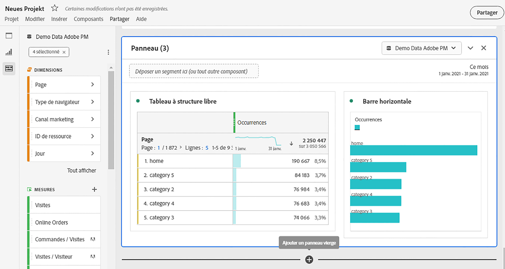

# Présentation des projets

Les projets Workspace vous permettent de combiner des composants de données, des tableaux et des visualisations afin d’élaborer votre analyse et de la partager avec qui vous le souhaitez au sein de votre entreprise. Avant de démarrer votre premier projet, découvrez comment accéder à vos projets, les parcourir et les gérer.

Regardez cette vidéo sur la création d’un projet Workspace :

>[!VIDEO](https://video.tv.adobe.com/v/334076/?quality=12)

## Liste de projets {#project-list}

Quand vous sélectionnez **[!UICONTROL Analytics]** > **[!UICONTROL Workspace]** pour la première fois, la page répertorie tous les projets dont vous êtes propriétaire ou qui ont été partagés avec vous. Cette page est également la page d’entrée d’Adobe Analytics, sauf si vous avez défini une page d’entrée personnalisée auparavant.

La page Projets contient les informations suivantes :

| Élément | Description |
|---|---|
| [Modifier les préférences](/help/analyze/analysis-workspace/user-preferences.md) | Gérez les paramètres d’Analysis Workspace et de ses composants associés pour tous les nouveaux projets ou panneaux que vous créez. |
| [Créer un dossier](/help/analyze/analysis-workspace/build-workspace-project/workspace-folders/create-folders.md) | Ajoutez un nouveau dossier ou sous-dossier à la liste des projets et dossiers. |
| [Créer un projet](/help/analyze/analysis-workspace/build-workspace-project/create-projects.md) | Démarrez un nouveau projet à partir de zéro ou d’un rapport. |
| Afficher plus | Cette sélection affiche les options permettant de créer un projet vierge ou une fiche d’évaluation mobile, [affichage des tutoriels de formation](https://experienceleague.adobe.com/en/docs/analytics-learn/tutorials/analysis-workspace/analysis-workspace-basics/analysis-workspace-introduction), ou [affichage des notes de mise à jour](/help/release-notes/latest.md). |
|  | Pour afficher ou masquer des filtres. Vous pouvez filtrer par balises, suite de rapports, propriétaires, type (projet, dossier, fiche d’évaluation mobile) et d’autres filtres. |
|  | Utilisez le champ de recherche pour rechercher des dossiers, des projets Workspace ou des fiches d’évaluation mobiles. |
| Afficher les dossiers et les projets | Indiquez si la structure de dossiers des projets doit être affichée. Pour plus d’informations, consultez [À propos des dossiers dans Analytics](/help/analyze/analysis-workspace/build-workspace-project/workspace-folders/about-folders.md). |
|  | Cette icône vous permet de personnaliser les colonnes affichées pour chaque projet dans la liste des projets. |

La liste des projets peut afficher les colonnes suivantes :

| Colonne | Description |
|---|---|
| [!UICONTROL Nom] | Nom du projet Workspace. Sélectionner  pour afficher une fenêtre contextuelle contenant plus de détails sur un projet ou un dossier. Sélectionner  pour afficher les actions disponibles. Voir [Gestion des projets](#manage-projects) pour plus d’informations. |
| [!UICONTROL Type] | Indique si cette entrée est un projet Workspace, un dossier ou un [Fiche d’évaluation mobile](https://experienceleague.adobe.com/en/docs/analytics/analyze/mobapp/home). |
| [!UICONTROL Balises] | Balises appliquées au projet. |
| [!UICONTROL Planifié] | Indique si les projets doivent être envoyés par courrier électronique aux destinataires. Voir [Planification de projets](/help/analyze/analysis-workspace/curate-share/t-schedule-report.md). |
| Lien partagé (tout le monde) | Les projets peuvent être partagés avec n’importe qui, même avec des personnes qui n’ont pas accès à Analysis Workspace. Cette colonne indique si les projets ont été partagés de cette manière. Voir [Partage d’un projet avec quiconque (aucune connexion requise)](/help/analyze/analysis-workspace/curate-share/share-projects.md#share-public-link) in [Partage de projets](/help/analyze/analysis-workspace/curate-share/share-projects.md) pour plus d’informations. |
| [Rôle de projet](https://experienceleague.adobe.com/en/docs/analytics/analyze/analysis-workspace/curate-share/share-projects) | Indique votre rôle pour ce projet : propriétaires, modifier, dupliquer, afficher. |
| [!UICONTROL Suite de rapports] | Suite de rapports à laquelle le projet est associé. |
| [!UICONTROL Propriétaire] | Personne qui a créé ce projet (vous ou quelqu’un qui a partagé le projet avec vous). |
| [!UICONTROL Partagé avec] | Utilisateurs avec lesquels le projet a été partagé. |
| [!UICONTROL Dernière modification] | Date et heure de dernière modification du projet. |
| [!UICONTROL Dernière ouverture] | Date et heure de la dernière ouverture du projet. |
| [!UICONTROL Dernière utilisation] | Date et heure de la dernière utilisation du projet. |
| [!UICONTROL Identifiant du projet] | ID du projet. |
| [!UICONTROL Période la plus longue] | La période la plus longue du projet. |
| [!UICONTROL Nombre de requêtes] | Nombre total de requêtes contenues dans le projet. |
| [!UICONTROL Emplacement] | Le dossier dans lequel réside le projet. |

### Gestion des projets

Pour gérer des projets, sélectionnez un ou plusieurs projets dans la liste des projets.

Dans la barre d’actions bleue, vous pouvez sélectionner les actions suivantes :

| Action | Description |
|---|---|
|  Supprimer | Lorsqu’elle est sélectionnée, une boîte de dialogue de confirmation vous invite à confirmer la suppression d’un projet Workspace ou d’une fiche d’évaluation mobile. Sélectionner **[!UICONTROL OK]** pour confirmer. |
|  Partager | Cette action vous permet de partager votre projet. Voir [Partage de projets](../curate-share/share-projects.md). |
|  Renommer | Ouvre une **[!UICONTROL Renommer : *name *]**pour renommer votre projet. Sélectionner**[!UICONTROL Enregistrer ]**pour enregistrer le nouveau nom du projet. |
|  Copier | Copie immédiatement le projet sélectionné dans un nouveau projet portant le nom *nom original* (Copier). |
|  Epinglage | Immédiatement le projet est placé en haut de la liste. Ajoute la variable  Indicateur. |
|  Balise | Ouvre la fenêtre **[!UICONTROL Projet de balise]** boîte de dialogue. Vous pouvez sélectionner une balise existante ou en ajouter de nouvelles. Sélectionner **[!UICONTROL Enregistrer]** pour enregistrer les balises du projet. |
|  Approuver ou refuser l’approbation | Approuve ou désapprouve le projet. |
|  Exportation CSV | Télécharge immédiatement un fichier contenant une liste de valeurs séparées par des virgules des projets. |
|  Déplacer vers | Cette action vous permet de déplacer le projet vers un dossier. Dans le **[!UICONTROL Sélectionner un dossier]** , sélectionnez un dossier dans la boîte de dialogue **[!UICONTROL Dossier]** et sélectionnez **[!UICONTROL Déplacer]**. |

## Barre de menus {#menu-bar}

Dans un projet, le menu fournit des options relatives à la gestion du projet, à l’ajout de composants, à la recherche d’aide et bien plus. Vous pouvez également accéder à chaque option de menu via le clavier [raccourcis](https://experienceleague.adobe.com/en/docs/analytics/analyze/analysis-workspace/build-workspace-project/fa-shortcut-keys).

| Élément de menu | Description |
|---|---|
| Projet    | Ce menu comprend des actions courantes pour la gestion de projet, notamment New, Open, Save, Save as, et [Enregistrer en tant que rapport d’entreprise](/help/analyze/analysis-workspace/build-workspace-project/starter-projects.md). Vous pouvez également actualiser l’intégralité du projet pour récupérer les données et définitions les plus récentes en cliquant sur Actualiser le projet. Les options de [téléchargement CSV et PDF](https://experienceleague.adobe.com/en/docs/analytics/analyze/analysis-workspace/curate-share/download-send) vous permettent d’exporter des données à partir de Workspace. Les [informations et paramètres du projet](https://experienceleague.adobe.com/en/docs/analytics/analyze/analysis-workspace/build-workspace-project/freeform-overview) vous offrent de nombreuses options relatives à la gestion de votre projet. |
| Modifier | Annulez ou rétablissez votre dernière action. L’option Effacer tout réinitialise votre projet sur un point de départ vide. |
| Insérer | Insérez de nouveaux panneaux ou de nouvelles visualisations à partir de ce menu. Vous pouvez également insérer de nouveaux panneaux et de nouvelles visualisations à partir du rail de gauche. |
| [Composants](https://experienceleague.adobe.com/en/docs/analytics/analyze/analysis-workspace/components/analysis-workspace-components) | Créez un segment, une mesure calculée, une période ou des composants d’alerte à partir de votre projet. Vous pouvez également créer des composants à partir du rail de gauche. Si vos définitions de composant ont récemment été modifiées, l’option Actualiser les composants récupère les dernières définitions. |
| [Partager](https://experienceleague.adobe.com/en/docs/analytics/analyze/analysis-workspace/curate-share/send-schedule-files) | Traitez, partagez et planifiez des projets PDF/CSV avec les destinataires de votre organisation. |
| Aide | Accédez à la documentation d’aide, aux vidéos et à la [communauté Experience League](https://experienceleaguecommunities.adobe.com/t5/adobe-analytics/ct-p/adobe-analytics-community?profile.language=fr) d’Analytics. Gérez la visibilité des conseils relatifs à Workspace ainsi que le [débogueur](https://developer.adobe.com/analytics-apis/docs/2.0/). Recherchez des informations détaillées sur Workspace et sur les facteurs qui affectent les [performances](https://experienceleague.adobe.com/en/docs/analytics/analyze/analysis-workspace/workspace-faq/optimizing-performance) du projet. |
| Bouton Partager ou Propriétaire | Si vous disposez du rôle Propriétaire ou Modifier pour le projet, le bouton Partager situé dans le coin supérieur droit vous permet d’accéder en un clic à la gestion des destinataires de votre projet. Si vous êtes dans un rôle Dupliquer ou Afficher pour le projet, le nom du propriétaire du projet s’affiche. |

### Informations et paramètres du projet {#info-settings}

**[!UICONTROL Workspace]** > **[!UICONTROL Projet]** > **[!UICONTROL Informations et paramètres du projet]** fournit des informations au niveau du projet sur le projet actif.

Les paramètres incluent :

| Paramètre | Description |
|---|---|
| Nom du projet | Nom donné au projet. Double-cliquez dessus pour le modifier. |
| Propriétaire | Nom du titulaire du projet. |
| Dernière modification | Date de la dernière modification du projet. |
| Balises | Répertorie les balises appliquées à un projet afin de faciliter la catégorisation. |
| Description | Une description est utile pour clarifier l’objet d’un projet. Double-cliquez dessus pour la modifier. |
| Compter les instances répétées | Ce paramètre indique si les instances répétées sont comptabilisées dans les rapports. Par exemple, lorsqu’il est activé, ce paramètre traite plusieurs vues consécutives de la même page comme plusieurs pages vues. Lorsque cette option est désactivée, ils sont comptés comme une seule page vue (ce paramètre n’affecte que certaines mesures, telles que Visites sur une seule page). **Remarque** : ce paramètre ne s’applique pas aux visualisations de flux ou d’abandons. |
| [Afficher les annotations](/help/analyze/analysis-workspace/components/annotations/overview.md) | Indiquez si les annotations doivent être affichées dans le projet ou non. |
| [Palette de couleurs du projet](https://experienceleague.adobe.com/en/docs/analytics/analyze/analysis-workspace/build-workspace-project/color-palettes) | Vous pouvez modifier la palette de couleurs catégoriques utilisée dans Workspace en choisissant parmi les palettes prêtes à l’emploi qui ont été optimisées pour le daltonisme ou en spécifiant votre palette personnalisée. Cette fonction affecte de nombreux éléments dans Workspace, y compris la plupart des visualisations. |
| [Densité d’affichage](https://experienceleague.adobe.com/en/docs/analytics/analyze/analysis-workspace/build-workspace-project/view-density) | Permet de voir plus de données sur l’écran en réduisant l’espacement vertical du rail gauche, dans les tableaux à structure libre et dans les tableaux de cohortes. |

## Rail de gauche {#left-rail}

Au sein d’un projet, différentes icônes sont disponibles dans le rail de gauche ; chacune d’elles représente des outils importants pour créer votre projet :

| Icône | Fonctionnalité |
|---|---|
|  | [Panneaux](/help/analyze/analysis-workspace/c-panels/panels.md) |
|  | [Visualisations](/help/analyze/analysis-workspace/visualizations/freeform-analysis-visualizations.md) |
|  | [Composants](/help/analyze/analysis-workspace/components/analysis-workspace-components.md) |
|  | [Dictionnaire de données](/help/analyze/analysis-workspace/components/data-dictionary/data-dictionary-overview.md) |
|  | [Table des matières](/help/analyze/analysis-workspace/build-workspace-project/project-table-of-contents.md) |

Les composants (dimensions, mesures, segments, plages de dates) du rail de gauche sont associés à la vue de données du panneau actif. Une bordure bleue identifie le panneau actif et la suite de rapports active est répertoriée en haut du rail des composants.

## Menu contextuel

Regardez cette vidéo sur lʼutilisation du menu contextuel dans Analysis Workspace :

>[!VIDEO](https://video.tv.adobe.com/v/23981/?quality=12)

## Canevas de projet {#canvas}

Le canevas du projet est l’emplacement où vous rassemblez des panneaux, des tableaux, des visualisations et des composants pour créer votre analyse. Un projet peut contenir de nombreux panneaux et chaque panneau peut contenir de nombreux tableaux et visualisations.

Les panneaux sont utiles pour organiser vos projets en fonction des périodes, des suites de rapports ou des cas d’utilisation d’analyses. Le panneau actif est entouré d’une bordure colorée et détermine les composants disponibles dans le rail de gauche.

Selon le point de départ choisi pour vos projets, un [tableau à structure libre](https://experienceleague.adobe.com/en/docs/analytics/analyze/analysis-workspace/visualizations/freeform-table/freeform-table) ou [panneau vierge](https://experienceleague.adobe.com/en/docs/analytics/analyze/analysis-workspace/panels/blank-panel) dans la zone de travail. Le moyen le plus rapide de démarrer une analyse consiste à sélectionner un ou plusieurs composants, puis tout simplement à les faire glisser et les déposer dans le canevas du projet. Un tableau de données s’affiche automatiquement. [En savoir plus](https://experienceleague.adobe.com/en/docs/analytics/analyze/analysis-workspace/visualizations/freeform-table/freeform-table) à propos des différentes options de création d’un tableau ou de l’utilisation des [tutoriel de formation](https://experienceleague.adobe.com/en/docs/analytics/analyze/analysis-workspace/home) pour plus d’informations sur la création de votre premier projet.

