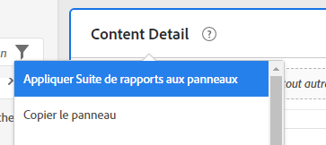
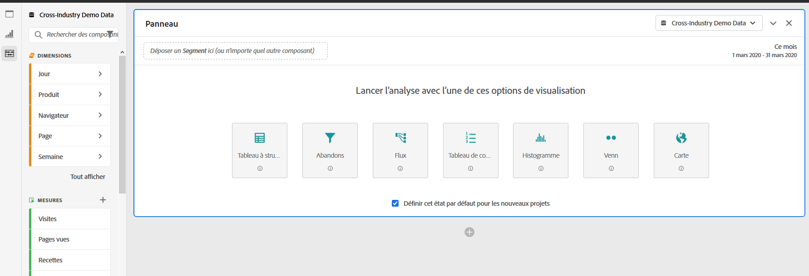
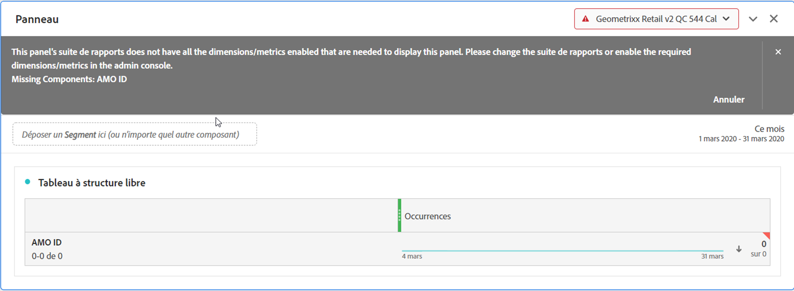

# Suites de rapports multiples dans Workspace

Vous pouvez désormais créer des projets dans Analysis Workspace à l’aide de données provenant de plusieurs suites de rapports. Les suites de rapports sont désormais sélectionnées au niveau du panneau. Vous pouvez donc choisir une suite de rapports différente pour chaque panneau du même projet Workspace.

Cette fonctionnalité est utile si vous souhaitez, par exemple :

* Comparer les données de deux régions différentes et que les données sont dans deux suites de rapports différentes. Vous pouvez créer des tableaux et des visualisations pour comparer les données côte à côte.

* Créer un tableau de bord de mesures et de visualisations pour envoyer des rapports à d’autres organisations. Vous pouvez désormais extraire des données de plusieurs suites de rapports au sein du même projet.

## Appliquer la suite de rapports à tous les panneaux

Vous pouvez appliquer une suite de rapports à tous les panneaux à la fois en cliquant avec le bouton droit sur l’en-tête d’un panneau et en sélectionnant **[!UICONTROL Apply Report Suite to All Panels]**.

## Panneau actif

Avec cette fonctionnalité, nous lançons le concept de « panneau actif » et de « panneau inactif ». Vous pouvez reconnaître le panneau actif par la bordure bleue claire qui l’entoure. Il suffit de cliquer à l’intérieur d’un panneau pour le transformer en panneau actif.

>[!IMPORTANT]
>Vous pouvez faire glisser le curseur vers n’importe quel panneau situé dans la même suite de rapports que votre panneau actif. En faisant glisser le panneau vers un panneau inactif de la même suite de rapports, le panneau devient actif.

| Tâche | Panneau actif | Panneau inactif |
|---|---|---|
| Modifier la suite de rapports | Oui | Non |
| Glisser-déposer des composants | Oui | Oui, pour tout panneau qui se trouve dans la même suite de rapports que votre panneau actif. |
| Glisser-déposer des visualisations | Oui | Oui, pour tout panneau qui se trouve dans la même suite de rapports que votre panneau actif. |

## Utilisation de plusieurs suites de rapports

1. Créez un projet avec 2 panneaux ou plus dans Workspace.

1. Faites glisser et déposez des composants (mesures, dimensions, segments, plages de dates) dans le panneau. Assurez-vous que les panneaux contiennent des données et des visualisations propres à leur suite de rapports.

   >[!NOTE]
   >Il arrive qu’une bannière s’affiche lors du chargement d’un projet (ou lors du passage à une suite de rapports), lorsque tous les composants inclus dans le projet ne sont pas inclus dans la suite de rapports. Les composants manquants sont répertoriés. Suivez [ces instructions](/help/admin/admin-console/permissions/product-profile.md) pour définir les autorisations requises sur les mesures et dimensions.

   

   Vous disposez de 3 options pour gérer cette incompatibilité :
   * Activer les dimensions/mesures requises
   * Modifier la suite de rapports.
   * Poursuivre sans certains composants. Cela ne générera aucune donnée pour ces composants et/ou des visualisations vides.

1. Modifier le panneau pour une autre suite de rapports et noter comment le libellé du composant (suite de rapports active) et les composants répertoriés sont mis à jour en fonction de cette modification.

1. Use a keyboard shortcut (`shift` while dragging) to turn an inactive panel to an active panel.

1. (Facultatif) Vous pouvez également accéder à d’autres créateurs de composants Analytics et vous assurer qu’ils affichent désormais un libellé de suite de rapports indiquant :

   * L’emplacement de création d’un segment : [Créateur de segments](https://docs.adobe.com/content/help/en/analytics/components/segmentation/segmentation-workflow/seg-build.html).
   * L’emplacement de création d’une mesure calculée : [Créateur de mesures calculées](https://docs.adobe.com/content/help/en/analytics/components/calculated-metrics/calcmetric-workflow/cm-build-metrics.html).
   * L’emplacement de création d’une alerte : [Générateur d’alertes](https://docs.adobe.com/content/help/en/analytics/components/alerts/alert-builder.html).