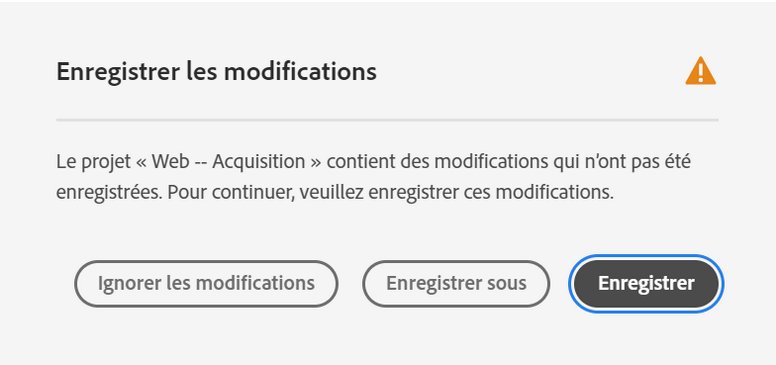
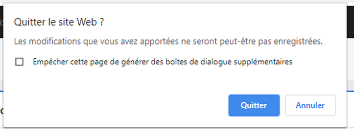
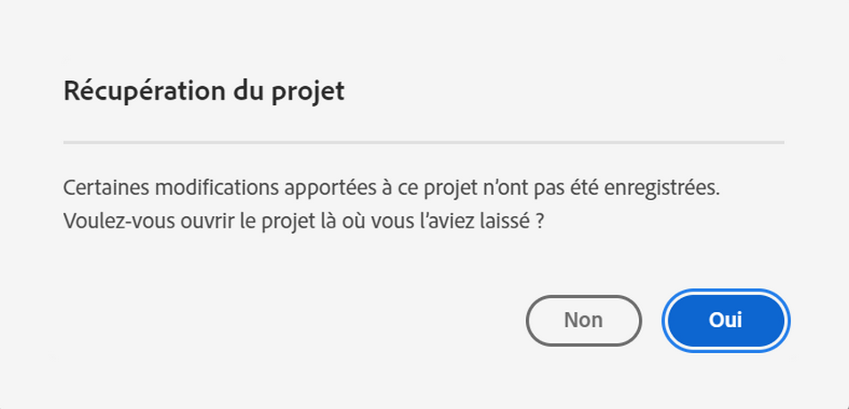
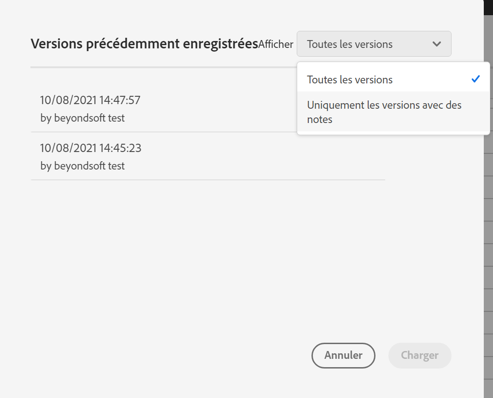

# Enregistrement des projets

Les projets dans Analysis Workspace sont automatiquement enregistrés toutes les 2 minutes.

Vous pouvez également enregistrer des projets manuellement. D’autres options, telles que l’ajout de balises ou de notes, sont disponibles lorsque vous enregistrez un projet manuellement.

## Enregistrer manuellement des projets {#Save}

Plusieurs options sont disponibles lors de l’enregistrement manuel d’un projet dans Analysis Workspace.

Enregistrer un projet manuellement :

1. Une fois votre projet ouvert dans Analysis Workspace, sélectionnez **[!UICONTROL Projet]**, puis choisissez l’une des options suivantes :

   | Action | Description |
   |---|---| 
   | **[!UICONTROL Enregistrer]** | Enregistrez les modifications apportées au projet. Si le projet est partagé, les destinataires du projet verront également les modifications. Lorsque vous enregistrez le projet pour la première fois, vous êtes invité à lui attribuer un nom, une description (facultative) et à ajouter des balises (facultatives). |
   | **[!UICONTROL Enregistrer avec les notes]** | Avant l’enregistrement de votre projet, ajoutez des notes sur les modifications apportées au projet. Les notes sont stockées avec la version du projet et sont disponibles pour tous les éditeurs sous [!UICONTROL Projet] > [!UICONTROL Ouvrir la version précédente]. |
   | **[!UICONTROL Enregistrer sous]** | Créez un doublon du projet. Le projet d’origine ne sera pas affecté. |
   | **[!UICONTROL Enregistrer en tant que rapport d’entreprise]** | Enregistrez votre projet en tant que [rapport d’entreprise](/help/analyze/analysis-workspace/reports/create-company-reports.md) disponible pour votre entreprise sous **[!UICONTROL Projet > Nouveau]**. |

## Enregistrement automatique {#Autosave}

Tous les projets dans Analysis Workspace sont automatiquement enregistrés toutes les 2 minutes sur votre ordinateur local. Cela inclut les nouveaux projets qui ne sont pas encore enregistrés manuellement.

* **Nouveaux projets :** même si les nouveaux projets sont enregistrés automatiquement, vous devez enregistrer chaque nouveau projet manuellement la première fois. Analysis Workspace vous invite à enregistrer les nouveaux projets manuellement lorsque vous passez à un autre projet, lorsque vous fermez l’onglet du navigateur, etc.

  Si, pour une raison quelconque, vous perdez inopinément l’accès à un nouveau projet avant de l’enregistrer manuellement, une version de récupération de votre projet est enregistrée sur la page de destination d’Analysis Workspace dans un dossier appelé `Recovered Projects (Last 7 Days)`. Vous devez restaurer le projet récupéré et l’enregistrer manuellement à l’emplacement souhaité.

  Restaurer un projet récupéré :

   1. Accédez au dossier [!UICONTROL **Projets récupérés**] sur la page de destination d’Analysis Workspace.

      

   1. Ouvrez votre projet et enregistrez-le à l’emplacement souhaité.

* **Projets existants :** si, pour une raison quelconque, vous quittez un projet dont les modifications n’ont pas encore été enregistrées automatiquement, Analysis Workspace vous invite à enregistrer vos modifications ou affiche un message d’avertissement.

  Voici quelques scénarios courants :

### Ouvrir un autre projet

Si vous ouvrez un projet supplémentaire alors que vous travaillez sur un projet qui contient des modifications qui n’ont pas encore été enregistrées automatiquement, Analysis Workspace vous invite à enregistrer le projet en cours avant de le quitter.

Les options disponibles sont les suivantes :

* **Enregistrer :** remplace la copie locale la plus récente de votre projet enregistrée automatiquement par vos dernières modifications.
* **Enregistrer sous :** enregistre vos dernières modifications en tant que nouveau projet. Le projet d’origine est enregistré uniquement avec les modifications les plus récentes enregistrées automatiquement.
* **Ignorer les modifications :** ignore les dernières modifications. Le projet conserve les modifications les plus récentes enregistrées automatiquement.

### Quitter ou fermer un onglet

Si vous quittez la page ou fermez l’onglet du navigateur lors de l’affichage d’un projet avec des modifications qui n’ont pas encore été enregistrées automatiquement, le navigateur vous avertit que les modifications non enregistrées seront perdues. Vous pouvez choisir de quitter ou d’annuler.

### Blocage du navigateur ou expiration d’une session

En cas de blocage du navigateur ou d’expiration de la session, vous êtes invité, lors de votre prochain accès à Analysis Workspace, à récupérer les modifications apportées à votre projet qui n’ont pas encore été enregistrées automatiquement.

Vous trouverez ci-dessous la boîte de dialogue Récupération du projet qui s’affiche la première fois que vous accédez à Analysis Workspace après un blocage ou une expiration de session.

Sélectionnez **Oui** pour restaurer le projet à partir de la copie la plus récente enregistrée automatiquement.

Sélectionnez **Non** pour supprimer la copie enregistrée automatiquement et ouvrir la dernière version du projet enregistrée par l’utilisateur.

Pour les **nouveaux** projets qui n’ont jamais été enregistrés, les modifications non enregistrées ne sont pas récupérables.

## Ouvrir une version précédente {#previous-version}

Pour ouvrir une version précédente d’un projet :

1. Accédez à **[!UICONTROL Projet]** > **[!UICONTROL Ouvrir la version précédente]**

   

1. Consultez la liste des versions antérieures disponibles.
   [!UICONTROL Date et heure] et [!UICONTROL Éditeur] s’affichent, en plus des [!UICONTROL Notes] s’ils ont été ajoutés lorsque l’[!UICONTROL Éditeur] a été enregistré. Les versions sans notes sont stockées pendant 90 jours. Les versions avec notes sont stockées pendant 1 an.
1. Sélectionnez une version précédente et cliquez sur **[!UICONTROL Charger]**.
La version précédente se charge ensuite avec une notification. La version précédente ne devient pas la version enregistrée actuelle de votre projet tant que vous n’avez pas cliqué sur **[!UICONTROL Enregistrer]**. Si vous quittez la version chargée, lorsque vous revenez, la dernière version enregistrée du projet s’affiche.
