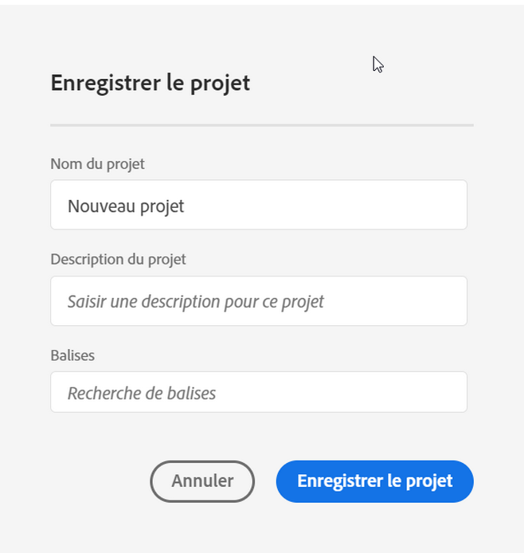

# Enregistrement des projets

Pour enregistrer vos modifications dans un projet, accédez au menu **[!UICONTROL Projet]** de Workspace. En outre, Adobe enregistre automatiquement les projets dans certains cas.

## Options d’enregistrement des projets {#Save}

Il existe différentes actions d’enregistrement que vous pouvez effectuer sous le menu **[!UICONTROL Projet]**, selon la manière dont vous souhaitez accéder à votre analyse à l’avenir.

| Action | Description |
|---|---| 
| **[!UICONTROL Enregistrer]** | Enregistrez les modifications apportées au projet. Si le projet est partagé, les destinataires du projet verront également les modifications. Lorsque vous enregistrez le projet pour la première fois, vous êtes invité à lui attribuer un nom, une description (facultative) et à ajouter des balises (facultatives). |
| **[!UICONTROL Enregistrer sous]** | Créez un doublon du projet. Le projet d’origine ne sera pas affecté. |
| **[!UICONTROL Enregistrer en tant que modèle]** | Enregistrez votre projet comme [modèle personnalisé](https://docs.adobe.com/content/help/fr-FR/analytics/analyze/analysis-workspace/build-workspace-project/starter-projects.html) disponible pour votre entreprise sous **[!UICONTROL Projet > Nouveau]** |

## Enregistrement automatique {#Autosave}

Les projets existants, c’est-à-dire les projets enregistrés au moins une fois auparavant, sont automatiquement enregistrés toutes les deux minutes sur votre ordinateur local. Les nouveaux projets qui n’ont jamais été enregistrés ne sont pas enregistrés automatiquement.

Plusieurs scénarios permettent d’éviter les modifications non enregistrées d’un projet. Différentes actions s’offrent alors à vous.

### Ouverture d’un autre projet Workspace

Adobe permet d’enregistrer avant de quitter la page. Après avoir quitté un projet existant, la copie locale enregistrée automatiquement est supprimée.

### Quitter ou fermer un onglet

Le navigateur signale que les modifications non enregistrées seront perdues. Vous pouvez choisir de quitter ou d’annuler.

### Blocage du navigateur ou expiration d’une session

Pour les projets **existants**, lorsque l’utilisateur revient à Workspace, une fenêtre modale de **récupération du projet** s’affiche. Sélectionnez « Oui » pour restaurer le projet à partir de la copie locale enregistrée automatiquement. Sélectionnez « Non » pour supprimer la copie locale enregistrée automatiquement et ouvrir la dernière version du projet enregistrée par l’utilisateur.

Pour les **nouveaux** projets qui n’ont jamais été enregistrés, les modifications non enregistrées ne sont pas récupérables.