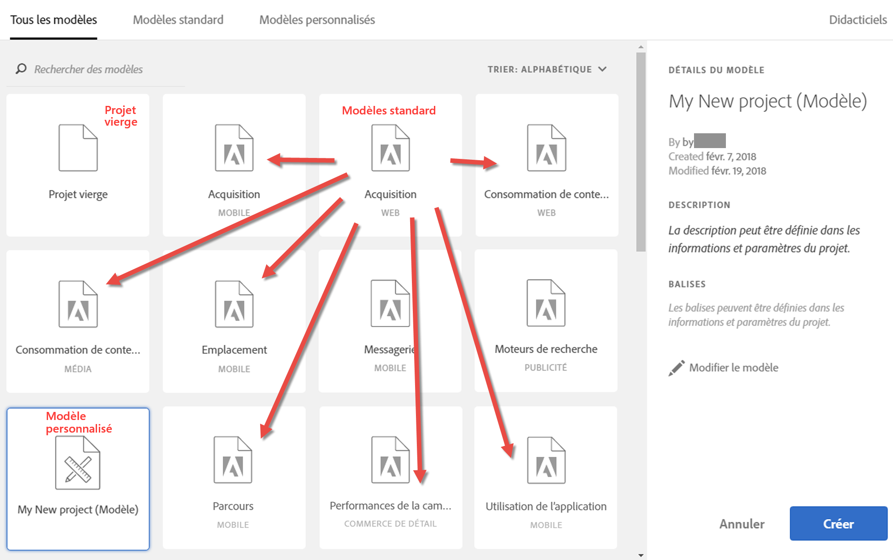

# Modèles

Vous pouvez créer un projet d’après :

* **Projet vierge (par défaut)**: Pour plus d’informations, voir [Création d’un projet](/help/analyze/analysis-workspace/build-workspace-project/t-freeform-project.md)d’espace de travail  .
* **Modèle** standard : Ces modèles sont créés par Adobe et livrés avec le produit.
* **Modèle** personnalisé : Ces modèles peuvent être créés, partagés ou supprimés par les utilisateurs disposant de droits d’administration ou par des non-administrateurs, à condition qu’ils aient obtenu l’autorisation [!UICONTROL Analysis Workspace: Save as Template] dans la Console d’administration. [En savoir plus...](https://docs.adobe.com/content/help/en/analytics/admin/admin-console/permissions/product-profile.html)

## Création d’un modèle personnalisé {#create-custom-template}

Les utilisateurs disposant des droits d’administration peuvent transformer n’importe quel projet qu’ils créent en modèle personnalisé. Procédez comme suit :

1. Ouvrez le projet.
1. Accédez à **[!UICONTROL Project]** > **[!UICONTROL Save As Template]**.

   

   Le projet enregistré sera nommé avec le nom du projet en cours suivi du mot « (Modèle) ». Les administrateurs peuvent modifier ce nom en modifiant le modèle.

   >[!NOTE]
   >
   >Par défaut, toutes les personnes de l’organisation ont accès aux modèles de projet. Vous pouvez organiser les modèles en leur appliquant des balises. (Accédez à **[!UICONTROL Project]** > **[!UICONTROL Project Info & Settings]** pour modifier les balises et les descriptions.)

### Actions possibles sur les modèles personnalisés

| Action | Description |
|--- |--- |
| Modifier  le modèle | Permet à un administrateur de modifier le modèle en modifiant sa source de données, ses composants, ses visualisations, ses plages de dates, etc.  Pour modifier un modèle personnalisé, procédez comme suit :<ul><li>affichez la liste des modèles personnalisés dans Analysis Workspace, sélectionnez-en un, puis cliquez sur Modifier le modèle ; ou</li><li>dans Analytics, sélectionnez Composants > Projets, puis filtrez les projets en fonction des Modèles. Cliquez sur le nom du modèle à modifier.</li></ul>**Remarque :** Après avoir modifié un modèle, vous disposez de deux options selon les cas : Enregistrez, Enregistrez Sous. En voici les différences :<ul><li>**Enregistrer :** Met à jour le modèle personnalisé pour tous les utilisateurs. Lorsqu’une autre personne crée un projet à partir de ce modèle personnalisé, elle voit les modifications que vous avez apportées.</li><li>**Enregistrer sous :** Crée une copie du modèle personnalisé avec vos modifications. (En mode de modification, le menu Partager > Partager le projet est désactivé.)</li></ul> |
| Rechercher des modèles | Dans la boîte de dialogue Modèles personnalisés, cliquez sur Rechercher des modèles. |
| Trier les modèles | Vous pouvez trier les modèles par ordre alphabétique, par pertinence et par date de création.  Dans la boîte de dialogue Modèles personnalisés, cliquez sur Tri :. |
| Appliquer des balises à un modèle | Ouvrez le modèle et sélectionnez Projet > Informations et paramètres du projet. Cliquez sur Ajouter des balises. |
| Modifier la description du modèle | Ouvrez le modèle et sélectionnez Projet > Informations et paramètres du projet. Double-cliquez sur la description pour la modifier. |

## Modèles standard

Lorsque vous ouvrez un Workspace pour la première fois, les modèles sont disponibles dans le rail de gauche.  les modèles de l’espace de travail  de l’espace de travail couvrent les cas d’utilisation courants. Ils sont regroupés selon la verticale à laquelle ils appartiennent et sont renseignés avec des dimensions, des segments, des mesures et des visualisations différents, selon la suite de rapports que vous avez sélectionnée.

Vous pouvez utiliser ces modèles préremplis tels quels ou les adapter à vos besoins (en ajoutant ou en remplaçant des mesures ou des visualisations, par exemple) et les enregistrer sous un nouveau nom.

[Modèles standard dans Analysis Workspace sur YouTube](https://www.youtube.com/watch?v=aRgYwPneVXg&list=PL2tCx83mn7GuNnQdYGOtlyCu0V5mEZ8sS&index=6) (2:46)

Voici les modèles disponibles et les questions auxquelles chaque modèle peut répondre.

### Formation

* **Didacticiel** de formation : Ce modèle standard vous guide tout au long de la terminologie et des étapes courantes pour créer votre premier   dans Workspace. Il est disponible sous forme de modèle standard dans le modal Nouveau projet et remplace l’exemple de projet qui existe aujourd’hui pour les nouveaux utilisateurs qui n’ont pas d’autres projets dans leur liste.

### Publicité

>[!IMPORTANT]
>
>Les modèles Publicité sont accessibles uniquement si votre suite de rapports est activée pour Advertising Cloud.

* **Moteurs** de recherche payante : Ce modèle ventile les tendances publicitaires, les plateformes publicitaires, les mots-clés, les comptes, les campagnes, etc.

### Commerce

* **Magento : Marketing et commerce** : ce modèle ventile la conversion de votre commerce électronique en fonction de l’attribution du canal marketing et fournit des informations par mot-clé de recherche, page d’entrée, emplacement géographique, etc. Pour une présentation vidéo, voir >[!VIDEO](https://www.youtube.com/watch?v=AQOViVLEMHw)

### Média

* **Consommation audio** : quel contenu est le plus consommé et attire le plus d’utilisateurs ?
* **Récence, fréquence, fidélité** : qui sont mes fidèles lecteurs ?

### Mobile

>[!IMPORTANT]
>
>Les modèles mobiles sont accessibles uniquement si votre suite de rapports est activée pour Mobile.

* **Message :** est axé sur les performances de la messagerie in-app et push.
* **Emplacement :** comprend une carte représentant les données de positionnement.
* **Mesures clés :** sachez de quelle façon se comportent les mesures clés de votre application.
* **Utilisation de l’application :** combien d’utilisateurs, de lancements et de premiers lancements de l’application avait l’application et quelle est la durée de session moyenne ?
* **Acquisition :** contrôlez les performances des liens d’acquisition mobile.
* **Performances :** quelles sont les performances de l’application et où les utilisateurs rencontrent-ils des problèmes ?
* **Rétention :** qui sont mes fidèles utilisateurs et que font-ils ?
* **Parcours :** quels sont les schémas d’utilisation dominants de mon application ?

### Vente au détail

* **Performances de la campagne :** quelles campagnes génèrent le plus de recettes ?
* **Produits :** quels produits sont les plus performants ?

### Web

* **Acquisition :** quels sont les principaux facteurs orientant le trafic vers mon site web ?
* **Consommation de contenu :** où se rendent surtout les personnes sur mon site ?
* **Rétention :** quels types d’utilisateurs seront a priori les plus fidèles à mon site ?
* **Technologie :** quelle technologie utilisent les visiteurs de mon site ?

### Personnes

> [!NOTE] Le modèle Personnes et la mesure Personnes associée peuvent être utilisés uniquement dans le cadre d’[Adobe Experience Cloud Device Co-op](https://marketing.adobe.com/resources/help/en_US/mcdc/mcdc-people.html).

Ce modèle est basé sur la mesure Personnes, qui est une version dédupliquée de la mesure uniques. La mesure Personnes fournit une mesure de la fréquence à laquelle les consommateurs utilisant plusieurs périphériques interagissent avec votre marque. Le modèle vous permet de

* Segmentez vos données pour les Etats-Unis et le Canada par rapport au reste du monde. Le Device Co-op est actuellement disponible uniquement en Amérique du Nord.
* Comparez côte à côte les mesures Personnes et uniques.
* Voir le &quot;taux de compression&quot;, une mesure calculée qui calcule la taille de la mesure Personnes sous la forme d’un pourcentage de uniques.
* Comparer les totaux des types de périphériques utilisés par vos clients
* déterminer le nombre moyen de périphériques utilisés par personne ;
* Découvrez comment utiliser l’empilement de segments avec la mesure Personnes.
* Découvrez comment l’utilisation de l’ID Experience Cloud dans votre   améliore l’efficacité de la mesure Personnes.

### Journey IQ : Modèle Analytics sur plusieurs périphériques

<!-->This content is mirrored in the CDA doc.<-->

Ce modèle vous permet d’afficher des données de performances interpériphériques essentielles. Il est uniquement disponible pour les clients qui ont accès à Analytics  sur plusieurs périphériques (CDA).

* **Note spéciale à l&#39;intention des membres du Graphique** coopératif : Indique la partie de votre suite de rapports qui contient des dans les régions où le graphique coopératif est pris en charge et les régions où il n’est pas pris en charge.
* **Identification des utilisateurs**: Indique la fréquence à laquelle les de votre site sont identifiés à l’aide de méthodes basées sur les analyses multipériphériques.
* **Mesure  taille** du : Affiche une comparaison entre &quot;Dispositifs uniques&quot; et &quot;Personnes&quot;. La proportion de ces deux nombres est connue sous le nom de &quot;compression inter-périphériques&quot;, une mesure calculée visible dans ce panneau. Cette mesure de compression dépend d’un large éventail de facteurs :
   * **Utilisation du graphique coopératif ou du graphique** privé : En général, les organisations qui utilisent la coopérative de l&#39;appareil ont tendance à voir de meilleurs taux de compression que les organisations qui utilisent le graphique privé.
   * **Taux** de connexion : Plus les utilisateurs se connectent sur votre site, plus Adobe peut identifier et assembler des sur plusieurs périphériques. Les sites qui présentent un faible taux de connexion ont aussi de faibles taux de compression.
   * **Couverture** d’ID Experience Cloud : Seuls les avec un ECID peuvent être assemblés. Un pourcentage plus faible de visiteurs qui accèdent à votre site en utilisant un ECID correspond à des taux de compression plus faibles.
   * **Utilisation** de plusieurs périphériques : Si les de votre site n’utilisent pas plusieurs périphériques, les taux de compression sont plus faibles.
   * **de granularité** du : La compression par jour est généralement plus petite que la compression par mois ou par année. Les chances qu’une personne utilise plusieurs appareils sont moindres au cours d’un seul jour qu’au cours d’un mois entier. La segmentation, le filtrage ou l’utilisation de dimensions de ventilation peuvent également indiquer un taux de compression plus faible.
* **Segments** basés sur les personnes : Contient une liste déroulante de segments qui vous permet de  données spécifiques au périphérique. Ce panneau encourage l’expérimentation de segments afin de voir comment l’inclusion ou l’exclusion des types de périphériques affectent les rapports.
* **Analyse du parcours** inter-périphériques : Fournit des rapports de flux et d’abandons en fonction du type de périphérique.
* **Attribution** sur plusieurs périphériques : Combinez les caractéristiques de Journey IQ et d’Attribution IQ.
* **Autres conseils et astuces**: Rubriques utiles sur l&#39;ADC qui vous permettent de mieux l&#39;utiliser.