# Création d’un projet Workspace

Créez un projet et ajoutez des composants (dimensions, mesures, segments et plages de dates) au panneau à structure libre.

Cet article présente les éléments d’Analysis Workspace et explique comment créer un projet. Pour consulter des cas d’utilisation spécifiques, voir [Cas d’utilisation d’Analysis Workspace](/help/analyze/analysis-workspace/freeform-analysis-examples-use-cases.md).

## Création d’un projet

1. Spécifiez les autorisations de création et de traitement des projets de l’utilisateur.

   Avant de créer ou de traiter un projet Analysis Workspace, les administrateurs doivent vous ajouter à un groupe avec l’autorisation **[!UICONTROL Créer/Traiter les projets dans Analysis Workspace]** activée ou au groupe d’utilisateurs **[!UICONTROL Accès à tous les rapports]**. ( **[!UICONTROL Administration]** &gt; **[!UICONTROL Gestion utilisateur]** &gt; [Groupes](https://marketing.adobe.com/resources/help/en_US/reference/groups.html)).

1. Dans [!DNL Experience Cloud], cliquez sur **[!UICONTROL Analytics]** &gt; **[!UICONTROL Workspace]**.

   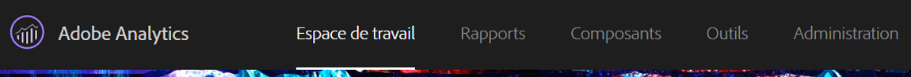

   Vous pouvez également entrer une barre oblique (/) afin d’ouvrir la barre de recherche des rapports, puis entrer *`workspace`*.

   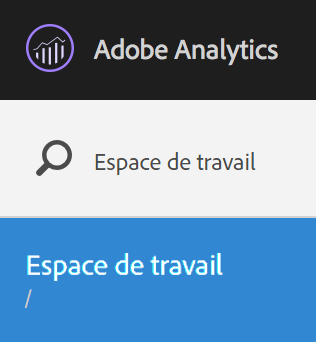

1. Cliquez sur **[!UICONTROL Créer un projet]**.

   Vous pouvez créer un projet d’après :

* un projet vierge (par défaut). Pour obtenir des instructions, voir ci-dessous.
* d’un modèle standard. Ces modèles créés par Adobe sont prêts à l’emploi. Pour obtenir des instructions, voir [Modèles](/help/analyze/analysis-workspace/build-workspace-project/starter-projects.md) ;
* d’un modèle personnalisé. Les utilisateurs dotés de droits d’administration peuvent créer ces modèles. Pour obtenir des instructions, voir [Modèles](/help/analyze/analysis-workspace/build-workspace-project/starter-projects.md).

   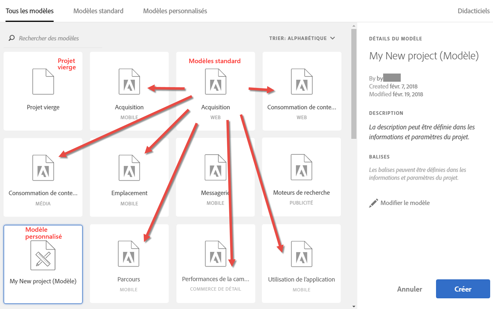

1. Pour créer un projet à partir d’un projet vierge, cliquez sur **[!UICONTROL Projet vierge]**.

   * Cliquez ensuite sur **[!UICONTROL Créer]**, ou
   * cliquez simplement sur **[!UICONTROL Entrée]**.
   Un projet vierge s’affiche, avec un panneau à structure libre et une visualisation de tableau de données.

   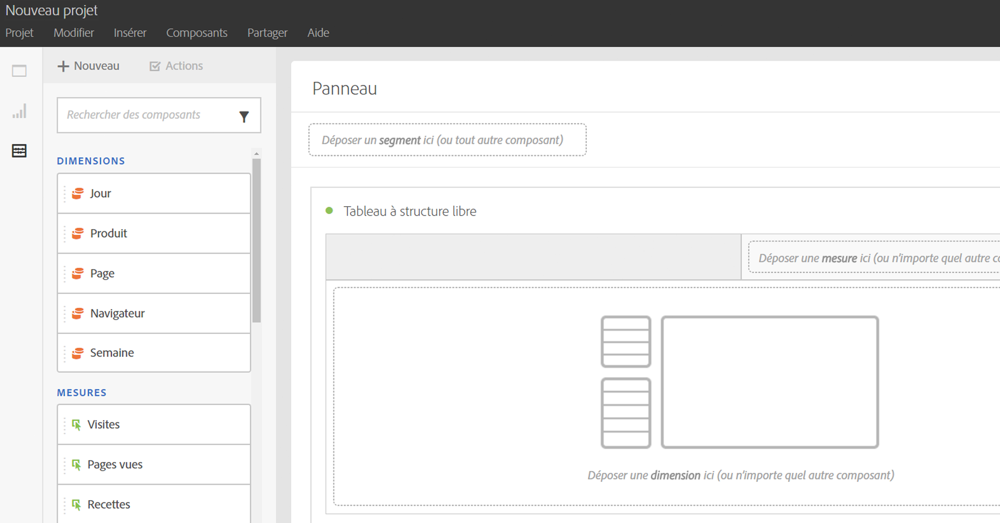

   >[!NOTE]
   >
   >Parfois, un message « Suite de rapports incompatible » s’affiche lors du chargement d’un projet (ou du changement de suite de rapports) pour lequel tous les composants (mesures/dimensions) ne sont pas inclus dans la suite de rapports. Vous pouvez consulter la liste des composants non compatibles et ainsi savoir pour quelle raison ce message s’affiche.

<table id="table_3989E45D9D4241CBB2E58B29DA257B2F"> 
 <thead> 
  <tr> 
   <th colname="col1" class="entry"> Élément </th> 
   <th colname="col2" class="entry"> Description </th> 
  </tr> 
 </thead>
 <tbody> 
  <tr> 
   <td colname="col1"><a href="/help/analyze/analysis-workspace/components/analysis-workspace-components.md"  > Composants</a> </td> 
   <td colname="col2"> 
Dimensions, mesures, segments et périodes que vous faites glisser sur les projets. 
 </td> 
  </tr> 
  <tr> 
   <td colname="col1"><a href="/help/analyze/analysis-workspace/visualizations/freeform-analysis-visualizations.md"  > Visualisations</a> </td> 
   <td colname="col2"> 
Éléments que vous pouvez faire glisser sur le panneau ou les zones du projet dans l’interface. 
 </td> 
  </tr> 
  <tr> 
   <td colname="col1"><a href="/help/analyze/analysis-workspace/visualizations/freeform-table.md"  > Panneau à structure libre</a> </td> 
   <td colname="col2"> 
Trame ou Workspace avec lequel vous interagissez dans Analysis Workspace. 
 </td> 
  </tr> 
 </tbody> 
</table>

1. Enregistrez le projet. Nommez-le, décrivez-le (facultatif, mais utile), balisez-le (facultatif), puis cliquez sur **[!UICONTROL Enregistrer le projet]**.

   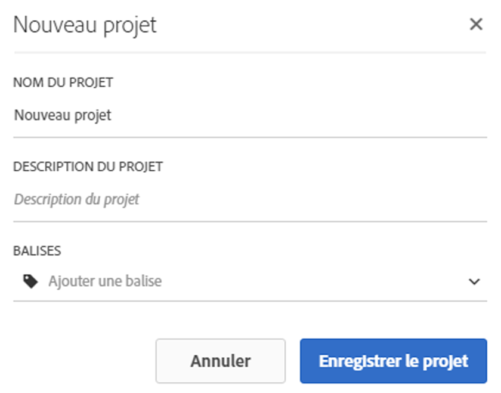

1. Désormais, vous pouvez cliquer avec le bouton droit de la souris sur une visualisation ou un panneau pour le copier, puis le coller (« insérer ») à un autre emplacement du projet ou dans un autre projet.

   Utilisez cette fonction pour créer des blocs de construction (visualisations ou panneaux prédéfinis) qui pourront être copiés dans d’autres projets afin de démarrer plus rapidement, avec des données spécifiques à votre entreprise.

   >[!NOTE]
   >
   >Une fois que le projet a été copié/enregistré sous, les liens internes appartiennent alors au projet dans lequel ils apparaissent et non plus au projet d’origine à partir duquel ils ont été copiés.

## Ajout de composants et de visualisations {#task_CDAC9B3007BE4A3790AFAD3746D669B1}

1. Créez votre projet en faisant glisser *`components`* et *`visualizations`* vers le projet.

   **Composants**

   La barre d’outils Composant contient les dimensions, mesures, segments et plages de dates pouvant faire l’objet de recherches et que vous utilisez le plus fréquemment.

<table id="table_4626163E26DE46CB86391868BBA3AD32"> 
 <thead> 
  <tr> 
   <th colname="col1" class="entry"> Composant </th> 
   <th colname="col2" class="entry"> Description </th> 
  </tr> 
 </thead>
 <tbody> 
  <tr> 
   <td colname="col1"> Dimensions (orange) </td> 
   <td colname="col2"> 
Appliquez-les au niveau du projet. 
 
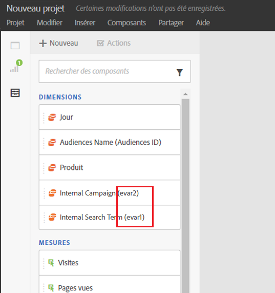 
 
Les dimensions Prop#, eVar# et event# sont ajoutées aux noms des dimensions et vous pouvez en rechercher les numéros. Exemple : « Campagne interne » apparaît dans le rail de gauche comme « Campagne interne (evar2) ». 
 
 Notez que les numéros des dimensions prop, eVar et event n’apparaissent pas dans le tableau (afin de conserver des titres courts). 
 
Il existe un ordre de classement par défaut pour certaines dimensions prêtes à l’emploi lorsqu’elles sont déposées dans un tableau à structure libre ou lorsqu’elles s’affichent dans le rail de gauche. Par exemple, lorsque la dimension « Heure du jour » est déposée dans un tableau ou affichée dans le rail de gauche, elle est triée par heure, de 00h à 23h. Vous avez toujours la possibilité de les classer en fonction de n’importe quelle colonne de mesures. 
 </td> 
  </tr> 
  <tr> 
   <td colname="col1"> Mesures (vert) </td> 
   <td colname="col2"> 
Appliquez-les au niveau du projet. 
 
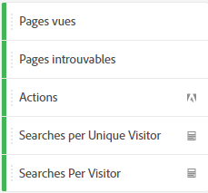 
 
  Occurrences est la mesure par défaut pour le tableau de données. 
 </td> 
  </tr> 
  <tr> 
   <td colname="col1"> Segments (bleu) </td> 
   <td colname="col2"> 
Vous pouvez les faire glisser uniquement au niveau du panneau, mais vous pouvez créer des segments incorporés dans le tableau de données. 
 
 
 
Pour en savoir plus, voir <a href="/help/analyze/analysis-workspace/freeform-analysis-examples-use-cases.md"  > Cas d’utilisation d’Analysis Workspace</a>. 
 </td> 
  </tr> 
  <tr> 
   <td colname="col1"> Plages de dates et granularités (violet) </td> 
   <td colname="col2"> 
Vous pouvez les faire glisser uniquement au niveau du panneau. Vous pouvez créer un projet à partir du calendrier, lorsque vous configurez une plage de dates. 
 
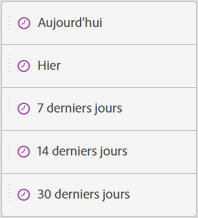 
 </td> 
  </tr> 
 </tbody> 
</table>

**[Visualisations](/help/analyze/analysis-workspace/visualizations/freeform-analysis-visualizations.md)**

Le panneau [!UICONTROL Visualisations] fournit des graphiques, des diagrammes, des anneaux, des tableaux de données, des tableaux de [cohortes](/help/analyze/analysis-workspace/visualizations/cohort-table/cohort-analysis.md), des diagrammes de Venn, etc. Vous pouvez faire glisser-déposer plusieurs visualisations sur votre projet.

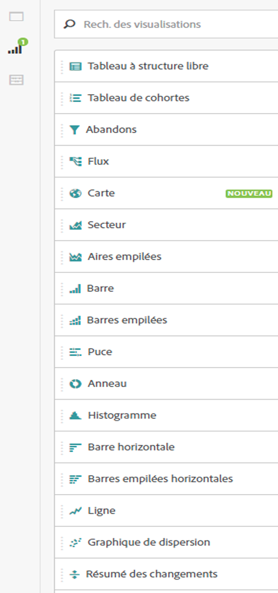

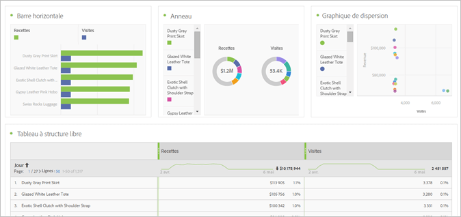

1. Étape

## Utilisation du menu contextuel pour personnaliser les données {#concept_8117C300F21843B99F4E1B9AB7B11B6F}

Grâce au menu contextuel, vous pouvez exécuter les actions suivantes, selon la cellule du tableau dans laquelle vous cliquez avec le bouton droit.

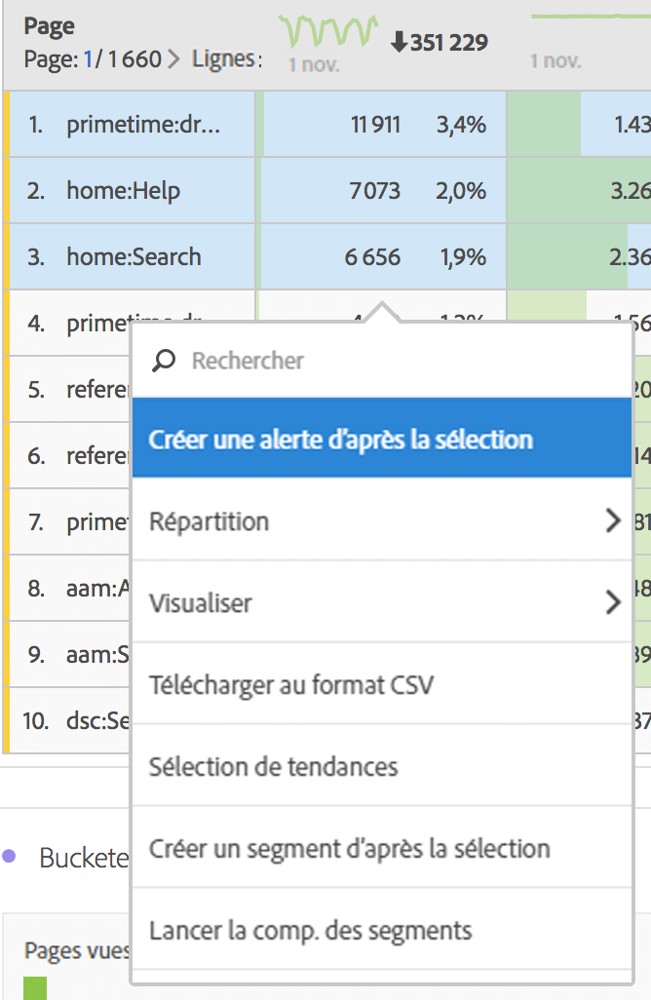

<table id="table_0F84CC5B604D4D41BD0C9668DF525929"> 
 <thead> 
  <tr> 
   <th colname="col1" class="entry"> Action </th> 
   <th colname="col2" class="entry"> Description </th> 
  </tr>
 </thead>
 <tbody> 
  <tr> 
   <td colname="col1"><a href="/help/analyze/analysis-workspace/components/calendar-date-ranges/time-comparison.md"  > Ajout d’une colonne de période</a> </td> 
   <td colname="col2"> </td> 
  </tr> 
  <tr> 
   <td colname="col1"><a href="/help/analyze/analysis-workspace/components/calendar-date-ranges/time-comparison.md"  > Comparaison de périodes</a> </td> 
   <td colname="col2"> </td> 
  </tr> 
  <tr> 
   <td colname="col1"> 
Copier dans le Presse-papiers 
 </td> 
   <td colname="col2"> </td> 
  </tr> 
  <tr> 
   <td colname="col1"> 
Supprimer la sélection 
 </td> 
   <td colname="col2"> </td> 
  </tr> 
  <tr> 
   <td colname="col1"><a href="/help/components/c-alerts/intellligent-alerts.md"  > Création d’une alerte d’après la sélection</a> </td> 
   <td colname="col2"> </td> 
  </tr> 
  <tr> 
   <td colname="col1"><a href="/help/analyze/analysis-workspace/components/dimensions/t-breakdown-fa.md"  > Ventilation</a> 
    <ul id="ul_18C83B8514AD4C1C86C071AA8402CB5C"> 
     <li id="li_6CA84ED293EA4940A7495DA9D9121264">Dimensions </li> 
     <li id="li_EA16EE017B2E4A6998918706938A21BF">Mesures </li> 
     <li id="li_0405D339CD01405DB508A7D8D1A976B4">Segments </li> 
     <li id="li_819CE81C552F49BB9C1B83ED3B42C5F7">Heure </li> 
    </ul> </td> 
   <td colname="col2"> </td> 
  </tr> 
  <tr> 
   <td colname="col1"><a href="/help/analyze/analysis-workspace/visualizations/freeform-analysis-visualizations.md"  > Visualisation</a> </td> 
   <td colname="col2"> </td> 
  </tr> 
  <tr> 
   <td colname="col1"><a href="/help/analyze/analysis-workspace/curate-share/download-send.md"  > Téléchargement au format CSV</a> </td> 
   <td colname="col2"> </td> 
  </tr> 
  <tr> 
   <td colname="col1"><a href="/help/analyze/analysis-workspace/analysis-workspace-features.md"  > Sélection de tendances</a> </td> 
   <td colname="col2"> </td> 
  </tr> 
  <tr> 
   <td colname="col1"><a href="/help/analyze/analysis-workspace/components/t-freeform-project-segment.md"  > Création d’un segment d’après une sélection</a> </td> 
   <td colname="col2"> </td> 
  </tr> 
  <tr> 
   <td colname="col1"><a href="/help/analyze/analysis-workspace/c-panels/c-segment-comparison/segment-comparison.md"  > Comparaison des segments</a> </td> 
   <td colname="col2"> </td> 
  </tr> 
  <tr> 
   <td colname="col1"> Afficher uniquement les lignes sélectionnées </td> 
   <td colname="col2"> </td> 
  </tr> 
  <tr> 
   <td colname="col1"> Afficher toutes les lignes </td> 
   <td colname="col2"> </td> 
  </tr> 
 </tbody> 
</table>

Voir [Interactions clavier-souris dans Analysis Workspace](/help/analyze/analysis-workspace/build-workspace-project/fa-shortcut-keys.md) pour obtenir des informations sur la copie et la sélection de lignes.
