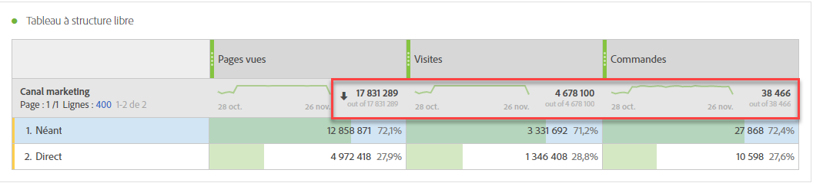
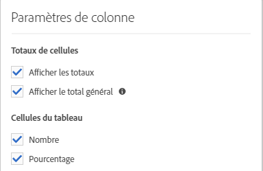
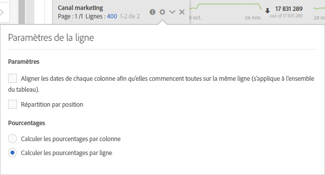

# Totaux de Workspace

Dans les tableaux à structure libre, une ligne de total s’affiche à chaque niveau de ventilation et peut afficher deux totaux :

* **[!UICONTROL Grand Total]** (nombre grisé &quot;hors de&quot;) : ce total représente tous les accès qui ont été collectés, parfois appelés &quot;total de la suite de rapports&quot;. Lorsqu’un segment est appliqué au niveau du panneau ou dans le tableau à structure libre, ce total s’ajuste pour refléter tous les accès qui correspondent aux critères de segment.
* **[!UICONTROL Table Total]** (nombre noir) : ce total est généralement égal ou un sous-ensemble du [!UICONTROL Grand Total]. It reflects any table filters applied within the freeform table, including the [!UICONTROL Include None] option.

## Paramètre Afficher le total

Sous **[!UICONTROL Column Settings]** cette rubrique, il y a des options à **[!UICONTROL Show Totals]** et **[!UICONTROL Show Grand Total]**. Si ces paramètres sont désactivés, les totaux sont supprimés du tableau. Cela peut être indiqué dans les cas où les totaux n’ont aucun intérêt, comme dans certains [scénarios de mesures calculées](https://docs.adobe.com/content/help/fr-FR/analytics/components/calculated-metrics/calcmetrics-reference/cm-totals.html).

## Paramètres Total de ligne statique

[Les totaux des lignes](https://docs.adobe.com/content/help/fr-FR/analytics/analyze/analysis-workspace/build-workspace-project/column-row-settings/manual-vs-dynamic-rows.html) statiques se comportent différemment et sont contrôlés sous **[!UICONTROL Row Settings]**.

* **[!UICONTROL Show sum of current rows as the total]** - ceci montre une somme côté client des lignes du tableau, ce qui signifie que le total **ne déduira pas** les mesures  telles que les visites ou les.
* **[!UICONTROL Show Grand Total]** - indique une somme côté serveur, ce qui signifie que le total va  les mesures comme les visites ou les.

## Questions fréquentes

| Questions | Réponse |
|---|---|
| Sur quel « total » sont basés les pourcentages de la colonne grise ? | Cela dépend du **[!UICONTROL Percentages]** paramètre sélectionné sous **[!UICONTROL Row Settings]**:<ul><li>Calculer les pourcentages par colonne : il s’agit du paramètre par défaut. Les pourcentages seront basés sur le total du tableau.</li><li>Calculer les pourcentages par ligne : les pourcentages seront basés sur le total général.</li></ul> |
| Quel est l’impact du **[!UICONTROL Include Unspecified (None)]** paramètre sur les totaux ? | If the **[!UICONTROL Include Unspecified (None)]** setting is unchecked, the None/Unspecified row will be removed from the table, the Table Total, and will carry through to any calculated metrics that use [&#39;Total&#39; metric types](https://docs.adobe.com/content/help/fr-FR/analytics/components/calculated-metrics/calcmetric-workflow/m-metric-type-alloc.html) |
| Lorsque des filtres de tableau personnalisés sont appliqués à un tableau à structure libre, est-ce que toutes mes mesures calculées et mon compte de mise en forme conditionnelle sont associés au filtre ? | Pas pour le moment. **[!UICONTROL Include Unspecified (None)]** seront prises en compte, mais les  de tableau personnalisées n’auront aucune incidence sur les éléments suivants :<ul><li>La plage max./min. de la colonne utilisée par la mise en forme conditionnelle s’appliquera à toutes les données.</li><li>Mesures calculées qui tirent parti des types de **[!UICONTROL Grand Total]** mesures.</li><li>Mesures calculées avec des fonctions qui effectuent des calculs sur les lignes d’un tableau à structure libre, c’est-à-dire Somme de la colonne, Max. de la colonne, Min. de la colonne, Nombre, Moyenne, Médian, Percentile, Quartile, Nombre de lignes, Écart type, Variance, Cumulative, Moyenne cumulée, Variantes de régression, Score normalisé, Test en T, Score centré réduit, Test Z.</li></ul> |
| In Calculated Metrics, what does the **[!UICONTROL Grand Total]** metric type reflect? | **[!UICONTROL Grand Total]** continue de faire référence à la **[!UICONTROL Grand Total]**, et ne reflète pas les  de appliquées à un tableau ou à la **[!UICONTROL Table Total]**. |
| Quel est le total affiché lorsque les données sont copiées et collées à partir d’un tableau à structure libre ou téléchargées via le format CSV ? | La ligne totale reflète **[!UICONTROL Table Total]** uniquement le paramètre de colonne **[!UICONTROL Show Totals]** et le respecte. |

