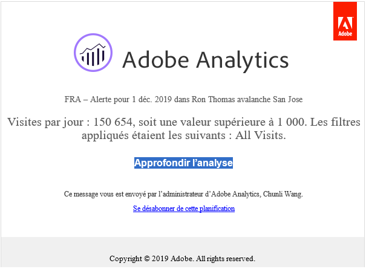
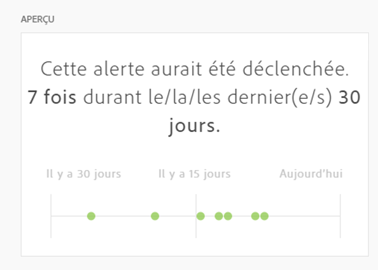

# Créer des alertes

>[!NOTE]
>
>Les alertes intelligentes ne sont disponibles que pour les clients Adobe Analytics Prime et Adobe Analytics Ultimate.

Les alertes intelligentes (ou simplement les &quot;alertes&quot;) dans Adobe Analytics vous permettent d’être averti immédiatement en cas d’événements anormaux dans vos données. (Les alertes d’utilisation des appels au serveur sont un autre type d’alerte disponible uniquement pour les administrateurs d’Analytics. Ces alertes vous informent du risque ou de l’occurrence d’un dépassement de vos données d’engagement et de consommation d’appels au serveur. Pour plus d’informations, voir [Alertes d’utilisation des appels au serveur](/help/admin/admin/c-server-call-usage/scu-alerts.md).)

Pour obtenir des informations d’aperçu plus détaillées sur les alertes intelligentes, reportez-vous à la section [Présentation des alertes intelligentes](/help/analyze/analysis-workspace/c-intelligent-alerts/intellligent-alerts.md).

Pour créer une alerte intelligente :

1. Commencez à créer une alerte en accédant au créateur d’alertes. Vous pouvez accéder au générateur d’alertes de l’une des façons suivantes :

   * Ouvrez un projet dans Analysis Workspace, puis sélectionnez **[!UICONTROL Composants]** > **[!UICONTROL Créer une alerte]**.
   * Ouvrez un projet dans Analysis Workspace, puis utilisez le raccourci suivant :

     `ctrl (or cmd) + shift + a`
   * Ouvrez un projet dans Analysis Workspace, sélectionnez une ou plusieurs lignes dans un tableau à structure libre, puis cliquez avec le bouton droit de la souris et sélectionnez **[!UICONTROL Créer une alerte d’après la sélection]**.

     Le créateur d’alertes est ainsi prérempli instantanément afin de créer une alerte avec les mesures et filtres corrects.
   * Créez une alerte [ à partir du gestionnaire d’alertes ](/help/components/c-alerts/alert-manager.md#create-alerts).

   Le créateur d’alertes s’affiche. Les personnes qui ont créé des segments ou calculé des mesures dans Analytics connaissent bien cette interface :

   

1. Définissez les options suivantes pour configurer l’alerte :

   | Option | Description |
   |---------|----------|
   | [!UICONTROL **Titre**] | Spécifiez le nom de l’alerte. Le nom de l’alerte doit contenir le nom du rapport ou le seuil des mesures. |
   | [!UICONTROL **Description (facultatif)**] | Spécifiez une description pour l’alerte. |
   | [!UICONTROL **Granularité du temps**] | Sélectionnez la fréquence à laquelle vous souhaitez vérifier la mesure : Quotidienne, Hebdomadaire ou Mensuelle.
<b>Remarque :</b>Pour les vues de données avec un calendrier personnalisé, la granularité mensuelle n’est pas prise en charge dans le Générateur d’alertes.<!--true?-->
 |
   | [!UICONTROL **Destinataires**] | Spécifiez où envoyer l’alerte. Une alerte peut être envoyée à un utilisateur ou à un groupe Analytics, à une adresse e-mail brute ou à un numéro de téléphone.
<b>Important :</b>Le numéro de téléphone doit être précédé d’un &quot;+&quot; et d’un [code de pays](https://countrycode.org/).

Le courrier électronique qu’un utilisateur recevrait une fois qu’une alerte a été déclenchée ressemble à ceci :

 |
   | [!UICONTROL **Date d’expiration**] | Définissez la date et l’heure d’expiration de l’alerte. |
   | [!UICONTROL **Envoyer une alerte lorsque**] | [!UICONTROL **L’un de ces déclencheurs de mesures**] : faites glisser et déposez des mesures (y compris des mesures calculées) ici pour créer des déclencheurs pour l’alerte.
Un message **&quot;composants incompatibles&quot;** s’affiche si toutes les mesures, dimensions ou segments de l’alerte ne sont pas compatibles avec la vue de données actuellement sélectionnée.

Déterminez le seuil que la mesure doit dépasser avant l’envoi d’une alerte. Vous pouvez définir un seuil, puis l’une des conditions suivantes :
<ul><li>il existe une anomalie</li><li>l’anomalie est supérieure à celle prévue</li><li>l’anomalie est inférieure à celle prévue</li><li>est supérieur ou égal</li><li>est inférieur ou égal</li><li>change de</li><li>Le seuil peut être défini à 90 %, 95 %, 99 %, 99,75 % ou 99,90 %.</li></ul>
[!UICONTROL **Avec tous ces filtres**] : faites glisser et déposez des segments ou des dimensions pour ajouter des filtres. Par exemple, l’ajout d’un segment &quot;Appareils mobiles uniquement&quot; signifie que la règle se déclenche uniquement pour les appareils mobiles. Vous pouvez ajouter d’autres filtres à l’aide d’une instruction ET. Pour ajouter des règles AND ou OR, cliquez sur l’icône d’engrenage.

Voir [Alertes intelligentes - cas d’utilisation](/help/analyze/analysis-workspace/c-intelligent-alerts/alerts-use-cases.md) par exemple cas d’utilisation.
 |
   | [!UICONTROL **Aperçu**] | Dans l’aperçu interactif des alertes, vous pouvez déterminer à quelle fréquence, approximativement, une alerte sera déclenchée en fonction d’une expérience antérieure.
Si, par exemple, vous définissez une granularité temporelle quotidienne, l’aperçu indique que, pour une certaine mesure, l’alerte aurait été déclenchée x fois durant les 30 ou 31 derniers jours.

Pour réduire le nombre d’alertes déclenchées, réglez le seuil dans le [Gestionnaire d’alertes](/help/components/c-alerts/alert-manager.md).

 |

1. Sélectionnez [!UICONTROL **Enregistrer**].
