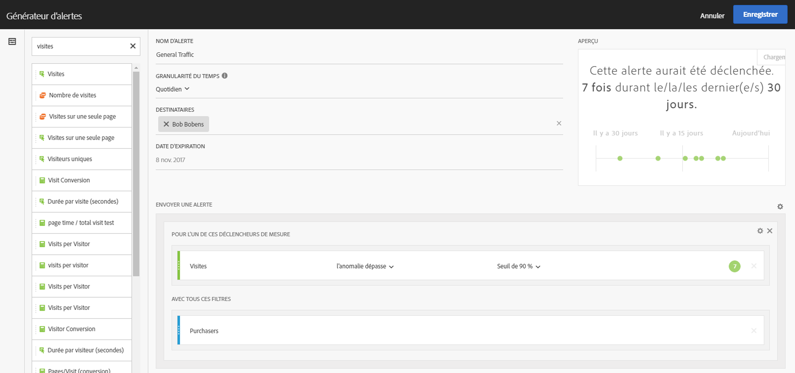

# Générateur d’alertes

>[!IMPORTANT]
>
>Les alertes intelligentes ne sont disponibles que pour les clients Adobe Analytics Prime et Adobe Analytics Ultimate.

## Accès au Générateur d’alertes

Accédez au Générateur d’alertes de l’une des quatre manières suivantes :

* En utilisant le raccourci ci suivant dans   Workspace de :

   `ctrl (or cmd) + shift + a`
* En sélectionnant **[!UICONTROL Workspace]** > **[!UICONTROL Components]** > **[!UICONTROL New Alert]**.
* By selecting one or more freeform table line items, right-clicking and selecting **[!UICONTROL Create Alert from Selection]**.
* Dans un rapport Rapports et analyses, sélectionnez **[!UICONTROL More]** > **[!UICONTROL Add Alert]**.

## Générer des alertes

Les utilisateurs qui ont déjà créé des segments ou calculé des mesures dans Analytics ne seront pas dépaysés par l’interface du Générateur d’alertes :

<!--Meike, I edited this table for validation -->

**Nom d’alerte**

Attribuez un nom à l’alerte. Le nom de l&#39;alerte peut contenir le nom du rapport ou le seuil des mesures.

**Granularité du temps**

Spécifiez quand vérifier la mesure : chaque heure, chaque jour, chaque semaine ou chaque mois.

>[!NOTE] Dans le Générateur d’alertes, il n’est pas possible de sélectionner la granularité mensuelle pour les suites de rapports dotées d’un calendrier personnalisé.

**Destinataires**

Spécifiez où envoyer l’alerte. Une alerte peut être envoyée à un utilisateur Analytics, à un groupe Analytics, à une adresse électronique brute ou à un numéro de téléphone.

>[!IMPORTANT]
>
>Le numéro de téléphone doit être précédé d’un « + » et d’un [code de pays](https://countrycode.org/).

Le courrier électronique qu’un utilisateur recevrait une fois qu’une alerte a été déclenchée ressemble à ceci :

**Date d’expiration**

Spécifiez la date d’expiration de l’alerte.

**Envoyer une alerte lorsque...**

*Pour l’un de ces déclencheurs de mesure*

* Faites glisser et déplacez les mesures dans la zone de travail des déclencheurs.

   Un message **« composants incompatibles »** s’affiche si certains composants (mesures/dimensions/segments) de l’alerte ne sont pas compatibles avec la suite de rapports actuellement sélectionnée.
* Déterminez le seuil que la mesure doit dépasser avant la définition d’une alerte. Vous pouvez définir cette valeur sur un seuil, puis sur l’une des conditions suivantes :

   * il existe une anomalie
   * l’anomalie est supérieure à celle prévue
   * l’anomalie est inférieure à celle prévue
   * est supérieur ou égal à
   * est inférieur ou égal à
   * modifications par
   * Le seuil peut être défini à 90 %, 95 %, 99 %, 99,75 % ou 99,90 %.
   Vous pouvez également utiliser les mesures calculées.

*Avec tous ces filtres*

* Faites glisser des segments ou des dimensions pour ajouter des . Par exemple, l’ajout d’un segment &quot;Périphériques mobiles uniquement&quot; signifie que la règle se déclenche uniquement pour les périphériques mobiles.
* Des  supplémentaires seront ajoutées à l’aide d’une instruction ET.

**Ajouter une règle**

Pour ajouter des règles AND ou OR, cliquez sur l’icône d’engrenage.

## Aperçu des alertes {#section_10D75BA7B77E4C5FAF58A719C082E070}

Le d’alertes interactif vous  la fréquence, approximativement, de déclenchement d’une alerte en fonction de l’expérience passée.

Si, par exemple, vous définissez la granularité temporelle sur quotidienne, le peut vous indiquer que l’alerte aurait été déclenchée pour une certaine mesure x fois au cours des 30 ou 31 derniers jours.

Si vous constatez qu’un trop grand nombre d’alertes auraient été déclenchées, vous pouvez ajuster le seuil dans le Gestionnaire d’ [alertes](/help/components/c-alerts/alert-manager.md).

