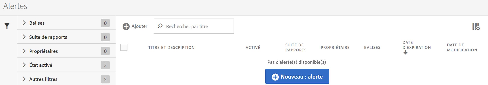
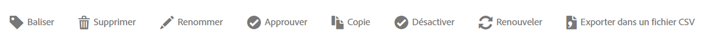

# Gestionnaire d’alertes

La structure du Gestionnaire d’alertes (**[!UICONTROL Analytics]** > **[!UICONTROL Composants]** > **[!UICONTROL Alertes]**) ressemble à celle du [Gestionnaire de segments](https://marketing.adobe.com/resources/help/fr_FR/analytics/segment/seg_manage.html) et du [Gestionnaire de mesures calculées](https://marketing.adobe.com/resources/help/fr_FR/analytics/calcmetrics/cm_manager.html) et permet d’accomplir ce qui suit :

* Accéder au Générateur d’alertes en cliquant sur **[!UICONTROL + Ajouter]**
* Marquer les alertes ; permet d’organiser les alertes pour plus de facilité
* Supprimer des alertes
* Renommer les alertes
* Approuver les alertes
* Copier des alertes
* Activer/désactiver des alertes
* **Renouveler** la date d’expiration d’une alerte. Lorsqu’une ou plusieurs alertes sont sélectionnées, elles peuvent être renouvelées en cliquant sur **Renouveler**. Cela prolonge leur date d’expiration d’un an à partir du moment où vous avez cliqué sur l’option Renouveler, quelle que soit leur date d’expiration d’origine.
* Exporter une alerte au format .CSV
* Modifier des alertes en double-cliquant sur le titre de l’alerte
* Rechercher des alertes
* Ajouter des alertes à d’autres suites de rapports
* Spécifier/modifier le propriétaire d’une alerte
* Ajouter d’autres filtres
* Définir la **date d’expiration** d’une alerte

