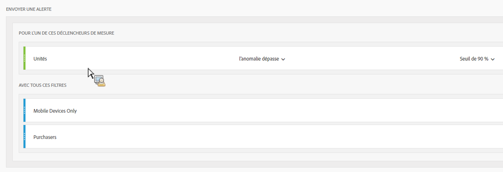
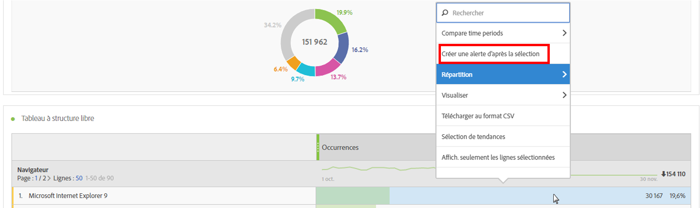
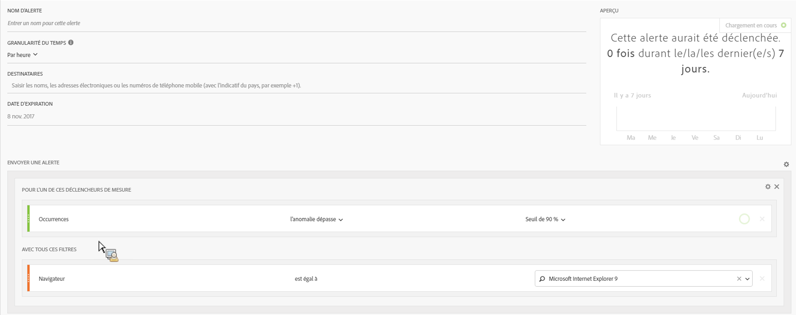
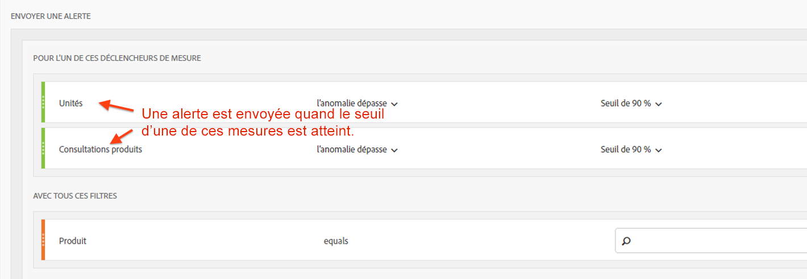

# Alertes intelligentes - Exemples d’utilisation

## Création d’une alerte simple filtrée par deux segments {#section_2E96FFFA93D44F7D8DBCEC97203204AA}

<!-- 

Update screenshots for better readability.

 -->

## Création d’une alerte d’après une sélection d’un tableau {#section_AE6D42E1255D498D908A2FA60370A419}

Dans les tableaux à structure libre, vous pouvez maintenant créer des alertes dans le contexte en cliquant avec le bouton droit de la souris sur une ligne d’un tableau, puis en sélectionnant **[!UICONTROL Créer une alerte d’après la sélection]**.

Le Générateur d’alertes est ainsi automatiquement prérenseigné afin de créer une alerte avec les mesures et filtres corrects :

## Consolidation (empilement) des alertes plutôt que de créer plusieurs alertes {#section_B27B0856BA104B9FB6D0BBB317633F18}

Les alertes empilées sont combinées, ce qui évite d’avoir à gérer plusieurs alertes distinctes.

