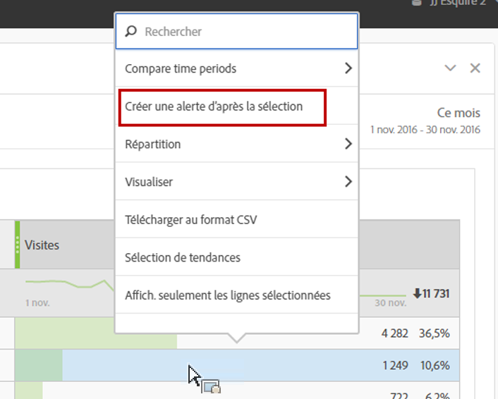
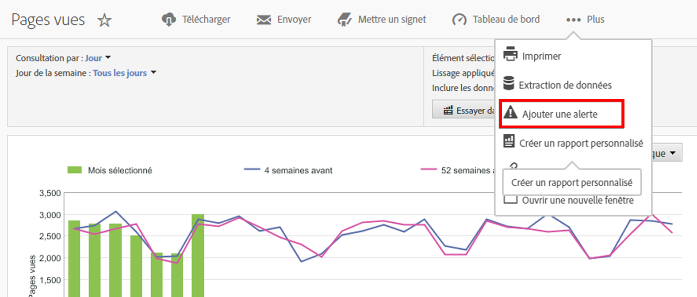

# Alertes intelligentes - Aperçu

La fonction Alertes intelligentes permet de contrôler plus précisément les alertes et intègre la détection des anomalies au système d’alerte.

[Alertes intelligentes sur YouTube](https://www.youtube.com/watch?v=UVH9xr_2REA) (5:34)

## Aperçu

Les nouveaux Générateur d’alertes et Gestionnaire d’alertes d’Analysis Workspace remplacent la fonction des alertes des Reports &amp; Analytics. Grâce aux alertes intelligentes, vous pouvez :

* créer des alertes d’après les anomalies (seuils de 90 %, 95 %, 99 %, 99,75 % et 99,90 % ; % de changement ; au-dessus/au-dessous) ;
* prévisualiser le nombre de fois où une alerte sera déclenchée ;
* envoyer des alertes par courrier électronique ou par SMS, avec des liens vers des projets Analysis Workspace générés automatiquement ;
* créer des alertes « empilées » qui présentent plusieurs mesures dans une seule alerte

Vous pouvez accéder au Générateur d’alertes de quatre façons :

* En accédant directement au Générateur d’alertes : **[!UICONTROL Composants]** > **[!UICONTROL Alertes]**
* En utilisant le raccourci clavier dans Workspace : `Ctrl + Shift + A` (Windows) ou `Cmd + Shift + A` (Mac)
* En sélectionnant une ou plusieurs lignes de tableau à structure libre, en cliquant avec le bouton droit de la souris, puis en sélectionnant **[!UICONTROL Créer une alerte d’après la sélection]**. Le Générateur d’alertes s’ouvre, puis les mesures et filtres appropriés sont préremplis à partir du tableau. Vous pouvez modifier l’alerte si nécessaire.

   

* Dans un rapport Reports &amp; Analytics, en sélectionnant **[!UICONTROL Plus]** > **[!UICONTROL Ajouter une alerte]**. Le Générateur d’alertes s’ouvre, puis les mesures et filtres appropriés sont préremplis à partir du rapport. Vous pouvez modifier l’alerte si nécessaire.

   

Les seuils (exprimé en pour cent) sont des écarts types. Par exemple, 95 % = 2 écarts types et 99 % = 3 écarts types. Selon la granularité temporelle choisie,  [différents modèles](../virtual-analyst/c-anomaly-detection/statistics-anomaly-detection.md) sont utilisés pour calculer à quel point chaque donnée s’écarte de la norme (le nombre d’écarts types). Si vous définissez un seuil inférieur (90 %, par exemple), vous obtenez davantage d’anomalies qu’avec un seuil plus élevé (99,75 %).

> [!IMPORTANT] L’utilisation de données horodatées pour créer des alertes peut entraîner un déclenchement incorrect des alertes. Adobe recommande d’utiliser des données non horodatées pour les alertes intelligentes.

## Recherche en amont des alertes par anomalies

Si une alerte utilise la détection des anomalies, la période de formation varie en fonction de la granularité sélectionnée pour l’alerte.

* Granularité mensuelle : 15 mois + même période l’an dernier
* Granularité hebdomadaire : 15 semaines + même période l’an dernier
* Granularité quotidienne : 35 jours + même période l’an dernier
* Granularité horaire : 336 heures

Pour en savoir plus, voir [Techniques statistiques de la détection des anomalies](../virtual-analyst/c-anomaly-detection/statistics-anomaly-detection.md).
