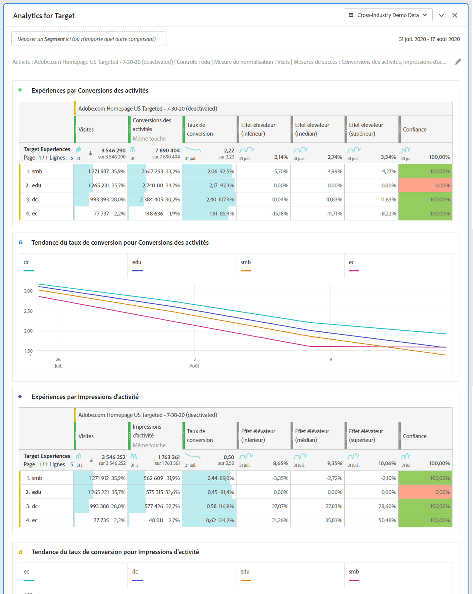

# Panneau Analytics for Target {#analyze-for-target-panel}

<!-- markdownlint-disable MD034 -->

>[!CONTEXTUALHELP]
>id="workspace_a4t_button"
>title="Analytics for Target"
>abstract="Analysez les activités et les expériences Target dans Analysis Workspace."

<!-- markdownlint-enable MD034 -->

<!-- markdownlint-disable MD034 -->

>[!CONTEXTUALHELP]
>id="workspace_a4t_panel"
>title="Panneau Analytics for Target"
>abstract="Analysez les activités et les expériences Target dans Analysis Workspace.  **Parameters ** **Target activity** : activité Target qui sera analysée. **Expérience de contrôle** : expérience de contrôle de l’activité Target sélectionnée. **Mesure de normalisation** : visiteurs, visites ou impressions. Cette mesure (également appelée méthodologie de comptage) devient le dénominateur du calcul de l’effet élévateur. Elle affecte également la manière dont les données sont agrégées avant l’application du calcul du degré de confiance. **Mesures de succès** : jusqu’à 3 mesures de succès standard (non calculées) par rapport auxquelles analyser l’activité Target."

<!-- markdownlint-enable MD034 -->

>[!BEGINSHADEBOX]

*Cet article présente le panneau Analytics for Target dans **Adobe Analytics**. Voir [Panneau Expérimentation](https://experienceleague.adobe.com/en/docs/analytics/analyze/analysis-workspace/panels/a4t-panel) pour plus d’informations sur la comparaison de différentes expériences utilisateur, variantes de marketing ou de messagerie dans **Customer Journey Analytics**.*

>[!ENDSHADEBOX]

Le panneau Analytics for Target vous permet d’analyser vos activités et expériences Adobe Target dans Analysis Workspace. Le panneau vous permet également d’afficher l’effet élévateur et le degré de confiance pour jusqu’à 3 mesures de succès. Pour accéder au panneau Analytics for Target, naviguez vers une suite de rapports dont les composants Analytics for Target sont activés. Sélectionnez ensuite l’icône du panneau à l’extrémité gauche et faites glisser le panneau Analytics for Target dans votre projet Analysis Workspace.

+++Regardez cet aperçu vidéo rapide sur le panneau Analytics for Target :

>[!VIDEO](https://video.tv.adobe.com/v/37247/?quality=12)

+++

## Utilisation

Pour utiliser un panneau **[!UICONTROL Analytics for Target]** :

1. Créez un panneau **[!UICONTROL Analytics for Target]**. Pour plus d’informations sur la création d’un panneau, consultez [Créer un panneau](panels.md#create-a-panel).

1. Spécifiez l’[entrée](#panel-input) du panneau.

1. Observez la [sortie](#panel-output) du panneau.

### Entrée du panneau {#panel-nput}

Vous pouvez configurer le panneau Analytics for Target à l’aide des paramètres d’entrée suivants :

| Paramètre | Description |
|---|---|
| **[!UICONTROL Activité cible]** | Effectuez une sélection à partir d’une liste d’activités Target ou faites glisser et déposez une activité à partir du rail de gauche. Remarque : la liste est remplie avec les 6 derniers mois d’activités qui comptent au moins 1 accès. Si vous ne voyez pas d’activité dans la liste, il se peut qu’elle remonte à plus de 6 mois. Elle peut encore être ajoutée à partir du rail gauche doté d’une période de retour en arrière de 18 mois. |
| **[!UICONTROL Expérience de contrôle]** | Sélectionnez votre expérience de contrôle. Vous pouvez la modifier si nécessaire dans la liste déroulante. |
| **[!UICONTROL Mesure de normalisation]** | Choisissez Visiteurs uniques, Visites ou Impressions d’activité. Visiteurs uniques est l’option recommandée pour la plupart des cas d’utilisation d’analyses. Cette mesure (également appelée méthodologie de comptage) devient le dénominateur du calcul de l’effet élévateur. Elle affecte également la manière dont les données sont agrégées avant l’application du calcul du degré de confiance. |
| **[!UICONTROL Mesures de succès]** | Sélectionnez jusqu’à 3 événements de succès standard (non calculés) dans les listes déroulantes ou faites glisser les mesures depuis le rail de gauche. Chaque mesure comporte une visualisation et un tableau dédiés dans le panneau généré. |
| C**[!UICONTROL période du calendrier]** | Cette variable est automatiquement renseignée à partir d’Adobe Target en fonction de la période d’activité. Vous pouvez la modifier, si nécessaire. |

### Sortie du panneau {#panel-output}

Le panneau Analytics for Target renvoie un vaste ensemble de données et de visualisations pour vous aider à mieux comprendre les performances de vos activités et expériences Adobe Target. En haut du panneau, une ligne de résumé vous rappelle les paramètres du panneau que vous avez sélectionnés. À tout moment, vous pouvez modifier le panneau en cliquant sur l’icône de modification en forme de crayon dans le coin supérieur droit.

Pour chaque mesure de succès sélectionnée, un tableau à structure libre et une tendance de taux de conversion sont affichés :

Chaque tableau à structure libre affiche les colonnes de mesures suivantes :

| Mesure | Description |
|---|---|
| **[!UICONTROL Normalisation des mesures]** | Visiteurs uniques, Visites ou Impressions d’activité. |
| **[!UICONTROL Mesure de succès]** | La mesure sélectionnée dans le créateur. |
| **[!UICONTROL Taux de conversion]** | Mesure de succès/normalisation |
| **[!UICONTROL Croissance]** | Compare le taux de conversion de chaque expérience à l’expérience de contrôle. Remarque : l’effet élévateur est une « mesure verrouillée » des expériences Target. Il ne peut pas être ventilé ou utilisé avec d’autres dimensions. |
| **[!UICONTROL Effet élévateur (inférieur)]** | Représente le pire effet élévateur qu’une expérience de variante pourrait avoir sur le contrôle, avec un intervalle de confiance de 95 %. Voir [Calculs statistiques](https://experienceleague.adobe.com/docs/target/using/reports/statistical-methodology/statistical-calculations.html) et [Calculateur de confiance complet](https://experienceleague.adobe.com/docs/target/assets/complete_confidence_calculator.xlsx) fichier Excel pour plus d’informations. |
| **[!UICONTROL Effet élévateur (moyen)]** | Représente l’effet élévateur moyen qu’une expérience de variante pourrait avoir sur l’expérience de contrôle, avec un intervalle de confiance de 95 %.  Voir [Calculs statistiques](https://experienceleague.adobe.com/docs/target/using/reports/statistical-methodology/statistical-calculations.html) et [Calculateur de confiance complet](https://experienceleague.adobe.com/docs/target/assets/complete_confidence_calculator.xlsx) fichier Excel pour plus d’informations. |
| **[!UICONTROL Effet élévateur (supérieur]**) | Représente le meilleur effet élévateur qu’une expérience de variante pourrait avoir sur le contrôle, avec un intervalle de confiance de 95 %. Voir [Calculs statistiques](https://experienceleague.adobe.com/docs/target/using/reports/statistical-methodology/statistical-calculations.html) et [Calculateur de confiance complet](https://experienceleague.adobe.com/docs/target/assets/complete_confidence_calculator.xlsx) fichier Excel pour plus d’informations. |
| **[!UICONTROL Confiance]** | Le test T calcule le degré de confiance, qui indique la probabilité selon laquelle les résultats seraient dupliqués si le test était exécuté à nouveau. Une plage de mise en forme conditionnelle fixe de 75 %/85 %/95 % a été appliquée à la mesure. Si nécessaire, cette mise en forme peut être personnalisée sous Paramètres de colonne. Remarque : le degré de confiance est une « mesure verrouillée » des expériences Target. Il ne peut pas être ventilé ou utilisé avec d’autres dimensions. Voir [Calculs statistiques](https://experienceleague.adobe.com/docs/target/using/reports/statistical-methodology/statistical-calculations.html) et [Calculateur de confiance complet](https://experienceleague.adobe.com/docs/target/assets/complete_confidence_calculator.xlsx) fichier Excel pour plus d’informations. |

Comme pour n’importe quel panneau d’Analysis Workspace, vous pouvez continuer votre analyse en ajoutant des tableaux et [visualisations](https://experienceleague.adobe.com/docs/analytics/analyze/analysis-workspace/visualizations/freeform-analysis-visualizations.html?lang=fr) supplémentaires qui vous aideront à analyser vos activités Adobe Target. Vous pouvez également appliquer un segment au niveau du panneau ou dans le tableau à structure libre. Veuillez noter que si vous l’ajoutez dans le tableau à structure libre, vous devez le superposer sur l’ensemble du tableau pour conserver les calculs relatifs à l’effet élévateur et au degré de confiance. Les segments au niveau des colonnes ne sont pour le moment pas pris en charge.

## Questions fréquentes {#FAQ}

| Question | Réponse |
|---|---|
| Quels types d’activité sont pris en charge dans Analytics for Target ? | [En savoir plus](https://experienceleague.adobe.com/docs/target/using/integrate/a4t/a4t-faq/a4t-faq-activity-setup.html?lang=fr) sur les types d’activité pris en charge. |
| Les mesures calculées sont-elles prises en charge dans les calculs d’effet élévateur et de degré de confiance ? | Non. [En savoir plus](https://experienceleague.adobe.com/docs/target/using/integrate/a4t/a4t-faq/a4t-faq-lift-and-confidence.html?lang=fr) sur les raisons pour lesquelles les mesures calculées ne sont pas prises en charge dans les calculs d’effet élévateur et de degré de confiance. Toutefois, les mesures calculées peuvent être utilisées dans les rapports Analytics for Target en dehors de ces mesures. |
| Pourquoi les visiteurs uniques varient-ils entre Target et Analytics ? | [En savoir plus](https://experienceleague.adobe.com/docs/target/using/integrate/a4t/a4t-faq/a4t-faq-viewing-reports.html?lang=fr) sur les variations de visiteurs uniques entre les produits. |
| Pourquoi des expériences sans rapport sont-elles renvoyées lorsque j’applique un segment d’accès pour une activité Target spécifique dans mon analyse ? | La dimension Analytics for Target est une variable de liste, ce qui signifie qu’elle peut contenir de nombreuses activités (et expériences) à la fois. [En savoir plus](https://experienceleague.adobe.com/docs/target/using/integrate/a4t/a4t-faq/a4t-faq-viewing-reports.html?lang=fr) |
| La mesure de degré de confiance tient-elle compte des commandes extrêmes ou applique-t-elle une correction de Bonferroni pour plusieurs offres ? | Non. [En savoir plus](https://experienceleague.adobe.com/docs/target/using/integrate/a4t/a4t-faq/a4t-faq-lift-and-confidence.html?lang=fr) sur la façon dont Analytics calcule le degré de confiance. |
| Les mesures Effet élévateur et Degré de confiance peuvent-elles être utilisées avec d’autres dimensions ou répartitions ? | L’effet élévateur et le degré de confiance sont des « mesures verrouillées » des expériences Target, car ils nécessitent un contrôle et une variante pour effectuer les calculs. Ils ne peuvent donc pas être ventilés ou utilisés avec d’autres dimensions. |
| Quand l’effet élévateur et le degré de confiance sont-ils recalculés ? | L’effet élévateur et le degré confiance sont recalculés chaque fois que le panneau est exécuté (ou exécuté à nouveau), que la période du panneau est modifiée ou qu’un segment est appliqué au panneau ou au tableau. L’application d’un filtre de segments au tableau à structure libre doit être effectuée au niveau de toutes les colonnes. Dans le cas contraire, l’effet élévateur et le degré de confiance ne seront pas mis à jour correctement. Les segments au niveau des colonnes ne sont pour le moment pas pris en charge. |

Pour plus d’informations sur les rapports Analytics for Target, consultez [Rapports Analytics for Target](https://experienceleague.adobe.com/docs/target/using/integrate/a4t/reporting.html?lang=fr)
