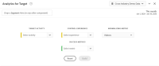

# Panneau Analyses pour la Cible (A4T)

>[!IMPORTANT]
>
>**[!UICONTROL Le panneau]** Analytics pour la Cible est actuellement soumis à des tests limités. [En savoir plus...](https://docs.adobe.com/content/help/en/analytics/landing/an-releases.html)

Le panneau Analyses de Cible (A4T) vous permet d’analyser vos activités et expériences de Cible Adobe dans l’espace de travail des Analyses. Il vous permet également d’afficher l’effet élévateur et la fiabilité pour 3 mesures de réussite au maximum. Pour accéder au panneau A4T, cliquez sur l’icône de panneau située à l’extrémité gauche et faites glisser le panneau Analyses de Cible dans votre projet Analyse Workspace.

## Générateur de panneau

Vous pouvez configurer le panneau A4T à l’aide des paramètres suivants :

| Paramètre | Description |
|---|---|
| Activité Target | Effectuez une sélection à partir d’une liste d’Activités de Cible ou faites glisser et déposez une activité à partir du rail de gauche. **Remarque :**La liste est remplie avec les 6 derniers mois d’activités qui ont eu au moins 1 accès. Si vous ne voyez pas d&#39;activité dans la liste, elle peut être plus vieille que 6 mois. Il peut encore être ajouté à partir du rail gauche, qui a une période de rétrospective de 18 mois. |
| Expérience de contrôle | Sélectionnez votre expérience de contrôle. Vous pouvez le modifier si nécessaire dans la liste déroulante. |
| Mesure de normalisation | Choisissez entre Visiteurs uniques, Visites ou Impressions d’Activité. |
| Mesures de succès | Sélectionnez jusqu’à 3 événements de réussite standard dans les listes déroulantes ou faites glisser les mesures depuis le rail de gauche. Chaque mesure comporte un tableau et une visualisation dédiés dans le panneau rendu. |
| Calendrier | Cette variable est automatiquement renseignée en fonction de la plage de dates d’Activité de la Cible Adobe. Vous pouvez le modifier, si nécessaire. |

## Sortie de panneau

Le panneau Analyses de Cible renvoie un riche ensemble de données et de visualisations pour vous aider à mieux comprendre les performances de votre activité de Cible Adobe et de vos expériences. En haut du panneau, une ligne de résumé vous rappelle les paramètres du panneau que vous avez sélectionnés. A tout moment, vous pouvez modifier le panneau en cliquant sur le crayon de modification en haut à droite.

Pour chaque mesure de réussite sélectionnée, un tableau à structure libre et une tendance de taux de conversion s’affichent :

Chaque tableau à structure libre affiche les colonnes de mesures suivantes :

| Mesure | Description |
|---|---|
| Normalisation des mesures | Impressions de Visiteurs, de visites ou d’Activités uniques |
| Mesure de réussite - taux de conversion | Mesure de réussite/normalisation |
| Effet élévateur | Compare le taux de conversion de chaque expérience à l’expérience de contrôle. **Remarque :**L’effet élévateur est une &quot;mesure verrouillée&quot; des expériences de Cible ; il ne peut pas être ventilé ou utilisé avec d&#39;autres dimensions. |
| Effet élévateur (inférieur) | Représente le pire lift qu’une expérience de variante pourrait avoir sur l’expérience de contrôle. |
| Effet élévateur (médian) | Représente le lift moyen qu’une variante de l’expérience pourrait avoir sur le contrôle, avec un intervalle de confiance de 95%. Il s’agit de l’effet élévateur dans les rapports et analyses. |
| Effet élévateur (supérieur) | Représente le meilleur lift qu’une expérience de variante pourrait avoir sur l’expérience de contrôle. |
| Degré de confiance | Le test en t des étudiants calcule le niveau de confiance, ce qui indique la probabilité que les résultats soient dupliqués si le test était exécuté de nouveau. **Remarque :**La confiance est une &quot;mesure verrouillée&quot; pour les expériences de Cible Adobe. Il ne peut pas être ventilé ou utilisé avec d’autres dimensions. |

Comme pour n’importe quel panneau de l’espace de travail des Analyses, vous pouvez continuer votre analyse en ajoutant des tableaux et des visualisations supplémentaires qui vous aideront à analyser vos activités de Cible Adobe.

Pour plus d’options concernant Analytics pour le rapports de Cible, consultez le rapports A4T (lien à venir prochainement).